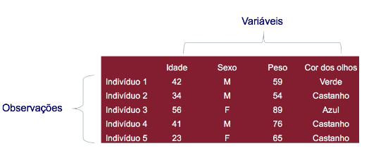

# Estatística

## Definição

(Estudo)Conjunto de métodos e processos quantitativos que serve para estudar e medir fenômenos coletivos.

Estatística e a ciência parte da matemática aplicada que fornece métodos para coletar, descrever, analisar, apresentar e interpretar dados, para utilização dos mesmos na tomada de decisões.

(Fato Numérico) Dado de resumo de um conjunto de dados

## Tipos de estatística

### Descritiva

Utiliza métodos para coleta, organização, apresentação e análise e síntese de dados obtidos em uma população ou amostra. Os dados são apresentados por meio de gráficos, tabelas, medidas para descrever o fenômeno.
Trabalha com dados históricos oferecendo insights sobre acontecimentos do passado.

### Inferencial

Processo de estimar informações sobre uma população a partir dos resultados observados em uma amostra.
Oferece conclusões, previsões, análise e interpretações de fenômenos com certo grau de confiabilidade.

Ex: Pesquisa de mercado, opinião pública.

## População

Conjunto de indivíduos, objetos ou informações que apresentam pelo menos uma característica em comum, cujo comportamento nos interessa analisar
Para que haja uma definição clara dos elementos que formam a população é necessária a especificação de trê elementos:

- uma característica comum
- localização temporal
- localização geográfica

### Tipos

- População Finita
  - Número limitado de elementos
- Universo estatístico
  - Todos os elementos de um grupo
- População Infinita
  - Teoricamente infinitos elementos. Na prática número muito grande de elementos

## Amostragem

Usa a coleta, organização, apresentação e análise dos dados como meio de estudar os parâmetros de uma população.

## Amostra

Parte de uma população, selecionada a partir de métodos específicos

## Censo

Exame completo de toda população, quanto maior a amostra mais preciso e confiável o resultado.
Técnica que seleciona e avalia todos os elementos da população quando se realiza uma pesquisa

- Prós
  - Maior acurácia/ confiança dos dados
- Contras
  - Alto custo de tempo e dinheiro

## Observação

Ocorrência de um item de dados específico que é gravado sobre uma unidade de dados

## Variáveis

Característica de interesse que e medidas em cada elemento da amostra ou população

### Variáveis nominais

Categoria não mensurável, rótulo ou nomes para identificar determinado atributo de um elemento
Ex: Cor dos olhos, marca de carro, sexo, etc.

### Variáveis ordinais

Categorias divididas em números, onde as propriedades inerentes aos dados nominais trazem a ideia de ordem, classificação(significativas).
Ex:Idade, grau de instrução, classe social, etc.

### Variáveis intervalares

Se os dados trazem a ideia de ordenação expressa por meio de um intervalo (como nota do ENEM)
Ex:Idade, grau de instrução, classe social, etc.

### Variáveis proporcionais

Se os dados trazem as propriedades de dados de intervalo,porém sua proporção é dos valores é significativa
Ex: distância, altura ,peso

## Tipos de estatística

### Estatística descritiva

Coleta, organização, classificação, apresentação, interpretação e análise de dados, por meio de: Gráficos, tabelas, medidas para descrever o fenômeno

### Estatística Indutiva ou Inferêncial

A partir de uma amostra são desenvolvidas: Conclusões, previsões, análises, interpretações (Teoria de probabilidade )

Ex: Pesquisa de mercado, opinião pública
