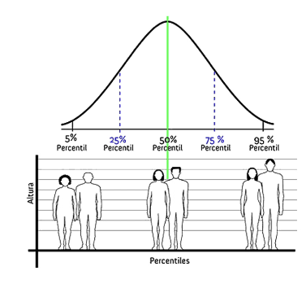

# Medida de posição 
As medidas de tendência central são valores representativos da distribuição em torno da qual as outras medidas se distribuem. Duas medidas são as mais utilizadas: a média aritmética e a mediana.

## Média 

\begin{equation} 
  \bar{x}= \frac{\sum x_{i}}{n}
  (\#eq:media)
\end{equation} 

$ x_{i}  = \textrm{ o valor da observação de i}$

$ n = \textrm{número de observações}$

A média aritmética de um conjunto de n valores, como o próprio nome indica, é obtida somando-se todas as medidas e dividindo-se a soma por n. 

Tentativa de sintetizar o comportamento do conjunto originário.

Representamos cada valor individual por uma letra (x, y, z, etc.) seguida por um sub-índice, ou seja, representamos os n valores da amostra por x1, x2, x3, …, xn, onde x1 é a primeira observação, x2 é a segunda e assim por diante. 

### Média Ajustada

Quando se tem valores extremos, é a média ajustada. Ela é obtida excluindo-se uma porcentagem dos valores menores e maiores de um conjunto e calculando-se então a média dos valores restantes. Por exemplo, a média ajustada de 5% é obtida eliminando-se os 5% dos valores de dados menores e o 5% dos valores de dados maiores e calculando-se depois a média dos valores restantes. 

### Média Aritmética ponderada


Onde cada valor tem um peso diferente  

$$\small \bar{x}= \frac{\sum w_{i}x_{i}}{\sum w_{i}}  
$$

$\small x_{i}  = \textrm{o valor da observação de i}  \\ w_{i}= \textrm{o valor da observação de i}$

#### Para dados agrupados sem intervalos de classes

População:

$$\small  
\mu= \frac{\sum X_{i}f_{i}}{N}  
$$ 

$\small X_{i}  = \textrm{o valor da classe} \\
f_{i}  = \textrm{o número de elementos classificados na classe}$

Amostra:

$$\small 
\bar{x}= \frac{\sum w_{i}x_{i}}{n}  
$$

$\small x_{i}= \textrm{o valor da classe} \\
w_{i}= \textrm{o número de elementos classificados na classe}$


Exemplo:

Notas dos alunos - $\small x_i$   | Número de alunos | $\small x_if_i$
------ | ------|------
1 | 1|1
2 | 3|6
3 | 5|15
4 | 1|4
Total (∑) | n = 10 | 26

#### Para dados agrupados com intervalos de classes

População:

$$\small x_i
\mu= \frac{\sum X_{i}f_{i}}{N} \textrm{, onde } X_{i} = \frac{l_{i}+l{s}}{2} 
$$

$\small x_{i}  = \textrm{o valor da classe} \\ f_{i}  = \textrm{o número de elementos classificados na classe}$

Amostra:

$$\small 
\bar{x}= \frac{\sum x_{i}f_{i}}{N} \textrm{, onde } x_{i} = \frac{l_{i}+l{s}}{2}
$$


Exemplo: 

Classes - Renda Familiar | $\small x_i$ | $\small f_i$ - N° de famílias | $\small x_if_i$
------|--|------|---
[2,4[ | 3 | 5 | 15
[4,6[ | 5 | 10 | 50
[6,8[ | 7 | 14 | 98
[8,10[ | 9 | 8 | 72
[10,12[ | 11 | 3 | 33
Total (∑) |  | n = 40| 268

$\small x_{i} = \textrm{ponto médio da classe}$

- R

Exemplo: A lista abaixo possui as notas de 10 alunos de um curso de graduação no exame final. Calcule a média.

```{r}
notas = c(6.4, 7.3, 9.8, 7.3, 7.9, 8.2, 9.1, 5.6, 8.5, 6.8) 
mean(notas)
```


## Mediana

A mediana é uma medida alternativa à média aritmética para representar o centro da distribuição, muito usada em estatística descritiva. 

A mediana de um conjunto de medidas (x1, x2, x3, …, xn) é um valor M tal que pelo menos 50% das medidas são menores ou iguais a M e pelo menos 50% das medidas são maiores ou iguais a M. 

- Em outras palavras, 50% das medidas ficam abaixo da mediana e 50% acima.
  - Se o número de elementos for ímpar, a mediana é o elemento do meio: n / 2
  - Se o número de elementos for par, a mediana ainda é o elemento do meio, mas calculado assim: 
  $$ \frac{(n + 1)} {2} $$

### R

Exemplo: Os dados da lista abaixo são tempos de vida (em dias) de 8 lâmpadas. Calcule a média e a mediana.

```{r}
tempos = c(400, 350, 510, 550, 690, 720, 750, 2000)
mean(tempos)
median(tempos)
```

### Mediana em dados agrupados

<div class="fontBlack">

  $$md = LI_i + (\frac{0,5n - F_{i-1}}{f_i})\times h$$

  $i: \textrm{Classe mediana (é o intervalo de classe onde a coluna dos} F_i \textrm{ na TDF superou o 50\% dos dados } \\
  LI_i: \textrm{Limite inferior da classe mediana} \\
  F_{i-1}: \textrm{é a frequência acumulada absoluta da classe anterior a classe mediana} \\
  f_i: \textrm{é a frequência absoluta da classe mediana} \\
  h: \textrm{comprimento do intervalo de classe}$

</div>

## Moda

A moda de uma distribuição é o valor que ocorre mais frequentemente,  ou o valor que corresponde ao intervalo de classe com a maior frequência. 

A moda, da mesma forma que a mediana, não é afetada por valores extremos.

Uma distribuição de frequência que apresenta apenas uma moda é chamada de unimodal. 

Se a distribuição apresenta dois pontos de alta concentração ela é chamada de bimodal. 

Distribuições bimodais ou multimodais podem indicar que na realidade a distribuição de frequência  se refere a duas populações cujas medidas foram misturadas. 

Por exemplo, suponha que um lote de caixas de leite longa vida é amostrado e em cada caixa da  amostra é medido o volume envasado. Se o lote é formado pela produção de duas máquinas de envase  que estão calibradas em valores diferentes, é possível que o histograma apresente duas modas,  uma para cada valor de calibração.
```{r}
tamanhos = c(38, 38, 36, 37, 36, 36, 40, 39, 36, 35, 36)
mean(tamanhos)
median(tamanhos)
moda = function(dados) {
  vetor = table(as.vector(dados))
  names(vetor)[vetor == max(vetor)]}

moda(tamanhos)

```

### Moda em dados agrupados

#### Czuber 
<div class="fontBlack">

  $$mo = LI_i + (\frac{d_1}{d_1+d_2})\times h$$
  $i: \textrm{Classe modal (é aquela classe que tem maior frequência absoluta)}(f_i) \\
  LI_i: \textrm{é o limite inferior da classe modal} \\
  d_1: f_i - f_{i-1} \\
  d_2: f_i - f_{i+1} \\
  h: \textrm{amplitude da classe modal}$

</div>

#### King

<div class="fontBlack">

  $$mo = LI_i + c \times(\frac{f_{post}}{f_{ant}+f_{post}})$$
  $i: \textrm{Classe modal (é aquela classe que tem maior frequência absoluta)}(f_i) \\
  LI_i: \textrm{é o limite inferior da classe modal} \\
  f_{ant}: \textrm{frequência da classe anterior à classe modal}  \\
  f_{post}: \textrm{frequência da classe posterior à classe modal} \\
  c: \textrm{comprimento do intervalo de classe}$

</div>


## Valor máximo e valor mínimo

Representam os valores máximos e mínimos da distribuição de dados

Exemplo: Quais são os valores máximo e mínimo dos tamanhos de sapatos do item anterior.

```{r}
tamanhos = c(38, 38, 36, 37, 36, 36, 40, 39, 36, 35, 36)
max(tamanhos)
min(tamanhos) 
```


## Quartil
Chamados de quartis da distribuição ou simplesmente quartil, dividem a distribuição em quartas partes

- Q1- 25% dos dados antes dele
- Q2 - 50% (mediana) 
- Q3 - 75%  
- Q4 - 100% 

### R

Exemplo: O horário de funcionamento de um banco já está se esgotando, para adiantar o atendimento dos clientes o gerente decide para de chamar individualmente e passa a chamar em grupos de 1/4 da quantidade total de clientes na fila. 

A partir dos números das fichas dos clientes, determine os grupos das 4 chamadas.

```{r}
num_fichas = c(54, 55, 56, 57, 58, 59, 60, 61, 62, 63)
quantile(num_fichas) 
```


## Percentil
Dividem a distribuição de dados em 100 parte iguais. 




- Ex
  - Percentil 10 = décimo percentil = 10% dos dados antes dele


### R


Exemplo: Considerando os dados do exemplos anterior, calcule o percentil 10, 80 e 98.

```{r}
num_fichas = c(54, 55, 56, 57, 58, 59, 60, 61, 62, 63)
quantile(num_fichas, c(.10, .80,.98))
```

