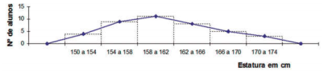
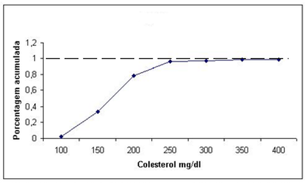
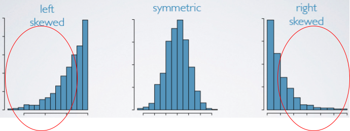
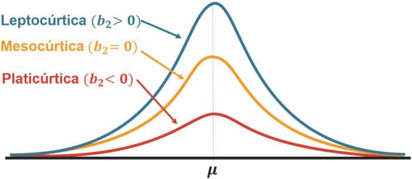
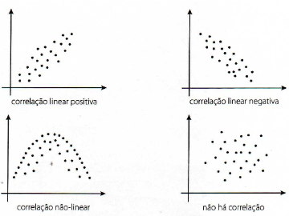
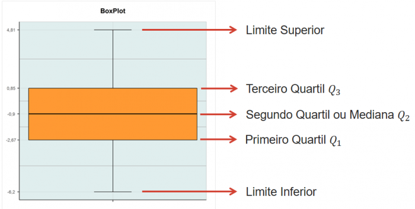

# Métodos tabulares e métodos gráficos

## Tabelas

Uma tabela resume os dados por meio de linhas e colunas podendo conter, além de linhas e colunas:
- Fonte
- Chamadas, localizadas no rodapé
- Notas
  - Esclarecimentos acerca dos dados ou apuração
  - Feitos em algarismos arábicos escritos entre parênteses, e colocados à direita da coluna

Ao preencher células/casas deve-se atentar:
- utilizar um traço horizontal (_) quando o valor é zero 
- utilizar três pontos (...) quando não há dados
- utilizar ponto de interrogação (?) quando há dúvida sobre a exatidão do valor
- zero (0) quando o valor é muito pequeno para ser expresso pela unidade utilizada

## Tabelas de contingência

As tabelas de contingência são utilizadas quando os dados precisam ser classificados de acordo com dois fatores. Dessa forma as tabelas tem duas entradas, cada uma relativa a um fator.

<table>
<thead>
  <tr>
    <th class = "text-center" >Regiões</th>
    <th class = "text-center" colspan="3">Meses</th>
    <th class = "text-center" >Total</th>
  </tr>
</thead>
<tbody>
  <tr>
    <td></td>
    <td align="center">Janeiro</td>
    <td align="center">Fevereiro</td>
    <td align="center">Março</td>
    <td></td>
  </tr>
  <tr>
    <td>Norte</td>
    <td align="center">  27 503 </td>
    <td align="center">  23 374 </td>
    <td align="center">  24 198 </td>
    <td align="center">75 075</td>
  </tr>
  <tr>
    <td>Nordeste</td>
    <td align="center">  72 377 </td>
    <td align="center">  62 618 </td>
    <td align="center">  66 158 </td>
    <td align="center">201 153</td>
  </tr>
  <tr>
    <td>Sudeste</td>
    <td align="center">  100 531 </td>
    <td align="center">  91 077 </td>
    <td align="center">  96 073 </td>
    <td align="center">287 681</td>
  </tr>
  <tr>
    <td>Sul</td>
    <td align="center">  35 068 </td>
    <td align="center">  31 331 </td>
    <td align="center">  33 716 </td>
    <td align="center">100 115</td>
  </tr>
  <tr>
    <td>Centro-Oeste</td>
    <td align="center">  21 439 </td>
    <td align="center">  19 487 </td>
    <td align="center">  21 072 </td>
    <td align="center">61 998</td>
  </tr>
</tbody>
</table>

Fonte: IBGE, 2021


## Definição de Classes

1. Determinar o número de classes não sobrepostas
   a. Em geral, usa-se entre 5 - 20 classes.
   b. Pode ser adotada fórmula:
      - $\small k - 1+3,3.log(n$)
        - n: número total de dados
        - k: número aproximado de classes
2. Determinar a amplitude de cada classe
   a. Amplitude = (Maior valor - Menor valor)/ Número de classes
3. Determinar o limite da classe

## Frequência Absoluta
Por frequência absoluta, entende-se o número de observações correspondente a cada classe. 

## Frequência Relativa
A frequência relativa, por sua vez, diz respeito ao quociente entre a frequência absoluta da classe  correspondente e a soma das frequências absolutas. 

$$FR= \frac{\textrm{Frequência da classe} }{ \textrm{Quantidade total de observações na amostra}}$$

## Frequência acumulada

Soma das frequências das classes anteriores a classe atual analisada.

Cores | Freq. Abs. | Freq. Rel. | Freq Rel. (%) | Freq. Rel. Ac.
--- | --- |--- |--- |--- |
Branco | 70 | 0,35 | 35 | 35
Preto | 50 | 0,25 |25 | 60
Amarelo | 40 | 0,20 | 20 | 80
Azul | 20 | 0,1 |10 | 90
Cinza | 15 | 0,075 |7,5 |97,5
Roxo | 5 | 0,025 |2,5 | 100
**Total** | 200 | 1 |100| 100


## Frequência acumulada relativa

Soma das frequências em relação ao total de amostras 


$$FAR= \frac{\textrm{Frequências acumuladas} }{ \textrm{Quantidade total de observações na amostra}}$$

## Polígono de frequências

O polígono de frequência é construído utilizando-se dos pontos médios de cada classe para marcar os pontos nas abscissas. Os pontos das ordenadas são traçados pela frequência de cada classe.



## Histograma
Um histograma é um modelo de gráfico que representa uma distribuição de frequências através de um agrupamento de classes, de forma que se pode contabilizar as ocorrências dos dados em cada classe. 

- Útil para visualizar a 
  - distribuição de medidas
  - dispersão
  - simetria dos dados 
  - tendências centrais.

A soma das áreas de todos os retângulos do histograma deve ser igual a 1.

Como fazer um histograma manualmente?

1. Ordenar os valores
1. Encontrar a amplitude total: A = xmax − xmin. Assim, os intervalos devem cobrir uma faixa de, no mínimo, o valor da amplitude.
1. Estimar o número de classes: 2k ≤ n. Sendo que n é igual a raiz quadrada do número total de observações.
1. Estimar o tamanho de cada intervalo de classe: C = A/k
1. Contar o número de observações que caem em cada intervalo de classe (subintervalo), frequência.
1. Determinar a frequência relativa do intervalo: Frequência relativa = frequência/total de observações.
1. Construir o gráfico.

Exemplo: Os seguintes dados representam o número de acidentes diários em um complexo industrial  (colocados em ordem crescente), durante o período de 50 dias. Represente o histograma desses dados.

```{r}
dados = c(18, 20, 20, 21, 22, 24, 25, 25, 26, 27, 29, 29, 30, 30, 31, 31, 32, 33, 34, 35, 36, 36, 37, 37,37, 37, 38, 38, 38, 40, 41, 43, 44, 44, 45, 45,45, 46, 47, 48, 49, 50, 51, 53, 54, 54, 56, 58, 62, 65)

hist(dados, main = "Número de Acidentes Diários", xlab = "Acidentes", ylab = "Frequência")

hist(dados, main = "Número de Acidentes Diários", xlab = "Acidentes", ylab = "Frequência", breaks = 6) 

 hist(dados, main = "Número de Acidentes Diários", xlab = "Acidentes", ylab = "Frequência", breaks = 5) 
```


## Gráfico Ogiva de Galton - Frequência Acumulada
O gráfico de uma distribuição cumulativa se chama ogiva, onde os dados se encontram no eixo horizontal e as frequências cumulativas, relativas cumulativas ou frequências percentuais cumulativas no eixo vertical.
No eixo horizontal são utilizados os pontos extremos de cada classe.



## Apresentação Ramo-e-folha

A apresentação de ramo-e-folha pode ser usada para mostrar simultaneamente tanto a ordem de classificação como a forma de dados.


Para desenvolver uma apresentação de ramo-e-folha organiza-se primeiramente os dígitos à esquerda de cada valor de dados à esquerda de uma linha vertical. À direita da linha vertical, registrando o último dígito de cada valor de dados.


As folhas podem valer 1, 10, 100 para tornar a apresentação mais legível.


## Coeficiente de Assimetria


O coeficiente de assimetria é o que permite dizer se uma determinada distribuição é assimétrica ou não.

A assimetria da amostra pode ser calculada por:

$$Assimetria =\frac{n}{(n -1)(n -2)} \sum \frac{(x_{i} - \bar{x})}{s}^3$$



- Inclinação à direita: assimetria positiva
  - Média > Mediana
- Inclinação à esquerda: assimetria negativa
  - Média < Mediana

### R 

Exemplo: Os seguintes dados representam o número de acidentes diários em um complexo industrial  (colocados em ordem crescente), durante o período de 50 dias. Represente o histograma desses dados.

```{r}
dados = c(18, 20, 20, 21, 22, 24, 25, 25, 26, 27, 29, 29, 30, 30, 31, 31, 32, 33, 34, 35, 36, 36, 37, 37, 37, 37, 38, 38, 38, 40, 41, 43, 44, 44, 45, 45, 45, 46, 47, 48, 49, 50, 51, 53, 54, 54, 56, 58, 62, 65)
hist(dados, main = "Número de Acidentes Diários", xlab = "Acidentes", ylab = "Frequência") 
mean(dados)
sd(dados)
median(dados)
library(moments)
SK = skewness(dados)
print(SK)
```


- Sk ≈ 0: dados simétricos. 
  - Tanto a cauda do lado direito quanto a do lado esquerdo da função densidade de probabilidade são iguais.
- Sk < 0: assimetria negativa. 
  - A cauda do lado esquerdo da função densidade de probabilidade é maior que a do lado direito.
- Sk > 0: assimetria positiva. 
  - A cauda do lado direito da função densidade de probabilidade é maior que a do lado esquerdo.

O coeficiente de assimetria é 0.2549279. 

Como o coeficiente de assimetria é maior que 0, diz-se que a curva apresenta assimetria positiva e a cauda do lado direito da função densidade de probabilidade é maior que no lado esquerdo. 

Ao observar também o Histograma, percebe-se que há maior densidade de dados do lado direito. 


Outro exemplo
```{r}
set.seed(1234)
x = rnorm(1000)
hist(x)
skewness(x)
```


## Coeficiente de curtose
O coeficiente de curtose é uma medida que caracteriza o achatamento da curva da função de distribuição.

### R

Exemplo: Os seguintes dados representam o número de acidentes diários em um complexo industrial (colocados em ordem crescente), durante o período de 50 dias. Represente o histograma desses dados.

```{r}
dados = c(18, 20, 20, 21, 22, 24, 25, 25, 26, 27, 29, 29,30, 30, 31, 31, 32, 33, 34, 35, 36, 36, 37, 37,37, 37, 38, 38, 38, 40, 41, 43, 44, 44, 45, 45, 45, 46, 47, 48, 49, 50, 51, 53, 54, 54, 56, 58, 62, 65)
hist(dados, main = "Número de Acidentes Diários", xlab = "Acidentes", ylab = "Frequência")
mean(dados)
sd(dados)
median(dados)
library(moments)
CK = kurtosis(dados)
print(CK)
```


CK ≈ 0: Distribuição normal. Chamada de Curtose Mesocúrtica.

CK < 0: Cauda mais leve que a normal. Para um coeficiente de Curtose negativo, tem-se uma Curtose Platicúrtica.

CK > 0: Cauda mais pesada que a normal. Para um coeficiente de Curtose positivo, tem-se uma Curtose Leptocúrtica.

O coeficiente de curtose é igual a 2.37652. Logo, como o valor de CK é maior que 0, a curva é Leptocúrtica.



Outro exemplo

```{r}
 n.sample <- rnorm(n = 10000, mean = 55, sd = 4.5)
#Skewness e Kurtosis
library(moments)
skewness(n.sample)
kurtosis(n.sample)

#Histograma
library(ggplot2)
datasim <- data.frame(n.sample)
ggplot(datasim, aes(x = n.sample), binwidth = 2) + geom_histogram(aes(y = ..density..), fill = 'red', alpha = 0.5) + geom_density(colour = 'blue') + xlab(expression(bold('Dados'))) + ylab(expression(bold('Densidade'))) 
```


## BoxPlot

Box-plot, ou diagrama de caixa, é possível obter informações sobre vários aspectos dos dados simultaneamente como, outliers, dispersão, tendências centrais, erros padrão e simetria. 

Utilizado para avaliar a distribuição empírica dos dados, é formado pelo primeiro e terceiro quartis, juntamente com a mediana.

```{r}
dados = c(18, 20, 20, 21, 22, 24, 25, 25, 26, 27, 29, 29,30, 30, 31, 31, 32, 33, 34, 35, 36, 36, 37, 37,37, 37, 38, 38, 38, 40, 41, 43, 44, 44, 45, 45,45, 46, 47, 48, 49, 50, 51, 53, 54, 54, 56, 58, 62, 65)
mean(dados)
sd(dados)
median(dados)
range(dados)
quantile(dados)
boxplot(dados, main = "Número de Acidentes Diários")
```


## Tabulação Cruzada

A tabulação cruzada (Cross table) é um sumário tabular de dados para duas variáveis. Muito útil para se analisar a relação entre duas variáveis

Por exemplo, a tabela abaixo (incompleta) pode ser sumarizada de forma a tornar mais fácil a leitura:


| **Restaurant** | **Quality Rating** | **Meal Price ($)** |
| :------------: | :----------------: | :----------------: |
|       1        |        Good        |         18         |
|       2        |     Very Good      |         22         |
|       3        |        Good        |         28         |
|       4        |     Excellent      |         38         |
|       5        |     Very Good      |         33         |
|       6        |        Good        |         28         |
|       7        |     Very Good      |         19         |
|       8        |     Very Good      |         11         |
|       9        |     Very Good      |         23         |
|       10       |        Good        |         13         |


| Avaliação | Frequência Relativa | Frequência Percentual |
| :-------: | :-----------------: | :-------------------: |
|    Bom    |        0,28         |          28%          |
|   Ótimo   |        0,50         |          50%          |
| Excelente |        0,22         |          22%          |
| **Total** |          1          |         100%          |


|   Preço   | Frequência Relativa | Frequência Percentual |
| :-------: | :-----------------: | :-------------------: |
|  $10-19   |        0,26         |          26%          |
|  $20-29   |        0,39         |          39%          |
|  $30-39   |        0,25         |          25%          |
|  $40-49   |        0,09         |          9%           |
| **Total** |          1          |          100          |

Tabela Cruzada -  Avaliação X Preço


| Avaliação | $10-19 | $20-29 | $30-39 | $40-49 | **Total** |
| :-------: | :----: | :----: | :----: | :----: | :-------: |
|    Bom    |   42   |   40   |   2    |   0    |    84     |
|   Ótimo   |   34   |   64   |   46   |   6    |    150    |
| Excelente |   2    |   14   |   28   |   22   |    66     |
| **Total** |   78   |  118   |   76   |   28   |    300    |


Tabela Cruzada -  Avaliação X Preço - Porcentagens por linha


| Avaliação | $10-19 | $20-29 | $30-39 | $40-49 | **Total** |
| :-------: | :----: | :----: | :----: | :----: | :-------: |
|    Bom    |  50%   | 47,6%  |  2,4%  |   0%   |   100%    |
|   Ótimo   | 22,7%  | 42,7%  | 30,6%  |   4%   |   100%    |
| Excelente |   3%   | 21,2%  | 42,4%  | 33,4%  |   100%    |

### Paradoxo de Simpson

Quando duas ou mais tabulações cruzadas são combinadas ou agregadas, chamamos a tabulação resultante de tabulação cruzada resumida ou tabulação cruzada agregada. Em tais tabulações pode ocorrer um fenômeno chamado Paradoxo de Simpson, no qual, a conclusão baseada na tabulação cruzada agregada é completamente inversa a conclusão baseada nos dados não-agregados.


|            |    Juiz    |            |
| :--------- | :--------: | :--------- |
| Veredito   |  Luckett   | Kendall    | **Total** |
| Confirmado | 129 (86%)  | 110 (88%)  | 239       |
| Revertido  |  21 (14%)  | 15 (12%)   | 36        |
| Total(%)   | 150 (100%) | 125 (100%) | 275       |

Conclusão: Juiz Kendall teve menos veredictos convertidos que o juiz Luckett, logo faz um melhor trabalho.

Porém, ao observar os dados menos resumidos.


| **Juiz Luckett** | **Juiz Kendall** |
| :--------------: | :--------------: |
|   **Veredito**   |  Apelação Comum  | Apelação Municipal | Total | **Veredito**   | Apelação Comum | Apelação Municipal | Total |
|  **Confirmado**  |     29 (91%)     | 100 (85%)          | 129   | **Confirmado** | 90 (90%)       | 20 (80%)           | 110   |
|  **Convertido**  |      3 (9%)      | 18 (15%)           | 21    | **Convertido** | 10 (10%)       | 5 (20%)            | 15    |
|    **Total**     |    32 (100%)     | 118  (100%)        | 150   | **Total**      | 100 (100%)     | 25 (100%)          | 125   |

Conclusão: Juiz Luckett  tem percentualmente, mais confirmacao e menos conversões, em ambas as classes, que o juiz kendall. Logo, Luckett faz uma trabalho melhor.

## Diagrama de Dispersão 

Um diagrama de dispersão é uma apresentação gráfica da relação existente entre duas variáveis e uma linha de tendência é uma linha que fornece uma aproximação da relação.



## Métodos tabulares e gráficos de sintetizar os dados


## Análise exploratória de dados
- Regra dos cinco itens
  - Menor valor
  - Primeiro Quartil (Q1)
  - Mediana(Q2)
  - Terceiro Quartil(Q3)
  - Maior Valor

Todos estes pontos podem ser encontrados num BoxPlot



O limite inferior é dado por Q3+ 1,5 AIQ

O limite superior é dado por Q1- 1,5 AIQ
