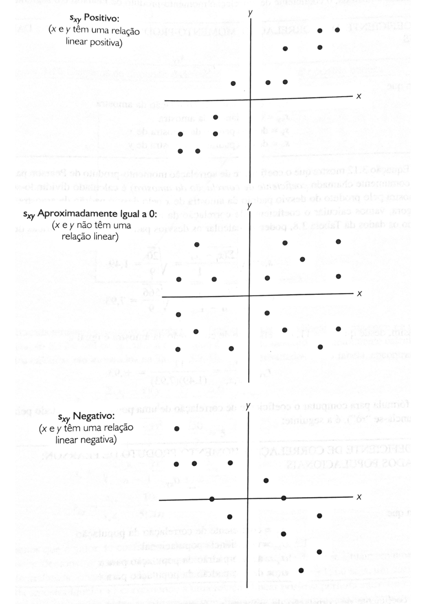

# Medidas de associação entre duas variáveis
## Covariância

$$ \frac{S_{xy}=(x_{i} - \bar{x} )(y_{i} - \bar{y} )}{n - 1} $$
$$\frac{
  \sigma_{xy}=\sum (x_{i} - \bar{x} )(y_{i} - \bar{y} )}
{N}$$


A covariância entre duas variáveis (X, Y) é uma medida de variabilidade conjunta dessas duas variáveis aleatórias, ou seja, a correlação linear entre duas variáveis, sendo X a variável independente (ou explanatória) e Y a variável dependente (ou resposta). 
- Quando a covariâncias entre essas variáveis é positiva os dados apresentam tendência positiva na dispersão. 
- Quando o valor da covariância é negativo, o comportamento é análogo, no entanto, os dados apresentam tendências negativas. 

A covariância é uma medida de como as alterações em uma variável estão associadas a mudanças em uma segunda variável. Especificamente, a covariância mede o grau em que duas variáveis estão linearmente associadas. No entanto, também é frequentemente usado informalmente como uma medida geral de como duas variáveis são monotonicamente relacionadas.



### R


```{r}
#cov(x,y)
```


## Coeficiente de correlação 
Também chamado de correlação momento-produto de Pearson

Para amostra:
<div class="fontBlack">

  $$\small r_{xy} =\frac{S_{xy}}
              {S_{x}S_{y}}$$
  $\small r_{xy}=\textrm{ coeficiente de correlação da amostra}$
  $\small S_{xy}= \textrm{covariância da amostra}$
  $\small S_x = \textrm{desvio padrão da amostra de x}$
  $\small S_y = \textrm{desvio padrão da amostra de y}$
</div>

Para população:

<div class="fontBlack">

  $$ \small \rho_{xy} = \frac{\sigma_{xy}}
                    {\sigma_{x}  \sigma_{y}}$$

  $\small \rho_{xy}= \textrm{coeficiente de correlação da população}$
  $\small \sigma_{xy}= \textrm{covariância da população}$
  $\small \sigma_x = \textrm{desvio padrão da população para x}$
  $\small \sigma_y = \textrm{desvio padrão da população para y}$
</div>

A correlação é uma versão em escala de covariância que assume valores em [−1,1]  com uma correlação de ± 1 indicando associação linear perfeita e 0 indicando nenhuma relação linear. 
- Diferença
  - Esse escalonamento torna a correlação invariante às mudanças na escala das variáveis originais 

A constante de escala é o produto dos desvios padrão das duas variáveis.

Portanto, o Coeficiente de Correlação p mede o grau de correlação entre duas variáveis, a qualidade da relação entre as variáveis.
- p entre 90% e 100%: alta ou ótima correlação
- p entre 80% e 90%: boa correlação
- p entre 60% e 80%: média correlação
- p entre 40% e 60% baixa correlação
- p entre 0 40%: péssima correlação

Para p = 1, tem-se uma correlação perfeita entre as duas variáveis. Isso significa que y aumenta com x 


Para p = 0, as duas variáveis não dependem linearmente uma da outra, não há associação entre as duas variáveis (x e y)

Para p = - 1, há uma correlação perfeita entre as variáveis, no entanto, essa correlação é negativa. Isso significa que toda vez que x aumenta, y diminui 

### R

Exemplo: Analisar a covariância e correlação entre as variáveis milhas/galão e peso do veículo no dataset mtcars.

```{r}
my_data <- mtcars
my_data

library("ggpubr")

ggscatter(my_data, x = "mpg", y = "wt", 
          add = "reg.line", conf.int = TRUE, 
          cor.coef = TRUE, cor.method = "pearson",
          xlab = "Autonomia", ylab = "Peso do Veículo")

# Definindo x e y
x = my_data$mpg
y = my_data$wt

# Covariância

cov(x, y)

# Correlação
cor(x, y)

```


