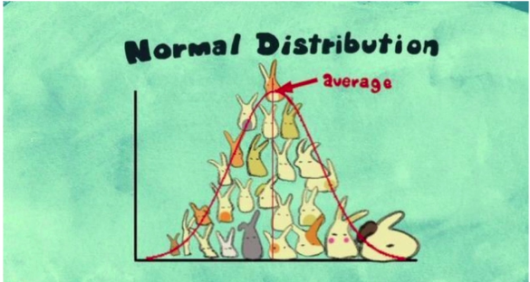
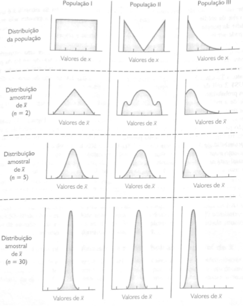

# Amostragem

<style>
.highlightRed { background-color:#ffcdd2; }
.highlightBlue { background-color:#bbdefb; }
.highlightGreen { background-color:#a2fca2; }
.highlightAmber { background-color:#ffecb3; }
</style>

A amostragem é a técnica, processo ou pesquisa que podem ser realizadas para obter uma amostra. A qual utiliza-se coleta, organização, apresentação e análise dos dados como meio de estudar os parâmetros de uma população.

Faz-se uso da amostragem devido ao fato de nem sempre ser possível ou desejável testar toda a população para se obter os parâmetros e conclusões desejadas. A amostragem é uma estimativa, e portanto tal, se torna mais assertiva pelo uso de técnicas de amostragem e pela regulação dos níveis de confiança.

- Prós
  - Economia de tempo e dinheiro
  - Pode-se obter uma acurácia/ precisão muito próxima do uso da população
    - A [margem de erro](#_phy34zavw3s0) pode ser calculada
- Contras
  - Não pode ser feito “de qualquer jeito”
  - É preciso conhecimento e aplicação de técnicas
- Pontos de atenção
  - O encaixe da técnica **x** dados **x** objetivos precisa ser bem avaliada
  - Caso contrário irá produzir anomalias que irão inutilizar os dados

## Probabilística
- Características
  - Objetiva
  - Escolha aleatória
  - Sorteio não viciado
  - Probabilidade conhecida dos elementos serem escolhidos
  - todos têm alguma chance de serem escolhidos
  - Distribuição amostral pode ser identificada
  - Erro amostral pode ser calculado - amostragem pode ser avaliada 

### Aleatória simples
#### População Finita
Trata-se de uma coleta dentro de uma população finita onde todos os elementos têm a mesma probabilidade de serem selecionados. Comumente é utilizada de sem substituição ( após um elemento ser selecionado ele sai da lista.

Para tanto, é feita a coleta na população até que se obtenha o tamanho da amostra desejado, por meio de um método de sorteio não viciado, onde pode-se realizar a amostragem com ou sem substituição.

#### População Infinita
São consideradas populações infinitas:

- Populações não contadas / listadas
- Populações muito grandes
- Populações contínuas (cliente em um restaurante)

Nesses casos, para que a amostragem seja feita de forma correta, deve-se satisfazer as seguintes condições:

- Cada elemento selecionado vem dessa população
- Cada elemento é selecionado de forma independente

O número de amostras aleatórias simples de tamanho n que podem ser obtidas de uma população infinita tamanho N é dado por:

$$\frac{N!}{n!(N - n!)}$$

#### População Amostrada

A amostra coletada não se dá exatamente da população de interesse (população alvo) mas de uma população mais acessível, conveniente.

Ex. Busca-se conhecer os hábitos noturno de mulheres divorciadas com mais de 40 anos. Para tanto se extrai uma amostra em uma grande cidade para estudo.

- População alvo: mulheres divorciadas com mais de 40 anos do país
- População amostrada: mulheres divorciadas com mais de 40 anos da cidade amostrada

Pode-se então obter conclusões válidas apenas para os elementos da grande cidade (população amostrada), mas se pode usar o julgamento do pesquisados para extrapolar os resultados para a população alvo (com cautela e reservas). 

### Sistemática

A amostragem sistemática é útil quando se trata de grandes populações, onde seria um trabalho muito dispendioso utilizar o método da amostragem aleatória simples. A partir da definição do tamanho da amostra desejado, o índice é definido a partir da fórmula:

$$i = \frac{N}{n}$$

$i = índice$

$n = \textrm{ tamanho da amostra desejada}$

$N =\textrm{tamanho da população}$

A partir do índice, pode-se escolher duas abordagens:

- Selecionar aleatoriamente um dos primeiros **i** elementos da lista da população
- E  selecionar na lista, a partir do elemento anteriormente escolhido, o i° elemento, seguidas vezes, até completar a amostra desejada
  - Por exemplo, a cada 100 biscoitos que passam na linha de produção, um é selecionado para teste.

<span class="highlightRed">A desvantagem é que a população precisa ser listada e estando ordenada, precisa-se ter cuidado para não haver algum tipo de periodicidade nos dados. E precisa ser o mais  homogênea possível, para não haver enviesamento.</span>

### Estratificada

Na amostragem aleatória estratificada os dados são divididos em estratos (grupos), de forma sistemática, de forma que cada elemento pertença a somente um estrato. Um estrato pode ser formado a partir de : idade, departamento, local, tipo de indústria, etc.

Os melhores resultados são obtidos quando os <span class="highlightAmber"> elementos de um estrato são os mais similares possíveis. </span> Pois quanto maior a homogeneidade do grupo, menor o enviesamento da amostra.

Após ser formado os estratos, uma amostra aleatória simples é extraída de cada um deles. Há fórmulas disponíveis para se combinar os resultados das amostras de estrato individuais em uma estimativa do parâmetro populacional de interesse.

### Conglomerados (cluster)

Na amostragem por conglomerados os elementos da população são divididos em grupos distintos chamados de conglomerados, onde cada elemento pertence somente a um conglomerado. Os conglomerados devem ser o mais diversos possível, pois devem ser uma pequena amostra representativa da população.

Uma das principais aplicações da amostragem por conglomerados é a amostragem por áreas, em que os conglomerados são quarteirões de uma cidade ou outras áreas bem definidas.

<span  class="highlightRed">A amostragem por conglomerados geralmente requer uma amostra maior que a amostragem aleatória simples ou a amostragem aleatória estratificada.</span>

### Reamostragem (bootstrap)

- Características
  - Várias amostras (com reposição) são repetidamente extraídas da população
    - pode-se estimar parâmetros da população como média e proporção

## Não probabilística

- Características
  - Subjetiva -> decisão do pesquisador
  - Não tem a mesma probabilidade entre si de serem escolhidos
  - Probabilidade dos elementos serem escolhidos é desconhecida
  - Não é possível avaliar a qualidade dos dados amostrais em relação à população
- Ex
  - Pesquisa social
  
### Conveniência ou acessibilidade

A amostragem por conveniência é uma técnica onde a amostra é identificada primeiramente por conveniência. Os elementos são incluídos sem probabilidades previamente especificadas ou conhecidas de serem selecionada. 

São exemplos: 

- selecionar laranjas de engradados aleatórios (contar e rotular todas as laranjas seria impraticável)
- grupos de voluntários para pesquisa de consumidores (são voluntários, não aleatórios)
- captura de animais selvagens para análise de hábitos ( não é aleatório, ou rotulado, é o que estava disponível)

A vantagem da amostra por conveniência é a facilidade de coleta e análise dos dados, entretanto, não se pode avaliar a excelência da amostral em termos da sua representatividade em relação à população.

### Intencional ou por Julgamento

Na amostragem por julgamento, o pesquisador escolhe os elementos que considera serem os mais representativos da população. 

Por exemplo, selecionar como amostra a opinião de dois ou três senadores, julgando que estes representam a opinião geral de todos os senadores. 

No caso, a qualidade da amostra depende da qualidade do julgamento da pessoa que faz a escolha.

## Estimação por ponto

As médias($\bar{x}$), desvios padrão($s$) e proporções ($\bar{p}$) entrados em amostras são chamadas estimação por ponto da média($\mu$), desvio padrão($\sigma$) e proporção da população($p$).

- Parâmetro = População
- Estatística amostral = amostra

Quando o  valor esperado de um estimador por ponto é igual ao parâmetro populacional, o estimador é considerado sem viés.

### Distribuição amostral de $\bar{x}$

$\bar{x}$  = média da amostra

Qualquer estimação por ponto possui uma margem de erro, como pode ser observado no exemplo abaixo:


| Parâmetros Populacionais | Valor                                                                   | Parâmetros Amostrais | Valor |
| :----------------------- | :---------------------------------------------------------------------- | :------------------- | :---- |
| μ - Salário Médio anual                                                     | 51.800               | $\bar{x}$ - Salário Médio anual                                                     | 51.814 |
| σ - Desvio Padrão do salário                                                | 4.000                | s -Desvio Padrão do salário                                                | 3.348  |
| p - Proporção da população que concluiu o programa de treinamento gerencial | 0,60                 | $\bar{p}$  - Proporção da população que concluiu o programa de treinamento gerencial | 0,63   |

Para diminuir o erro da estimação de média, podemos realizar diversas coletas de amostras na população e tirar a média de cada uma dessas amostras.

Como $\bar{x}$ também é uma variável aleatória e podemos a partir dela fazer uma distribuição amostral.

A tabela de distribuição de frequência abaixo ilustra o processo de coleta de 500 amostras aleatórias numa população de 2500 registros.

| Salário Anual Médio ($) | Frequência | Frequência Relativa |
|-------------------------|------------|---------------------|
| 49.500,00 - 49.999,99   | 2          | 0,004               |
| 50.000,00 - 50.499,99   | 16         | 0,032               |
| 50.500,00 - 50.999,99   | 52         | 0,104               |
| 51.000,00 - 51.499,99   | 101        | 0,202               |
| 51.500,00 - 51.999,99   | 133        | 0,266               |
| 52.000,00 - 52.499,99   | 110        | 0,220               |
| 52.500,00 - 52.999,99   | 54         | 0,108               |
| 53.000,00 - 53.499,99   | 26         | 0,052               |
| 53.500,00 - 53.999,99   | 6          | 0,012               |
| **Total**                   | **500**        | **1**                   |

```{r}

amostra = read.csv(file = "data/EAI.csv", sep = ",", as.is = F)
str(amostra)

media_amostras <- c()
proporcao_amostras <- c()
for(i in 1:500) {
  coleta = sample(amostra$Salary,30, replace = T)
  media_amostras <- append(mean(coleta),media_amostras)
  coleta = sample(amostra$Training,30, replace = T)
  proporcao_amostras <-append(prop.table(table(coleta))["Yes"],proporcao_amostras)

}

hist(media_amostras, breaks = seq(40000, 60000, 500 ), main = "Histograma de frequência relativa dos valores da média de \n 500 amostras aleatórias simples com tamanho 30 cada uma", ylab = "Frequência Relativa", xlab = "Valores das médias das amostras")
hist(proporcao_amostras, breaks = seq(0.10,0.99,0.08),main = "Histograma de frequência relativa dos valores da proporção de \n 500 amostras aleatórias simples com tamanho 30 cada uma", ylab = "Frequência Relativa", xlab = "Valores médios das proporções das amostras")

```


A distribuição amostral de x é a distribuição de probabilidade de todos os valores possíveis da amostrais de x

#### Valor esperado

É a média de todos os possíveis valores de x que podem ser gerados a partir das amostras aleatórias simples. 

$$ E (\bar{x}) = \mu $$

#### Desvio Padrão

O desvio padrão de $\bar{x}$ é chamado de erro padrão da média. Em geral, o termo erro padrão se refere ao desvio padrão de um estimador por ponto.  Neste caso será útil para demonstrar quão distante a média amostral se encontra da média da população.

##### População Finita

$$\sigma_{\bar{x}}=\sqrt{\frac{N - n}
                              {N - 1} (\frac{\sigma}
                                      {\sqrt{n}})}$$

$\sqrt{\frac{N-n}{N-1}}$ = Fator de correção para populações finitas

##### População Infinita

Utiliza-se esta fórmula para populações infinitas e populações finitas onde o tamanho da amostra for menor ou igual a 5% do tamanho da população, ou seja, $\frac{n}{N} ≤0,05$. Isto porque, o fator de correção para populações finitas terá pouca influência sobre o resultado.

$$\sigma_{\bar{x}}=\frac{\sigma}
                        {\sqrt{n}}$$

No exemplo acima temos que:

$\frac{n}{N} ≤0,05$

$\frac{30}{2500} = 0,012 ≤0,05$

Portanto utilizaremos a fórmula da população infinita.

$$\sigma_{\bar{x}}=\frac{\sigma}
                        {\sqrt{n}}$$

$\sigma_{\bar{x}}=\frac{4000}
                        {\sqrt{30}}=730,3$

#### Forma da Distribuição Amostral de $\bar{x}$ 

Dado o [Teorema do Limite Central](#_4lvujapuzgsk), podemos afirmar que a amostra de gerentes está normalmente distribuída, pelo fato de n ≥ 30. 

O valor da média da amostra é sempre utilizada para aproximar o valor da média da população. Porém, como se pode saber o quão aproximada essa média se encontra? Se o observarmos a média das 500 amostras, veremos que algumas se distanciam em torno de 2 mil dólares da média da população, no caso, seria aceitável uma amostra que se distancia tanto da média da população? 

Caso fosse solicitado que a média da amostra estivesse dentro de 500 dólares da média da população, qual a probabilidade disso ocorrer?

Sabendo-se que a média populacional é de 51.800, qual a probabilidade da média amostral estar entre 51.300 e 52.300? 

A probabilidade é dada pela área sob a curva sombreada:


```{r, echo=FALSE,warning=FALSE,message=FALSE,error=FALSE, results='hide',fig.keep='all'}
library(tigerstats)
mean=51800; sd=730.3
lb=51300; ub=52300

x <- seq(-4,4,length=100)*sd + mean
hx <- dnorm(x,mean,sd)

plot(x, hx, type="n", xlab="A probabilidade de uma média amostral estar dentro de US$500 da média da população", ylab="",
  main="Normal Distribution\n", yaxt="none")


i <- x >= lb & x <= ub
lines(x, hx)
polygon(c(lb,x[i],ub), c(0,hx[i],0), col="#ffcdd2")
z1 = (ub-mean)/sd
z2 = (lb-mean)/sd
area <- pnorm(round(z1,2)) -pnorm(round(z2,2)) 
result <- paste("P(",lb,"< X <",ub,") =",
   signif(area, digits=4))
mtext(result,3)
axis(1, at=seq(40, 160, 20), pos=0)
abline(v=mean, col="blue",lty=3, lwd=2)

pnormGC(c(lb,ub),region="between",mean=mean,
        sd=sd,graph=TRUE)

```

A fórmula correspondente seria então:

$$
z = \frac{x_1 - \mu}
          {\sigma_\bar{x}}
$$

$z = \frac{51.300 - 51.800}{730,3} = - 0,68$

$$
z = \frac{x_2 - \mu}
          {\sigma_\bar{x}}
$$

$z = \frac{52.300 - 51.800}{730,3} = 0,68$

Consultando a tabela da distribuição normal verificamos a área entre 

- $z = 0$ e $z = 0,68$ é $0,2517$ 
- $z = 0$ e $z = -0,68$ é  $0,2517$

Portanto, a probabilidade de o valor da média da amostra estar entre 51.300 - 52.300 é 0,2517 + 0,2517 = 0,5034.

E analogamente, a probabilidade da amostra estar fora do intervalo de 51.300 - 52.300 é de 1 - 0,5034 = 0,4966

Portanto, a probabilidade é de aproximadamente 50-50 de produzir uma média amostral dentro dos limites de 500 dólares.

<span class=highlightAmber>Seria uma tamanho de amostra maior a solução para que a probabilidade da média fique contida no intervalo ?<span>

Dada uma amostra de n = 100 teremos um erro amostral (desvio padrão):

$$ \sigma_\bar{x} = \frac{\sigma}{\sqrt{n}}
$$

$\sigma_\bar{x} = \frac{4000}{\sqrt{100}}=400$


Como podemos observar, o erro padrão diminui, portanto a distribuição muda de forma, se torna mais acentuada:

```{r}

mean=51800; 
sd=730.3;
sd_2 <-400

lcb <- ((mean - (3 * sd)) - 5)
ucb <- ((mean + (3 * sd)) + 5)

u <- seq(from = lcb,
         to = ucb)
v1 <- dnorm(x = u,
            mean = mean,
            sd = sd)
v2 <- dnorm(x = u,
            mean = mean,
            sd = sd_2)
ggplot(data = data.frame(u = c(lcb, ucb)),
       mapping = aes(x = u)) +
  stat_function(mapping = aes(colour = "n=30 sd=730.3"),
                fun = dnorm,
                args = list(mean = mean,
                            sd = sd)) +
  stat_function(mapping = aes(colour = "n=100 sd=400"),
                fun = dnorm,
                args = list(mean = mean,
                            sd = sd_2)) +
  scale_colour_manual(values = c("red", "blue")) +
  labs(x = "salários",
       y = "densities",
       title = "Comparação entre distribuições com 30 e 100 elementos para \n amostras aleatórias simples dos salários dos gerentes EAI")


```


Agora, se formos considerar a probabilidade da média amostral se encontrar em torno de 500 dolares da média populacional teremos:

$$z = \frac{x_1 - \mu}{ \sigma_\bar{x}}$$

$z = \frac{51.300 - 51.800}{400} = -1,25$

$$z = \frac{x_2 - \mu}{ \sigma_\bar{x}}$$

$z = \frac{52.300 - 51.800}{400} = 1,25$

Consultando a tabela da distribuição normal verificamos a área entre 

- $z = 0$ e $z = 1,25$ é $0,3944$
- $z = 0$ e $z = -1,25$ é  $0,3944$

Portanto, a probabilidade de o valor da média da amostra estar entre 51.300 - 52.300 é 0,3944 + 0,3944 = 0,7888.

E analogamente, a probabilidade da amostra estar fora do intervalo de 51.300 - 52.300 é de 1 - 0,5034 = 0,2112

Portanto, a probabilidade do intervalo (51.300 - 52.300 ) conter a média populacional aumentou de 0,5034 para 0,7888

Obs: Demonstrações teóricas do teorema do limite central requerem observações independentes, ou seja, amostragem com substituição.

```{r}
lb<-51300
ub<-52300
sd<-400
mean<-51800
pnormGC(c(lb,ub),region="between",mean=mean,
        sd=sd,graph=TRUE)
```

### Distribuição amostral de $\bar{p}$

A proporção amostral $\bar{p}$ é o estimador por ponto da proporção p da população. E é dado por:

$$\bar{p} =\frac{x}{n}$$

$x =\textrm{número de elementos da amostra com a característica de interesse}$

$n = \textrm{o tamanho da amostra}$

#### Valor esperado de $\bar{p}$

O valor esperado de $\bar{p}$ , que é a média de todos os valores possíveis de $\bar{p}$ , é igual a proporção populacional de p

$$E(\bar{p} ) = p$$

$E(\bar{p} )= \textrm{o valor esperado de } \bar{p}$

$p = \textrm{proporção populacional}$

#### Desvio padrão de $\bar{p}$  

O desvio padrão de $\bar{p}$ é chamado de erro padrão da proporção. Em geral, o termo erro padrão se refere ao desvio padrão de um estimador por ponto.  Neste caso será útil para demonstrar quão distante a proporção amostral se encontra da proporção da população.

##### População Finita

$$\sigma_\bar{p} = \sqrt{\frac{N-n}{N-1}}
\sqrt{\frac{p(1 - p)}{n}}$$


$\sqrt{\frac{N-n}{N-1}}= \textrm{Fator de correção para populações finitas}$

##### População Infinita

Utiliza-se esta fórmula para populações infinitas e populações finitas onde o tamanho da amostra for menor ou igual a 5% do tamanho da população, ou seja,$\frac{n}{N}≤0,05$ . Isto porque, o fator de correção para populações finitas terá pouca influência sobre o resultado.


$$\sigma_\bar{p} = 
\sqrt{\frac{p(1 - p)}{n}}$$

No exemplo acima, temos que:

$\frac{n}{N}$ ≤0,05

$\frac{30}{2500}= 0,012 ≤ 0,05$ 

Portanto utilizaremos a fórmula da população infinita:

$$\sigma_\bar{p} = 
\sqrt{\frac{p(1 - p)}{n}}$$

$\sigma_\bar{p} = 
\sqrt{\frac{0,60(1 - 0,60)}{100}} = 0,0894$

Se amostra fosse aumentada para 100:

$$\sigma_\bar{p} = 
\sqrt{\frac{p(1 - p)}{n}}$$

$\sigma_\bar{p} = 
\sqrt{\frac{0,60(1 - 0,60)}{100}} = 0,049$

#### Forma da distribuição amostral de $\bar{p}$

Agora para determinarmos a forma da distribuição de $\bar{p}$, devemos considerar que esta se trata de uma variável aleatória binomial (ou é característica específica ou não ( “sucesso ou fracasso”) que indica o número de elementos na população que possuem a variável de interesse. 

Dado que a proporção é dada por $\bar{p} = \frac{x}{n}$ e n é uma constante, a probabilidade $\frac{x}{n}$ é idêntica a probabilidade binomial de x, o que significa que a distribuição amostral de $\bar{p}$ também é uma distribuição discreta de probabilidade e que a probabilidade correspondente a cada valor de $\frac{x}{n}$  é idêntica a probabilidade binomial de x.

Sendo satisfeitas as condições:

- $n × p ≥ 5$
- $n ( 1 - p) ≥ 5$

A distribuição de probabilidade de x pode ser aproximada por meio de uma distribuição normal. E desde que n seja uma constante a distribuição amostral de $\bar{p} = \frac{x}{n}$  também pode. 

Caso fosse desejado saber a probabilidade da proporção amostral se encontrar em 0,05 da média populacional, teríamos:

$P( 0,55- 0,65)$

$$z = \frac{x_1 - \mu}{ \sigma_\bar{x}}$$

$z = \frac{0,55 - 0,60}{ 0,0894}=-0,56$

$$z = \frac{x_2 - \mu}{ \sigma_\bar{x}}$$

$z = \frac{0,65 - 0,60}{ 0,0894}= 0,56$

Consultando a tabela da distribuição normal verificamos a área entre 

- $z = 0$ e $z = 0,56$ é $0,2123$
- $z = 0$ e $z = -0,56$ é  $0,2123$

Portanto, a probabilidade de o valor da proporção da amostra estar entre 0,55- 0,65 é 0,2123 + 0,2123 = 0,4246.

```{r}
lb<-0.55
ub<-0.65
mean<-0.60
sd<-0.0894

pnormGC(c(lb,ub),region="between",mean=mean,
        sd=sd,graph=TRUE)
```

E analogamente, a probabilidade da amostra estar fora do intervalo de 0,55- 0,65 é de 1 - 0,4246 = 0,5754

Se a amostra fosse aumentada para 100:

$$z = \frac{x_1 - \mu}{ \sigma_\bar{x}}$$

$z = \frac{0,55 - 0,60}{ 0,049}=-1,02$

$$z = \frac{x_2 - \mu}{ \sigma_\bar{x}}$$

$z = \frac{0,65 - 0,60}{ 0,049}= 1,02$

Consultando a tabela da distribuição normal verificamos a área entre 

- $z = 0$ e $z = 1,02$ é $0,3461$
- $z = 0$ e $z = -1,02$ é  $0,3461$

Portanto, a probabilidade de o valor da proporção da amostra estar entre 0,55- 0,65 é 0,3461 + 0,3461 = 0,6922.

E analogamente, a probabilidade da amostra estar fora do intervalo de 0,55- 0,65 é de 1 - 0,6922 = 0,3078

```{r}
lb<-0.55
ub<-0.65
mean<-0.60
sd<-0.049

pnormGC(c(lb,ub),region="between",mean=mean,
        sd=sd,graph=TRUE)
```


## Estimação por intervalo

Dado que um estimador por ponto é uma estatística da amostra usada para estimar um parâmetro populacional e que não se pode esperar que um estimador produza o valor exato da do parâmetro populacional, uma **estimação por intervalo** frequentemente é calculada adicionando ou subtraindo-se um valor, denotado de **margem de erro**, ao estimador por ponto. A forma geral da estimação por ponto é dada por:

<span class="highlightBlue">Estimação por ponto ± Margem de erro</span>

A finalidade de uma estimação por intervalo é fornecer informações sobre o quão próximo o estimador por ponto, produzido pela amostra, está do valor do parâmetro populacional.

### Média da população : Desvio Padrão (σ)Conhecido

Para desenvolver uma estimação por intervalo da média populacional o <span  class="highlightGreen"> desvio padrão</span> da população σ ou o s da amostra devem ser conhecidos <span class="highlightGreen"> para se calcular a margem de erro </span>. Sendo o σ desconhecido, utiliza-se o s.

Tendo-se grandes quantidades de dados históricos, pode-se calcular o σ da população antes de se fazer a amostragem, assim como em situações de controle de qualidade nas quais se supõe que um processo esteja operando corretamente.

Exemplo:

Dado um histórico de compras normalmente distribuído, de desvio padrão de 20 dólares, uma amostra de 100 clientes é retirada e obtendo-se uma média $\bar{x}= 82 $ dólares por compra. Sabemos, que a estimação por ponto possui um erro padrão (desvio padrão da estimação por ponto) de:

$$\sigma_x=\frac{\sigma}{\sqrt{n}}$$

$\sigma_x=\frac{20}{\sqrt{100}} =2$

Consultando a tabela de score z sabemos que numa distribuição normal, 95% dos valores estarão contidos em um desvio padrão de ±1,96 desvio padrão da média. Sabendo então que o desvio padrão da amostra é 2:

$1,96 × \sigma$

$1,96 × 2 = 3,92$

Podemos então concluir que 95% de todos os valores da média da amostra ($\bar{x}$) estarão contidos em ± 3,92 da média populacional $\mu$.

$82 + 3,92 = 85,92$

$82 - 3,92 = 78,08$

```{r}
mean<-82
sd<-2

qnormGC(0.95,region="between",mean=mean,
        sd=sd,graph=TRUE)
```


Portanto, podemos concluir com grau de confiança de 95% que o intervalo de 78,08 - 85,92 contém a média populacional μ.


<span class=highlightGreen>**0,95** = coeficiente de confiança</span>

<span class=highlightGreen>**78,08 - 85,92** = intervalo de confiança de 95%</span>

A forma geral da estimação por intervalo é dada por:

$$\bar{x} ±  z_\frac{\alpha}{2} \frac{\sigma}{\sqrt{n}} $$

$( 1 - \alpha) = \textrm{coeficiente de confiança}$

$\alpha = \textrm{Nível de significância}$

$z_\frac{α}{2} = \textrm{é o valor de z que produz uma área de α/2  na cauda superior da distribuição normal padrão de probabilidade}$

$z_\frac{\alpha}{2} = \textrm{Semi amplitude}$

### Média da população: Desvio Padrão ( σ) Desconhecido 

Quando o σ populacional é desconhecido é necessário utilizar-se a mesma amostra para se estimar o μ  e o σ . Nos casos em que o s é usado para estimar o σ a margem de erro e a estimação por intervalo da média populacional baseiam-se em uma distribuição de probabilidade chamada de **Distribuição t.**


Isso porque como não se trabalha com o Desvio Padrão da população, não se pode mais trabalhar com a curva normal ou com as probabilidades dadas pela áreas de curva normal. A Distribuição T de Studant traz um fator de correção por se trabalhar com o desvio padrão da amostra, ou seja, um menor nível de precisão.

#### Distribuição de Probabilidade T de Studant

A distribuição T de Student é uma distribuição de probabilidade estatística, publicada por um autor que se

chamou de Student, pseudônimo de William Sealy Gosset, que não podia usar seu nome verdadeiro para publicar trabalhos enquanto trabalhasse para a cervejaria Guinness.

A distribuição t também tem a forma normal e é simétrica sobre a média. A média, moda e mediana são iguais à zero. A principal diferença é que <span class="highlightGreen">a distribuição t tem mais áreas nas caudas, fazendo com que seus valores críticos sejam maiores que os da distribuição Normal.</span> Como consequência, o intervalo de confiança usando a distribuição t ficará mais largo se usa-se a distribuição Normal. A idéia aqui é que você deve pagar um preço por trabalhar com pequenas amostras.

<span class="highlightGreen">Cada tamanho amostral possui sua própria distribuição t</span>, ou seja, ao contrário da distribuição normal, a distribuição t não tem forma fixa, mas sim uma família de curvas. Cada curva é determinada por um parâmetro chamado grau de liberdade, encontrado pelo tamanho da amostra menos um (GL = n - 1). A idéia aqui é que o preço a ser pago por se ter uma amostra muito pequena, como 5, é mais alto do que o preço por se ter uma amostra de tamanho um pouco maior, como 10 ou 20. A medida que o número de graus de liberdade aumenta, a diferença entre a distribuição t e a distribuição normal padrão torna-se cada vez menor, acima de 30 graus de liberdade a diferença é tão insignificante que pode-se trabalhar com a normal.

O **grau de liberdade** se refere ao número de valores que são livres para variar após estabelecerem algumas restrições de dados.

V = (n - 1) graus de liberdade
```{r}
x <- seq(-3, 3, length=100)
hx <- dnorm(x)

degf <- c(1, 3, 8, 30)
colors <- c("#ef5350", "#29b6f6", "#66bb6a", "#ffca28", "black")
labels <- c("df=1", "df=3", "df=8", "df=30", "normal")

plot(x, hx, type="l", lty=1,lwd=3, xlab="x value",
  ylab="Density", main="Comparison of t Distributions")

for (i in 1:4){
  lines(x, dt(x,degf[i]), lwd=2, col=colors[i])
}

legend("topright", inset=.05, title="Distributions",
  labels, lwd=2, lty=c(1, 1, 1, 1, 1), col=colors)
```


##### Graus de liberdade

Podemos definir graus de liberdade de diversas maneiras:

- O número de elementos que são livres para variar
- Maneira de quantificar as estimativas métricas para um cálculo estatístico qualquer
- O número de determinações independentes (dimensão da amostra) menos o número de parâmetros estatísticos a serem avaliados na população
- <span class=highlightGreen> Medida da dependência das suas estimativas (das suas métricas estatísticas) em relação a sua amostragem</span>

Ou seja, nada mais que é que uma <span class=highlightGreen>maneira de contar quantos parâmetros já foram estimados para que se possa calcular uma outra estimativa e descontando isso do número de observações</span>,  trata-se da independência entre os termos a partir do tamanho da sua observação.

Quanto menos graus de liberdade você tem, mais restritivo vai sendo pra se achar uma diferença significativa - porque as estimativas vão ficando dependentes umas das outras  e a penalização é a diminuição da confiança !

Por exemplo, no caso de se estimar a variância de uma população a partir da amostra, temos uma amostra com n observações, para calcular a variância é preciso calcular a média, logo sobram n-1 graus de liberdade para calcular a variância, pois existe uma dependência entre as estimativas

Para calcular a variância para dois grupos de dados sabemos que para calcular a variância é preciso calcular  duas médias (uma de cada grupo) portanto, e sobram n1+ n2 – 2 graus de liberdade para calcular a variância.

#### Margem de erro

A estimação por intervalo de uma média populacional com σ conhecido é dada por:

$$\bar{x} ± z_\frac{\alpha}{2}\frac{\sigma}{\sqrt{n}}$$

No entanto, para calcular a estimação por intervalo de μ para o caso de σ desconhecido , o desvio padrão da amostra é usado para estimar σ e $z_\alpha/2$ é substituído pelo valor da distribuição t, $t_\alpha/2$. A margem de erro é dada

```{r}
qnormGC(0.025,region="above",mean=0,
        sd=1,graph=TRUE)
```


Com essa margem de erro a expressão geral de uma estimação por intervalo de uma média populacional quando o σ é desconhecido é dado por:

$$\bar{x} ± t_\frac{\alpha}{2}\frac{s}{\sqrt{n}}$$

$( 1 - α) = \textrm{ coeficiente de confiança}$

$α = \textrm{Nível de significância}$

$s = \textrm{Desvio padrão da amostra}$

$t_\frac{α}{2}  = \textrm{ é o valor de t que produz uma área de α/2  na cauda superior da dist. t de probabilidade com n - 1 graus de liberdade}$

$t_\frac{α}{2} = \textrm{ Semi amplitude}$

A razão pela qual o número de graus de liberdade associado ao valor de t é **n - 1** refere-se ao uso de **s** como uma estimativa do desvio padrão **s** da população. A expressão de desvio padrão da amostra é :

$$s =\sqrt{ \frac{\sum(x_i- x)^2}{n - 1}}$$

Exemplo:

Dada um conjunto de saldos de cartão de crédito em uma amostra de 85 famílias, onde os parâmetros populacionais são desconhecidos, desenvolva uma estimativa de 95% de confiança para média e desvio padrão populacionais.

A média amostral é : 5.900

O desvio Padrão amostral é: 3.058

Dado:

- 95% de confiança
- n - 1 graus de liberdade
  - grau de liberdade = 85 -1  →  84
- t0,025 = 1,989   → De acordo com tabela t

$$ \bar{x}\pm t_\frac{\alpha}{2} \frac{s}{\sqrt{n}}
$$

$5900 ± 1,989  \frac{3.058}{\sqrt{85}}$

$45900 ± 6604$

Portanto a estimação por intervalo, com confiança de 95% é :

$5.240 ≤ μ ≤ 6560 $

```{r, echo=FALSE,warning=FALSE,message=FALSE,error=FALSE, results='hide',fig.keep='all'}
saldos <- read.csv(file = "data/Balance.csv", sep = ",")

resultado<- t.test(x = saldos$Balance, conf.level = .95, )

sd(saldos$Balance)
resultado["estimate"]
resultado["stderr"]
resultado["parameter"]
resultado["conf.int"]
```


### Determinação do tamanho da amostra

Se uma margem de erro for escolhida antes da amostragem, o procedimento a seguir é útil para determinar o tamanho de amostra mínimo necessário para satisfazer os requisitos da margem de erro:

$$n = \frac{(z_{\frac{α}{2}})^2σ^2}{E^2}$$

$E= \textrm{margem de erro escolhida}$

$z_{\frac{α}{2}} = \textrm{grau de confiança a ser usado na estimação por intervalo}$

$α = \textrm{Nível de significância}$

$σ = \textrm{Desvio padrão planejado}$

O valor de σ pode ser conhecido ou planejado, o qual pode ser obtido a partir dos seguintes procedimentos:

- Usar a estimativa do desvio padrão da populacional, calculada a partir de dados históricos
- Usar um estudo piloto para selecionar uma amostra preliminar e calcular o desvio da amostra
- Usar julgamento ou melhor palpite de σ, que pode ser calculada pela amplitude dividida por quatro. É uma aproximação tosca, porém aceitável para  σ.

### Proporção da população

De forma geral, a estimação por intervalo de uma proporção é dada por:

$$p ± \textrm{Margem de erro}$$

A distribuição amostral de $\bar{p}$ desempenha um papel fundamental no cálculo da margem de erro dessa estimação por intervalo. Sabe-se que a distribuição amostral de $\bar{p}$ pode ser aproximada por meio de uma distribuição normal quando:

$$n × p ≥ 5$$   


$$n (1 - p) ≥ 5$$ 


<span class="highlightAmbar">A média da distribuição amostral de $\bar{p}$ </span>é a proporção  p da população.

O desvio padrão de $\bar{p}$  é dado por:

$$σ_{\bar{p}}= \sqrt{\frac{p(1 - p)}{n}}$$

Dado que a distribuição amostral de  $\bar{p}$ está normalmente distribuída:

- se $z_{\frac{α}{2}}σ_\bar{p}$ for escolhida como a margem de erro de uma estimação por intervalo de uma proporção populacional, saberemos que 100( 1 - α)% dos intervalos gerados conterão a proporção populacional verdadeira
  - Mas $σ_\bar{p}$ não pode ser utilizado diretamente no cálculo da margem de erro, pois p não será conhecido, p é justamente o que se deseja estimar
  - Então se substitui p por $\bar{p}$ e temos
    - $\textrm{Margem de erro} = z_{\alpha /2} \sqrt{\frac{\bar{p}(1 - \bar{p})}{n}}$
 
    - Margem de erro 0,1 é ok. Pesquisas de opinião pública trabalham com 0,3 - 0,4

Temos então que a expressão geral da <span class="highlightGreen">estimação por intervalo de uma proporção populacional:</span>

$$\bar{p} ± z_{\alpha /2} \sqrt{\frac{\bar{p}(1 - \bar{p})}{n}}$$

$z_{α/2} = \textrm{é o valor de z que produz a área igual a  α/2 na cauda superior da distribuição normal padrão}$

$1 - α = \textrm{Coeficiente de confiança}$

Exemplo:

Dado uma amostra de 900 jogadoras de golfe de uma pesquisa a respeito da satisfação com o tratamento dados às mulheres nos cursos de golfe nos EUA. A pesquisa revelou que 396 mulheres estavam satisfeitas, portanto tem-se a proporção de 44% de mulheres satisfeitas. Fazendo o cálculo com 95% de confiança, temos o intervalos de:

$$\bar{p} ± z_{\alpha /2} \sqrt{\frac{\bar{p}(1 - \bar{p})}{n}}$$
$0,44 ± 1,96 \sqrt{\frac{0,44( 1 - 0,44)}{900}}$

$0,44 ± 0,0324$

Temos portanto uma margem de erro de 0,0324 e a estimação por intervalo de confiança de 95% da proporção da população é de $( 0,4076 ≤ p ≤ 0,04724)$ em porcentagem, temos uma proporção entre 40,76 e 47,24 de todas as mulheres golfistas estarem satisfeitas.


#### Determinação do tamanho da amostra

Para se determinar o tamanho da amostra necessário para se obter uma estimativa da proporção populacional com um grau de confiança específico, utiliza-se um pensamento análogo ao utilizado para estabelecer o tamanho da amostra para estimar a média populacional.

Temos portanto:

- a margem de erro é dada por:  $$z_{α/2} =\sqrt{\frac{ \bar{p}( 1 - \bar{p})}{n}}$$
  - esta se baseia no valor de $z_{α/2}$  na proporção de p da amostra e no tamanho n da amostra, tendo portanto que tamanhos de amostras maiores maiores produzem margens de erro menores
  - Digamos que E denote a margem de erro:  
  
$$E = z_{α/2} \sqrt{\frac
  { \bar{p}( 1 - \bar{p})}{n}}$$
  
- Isolando o **n** na equação, produz-se a fórmula do tamanho da amostra que fornecerá uma margem de erro de tamanho E: 
$$n = \frac{(z_{α/2})^2 \bar{p} (1 - \bar{p} )}{E^2}$$

  - Entretanto, não podemos utilizar essa fórmula, para calcular o tamanho da amostra pois p somente será conhecido depois de selecionarmos a amostra. Para contornar, utilizaremos um valor planejado de $\bar{p}$  o $p^*$

Temos então que a fórmula para calcular o tamanho da amostra para uma estimação por intervalo de uma proporção populacional é dada por:

$$n = \frac{(z_{α/2})^2 p^* (1 - p^* )}{E^2}$$

$p^*$ = Valor planejado de $\bar{p}$

O valor planejado $p^*$ pode ser obtido:

- Usando a proporção de uma amostra anterior das mesmas unidades ou de unidades similares
- Usando um estudo piloto para selecionar uma amostra preliminar
- Usando o julgamento ou melhor palpite para o valor planejado de $p^*$
- Usando o valor planejado de  $p^* = 0,50$. Caso nenhuma das alternativas anteriores seja apropriada.

Exemplo:

Dado uma amostra de 900 jogadoras de golfe de uma pesquisa a respeito da satisfação com o tratamento dados às mulheres nos cursos de golfe nos EUA. A pesquisa revelou que 396 mulheres estavam satisfeitas, portanto tem-se a proporção de 44% de mulheres satisfeitas. Fazendo o cálculo com 95% de confiança, obtemos o intervalo de $( 0,4076 ≤ p ≤ 0,04724)$ para  a proporção populacional de mulheres satisfeitas.

Supondo que haja interesse de se fazer uma nova pesquisa, qual o tamanho da amostra necessário para uma margem de erro de 0,025, com 95% de confiança?

Sabendo que na amostra anterior o valor de $\bar{ p} = 0,44$  estãos será utilizado como valor de $p^*$

$$n = \frac{(z_{α/2})^2 p^* (1 - p^* )}{E^2}$$

$n = \frac{(1,96)^2 0,44 (1 - 0,44 )}{(0,025)^2}=1514,50$

Portanto, o tamanho mínimo da amostra seria 1515 de mulheres golfistas.

` `Caso fosse utilizado o valor de 0,5 - por não haver um valor histórico para ser utilizado como valor de $p^*$ planejado.

$n = \frac{(1,96)^2 0,5 (1 - 0,5 )}{(0,025)^2}=1536,6$

A diferença do tamanho da amostra seria ligeiramente maior.

Observando alguns valor possíveis de $p^*$


|  $p^*$  |    $p^*(1 - p^*)$    |
| :---: | :-----------------: |
|  0,1  | (0,10)(0,90) = 0,09 |
|  0,3  | (0,30)(0,70) = 0,21 |
|  0,4  | (0,40)(0,60) = 0,24 |
|  0,5  | (0,50)(0,50) = 0,25 |
|  0,6  | (0,60)(0,40) = 0,24 |
|  0,7  | (0,70)(0,30) = 0,21 |
|  0,9  | (0,90)(0,10) = 0,09 |

O valor de 0,5 resultará no maior tamanho da amostra. Assim, no caso de qualquer incerteza a respeito de um valor planejado apropriado,  sabemos que $p^*=0,5$ apresentará a recomendação do maior tamanho da amostra.


#### Erro de amostragem 

Diferença entre os parâmetros da população e as estatísticas da amostra.

- Porque ocorre?
  - amostragem inadequada
  - amostra não representativa da população
  - amostra insuficiente para fazer inferências sobre a população
- Características
  - Variam entre amostras
  - Quanto maior a amostra menor o erro de amostragem


## Teorema do Limite Central
##### População está  normalmente distribuída

Se a população tem uma distribuição normal, ou aproximadamente normal <span  class="highlightBlue"> a distribuição amostral de x estará normalmente distribuída para qualquer tamanho de amostra </span>



##### População não é  normalmente distribuída

Mãe de todos os teoremas, afirma que quando o tamanho da amostra aumenta, a distribuição amostral da sua média aproxima-se cada vez mais de uma distribuição normal. E fundamental na teoria da inferência estatística. A ilustração abaixo demonstra o Teorema do limite central para três populações não normalmente distribuídas:




- A população 1 tem a uma distribuição uniforme.
- A população 2 tem uma distribuição simétrica (chamada também de “orelha-de-coelho”), onde os valores mais prováveis se encontram nas extremidades.
- A população 3 tem uma distribuição semelhante a distribuição exponencial, tendo uma inflexão à direita.

<span class="highlightAmbar">Nas três populações quanto maior o tamanho da amostra, mais a distribuição se torna aproximadamente normal e as inflexões são acentuadas.</span>

Portanto sabe-se que para uma amostra:

- de <span class="highlightBlue"> n > 30:</span>  a distribuição amostral se aproxima de uma distribuição normal
  - Caso a população tenha uma <span class="highlightBlue">forte inflexão ou pontos fora da curva</span> o adequado é um <span class="highlightBlue"> n > 50</span> 
- Caso a <span class="highlightBlue">população seja discreta
  - o tamanho da amostra depende da proporção amostral</span>
