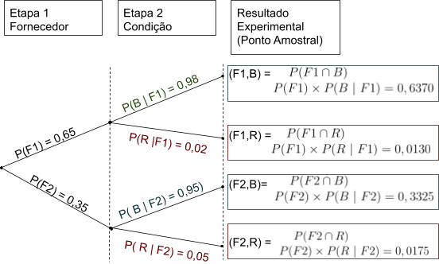

# Probabilidade

- Definição
  - A medida da incerteza
  - Indica a chance(a medida da possibilidade) ou a probabilidade de um evento ocorrer
  - Quantificação do conhecimento que temos sobre um particular evento
- Regras
  - 0 = impossível ocorrer
  - 1 = certamente ocorrerá
  - A probabilidade não pode ser negativa ou maior que 1. Deve variar entre 0 e 1 (incluso)
  - A soma das probabilidades de um evento simples, em um espaço da amostra, deve ser igual a 1
  - O complemento de um evento A é definido como todos os resultados, em um espaço de amostra, que não fazem parte do evento A.

## Conceitos

### Espaço da amostra

Todos os resultados possíveis de um experimento.

Ex: Dados - > números de 1 a 6

### Evento

Um ou mais resultados de um experimento

Ex: O jogar o dado

### Experimento

E o processo de medir ou observar uma atividade com o propósito de coletar dados.

#### Experimento simples

Experimento simples: duas opções (moeda, cara ou coroa)

- Tipos
  - Experimento determinístico
    - ex. Caneta caindo no chão - resultado sempre o mesmo
  - Experimento aleatório
    - ex. distância entre a caneta que caiu em relação a parede- resultado sempre diferente

Ex: Jogar dados

#### Experimento de Múltiplas Etapas

Um experimentos em múltiplas etapas é nada mais que realizar diversas vezes um experimento.

Ex: Jogar duas moedas

O espaço amostral seria:

<div class="fontGray">

$\small S = [(H, H), (H,T),(T,H),(T,T)]$

</div>

- H = Head T=Tail, sendo 4 os resultado experimentais.

##### Regra de Contagem

<div class="fontBlack">

$$\small \textrm{Regra de contagem} = n_1×n_2×....×n_k$$

</div>

Sendo um experimento uma sequência de k etapas, com $n_1$ resultados possíveis na primeira etapa, com $n_2$ resultados possíveis na segunda etapa, e assim por diante.

No caso de um evento envolvendo seis moedas:<div class="fontGray"> $\small (2)(2)(2)(2)(2)(2) = 64$</div> resultados possíveis.

###### _Diagrama de Árvore_

Uma forma de visualizar o desdobramento desses eventos é por meio de diagrama de Árvore:


##### Regra de contagem de combinações

O número de combinações de N objetos, tomados n a cada vez, é:

<div class="fontBlack">
  $$\small C_n^N= (\frac{N}{n}) = \frac{N!}{n!(N - n)!}$$
</div>

Permite contar o número de resultados experimentais quando o experimento envolve escolher n objetos de um conjunto ( geralmente maior) de N objetos.

Exemplo:

<div class="fontGray">

$\small N = [ A, B, C, D, E]$<br>

$\small n = 2$

</div>
<div class="fontBlack">

$$\small C_n^N= (\frac{N}{n}) = \frac{N!}{n!(N - n)!}$$

</div>
<div class="fontGray">

$\small C_2^5= (\frac{5}{2}) = \frac{5!}{2!(3)!}$<br>

$\small \frac{5!}{2!(3)!} =\frac{5×4×3×2×1}{2×1×3×2×1} = \frac{120}{12}= 10$

</div>

|  N  |  S  |
| :-: | :-: |
|  1  | AB  |
|  2  | AC  |
|  3  | AD  |
|  4  | AE  |
|  5  | BC  |
|  6  | BD  |
|  7  | BE  |
|  8  | CD  |
|  9  | CE  |
| 10  | DE  |

```{r,warning=FALSE,message=FALSE,error=FALSE,fig.keep='all'}
library('gtools')
choose(n = 5, k = 2)
```

##### Regra de contagem de Permutações

O número de permutações de N objetos, tomados a cada n vez, é dado por:

<div class="fontBlack">
  $$\small P_n^N= n!(\frac{N}{n}) = \frac{N!}{(N - n)!}$$
</div>
O número de resultados experimentais quando n objetos são escolhidos de um conjunto de N objetos em que a ordem de escolha é importante.

Exemplo:

<div class="fontGray">

$\small N = [ A, B, C, D, E]$

$\small n = 2$

</div>
<div class="fontBlack">

$$\small P_n^N= n!(\frac{N}{n}) = \frac{N!}{(N - n)!}$$

</div>
<div class="fontGray">

$\small P_2^5= 2!(\frac{5}{2}) = \frac{5!}{(5 - 2)!}$

$\small \frac{5!}{3!}=\frac{5×4×3×2×1}{3×2×1} = \frac{120}{6}=20$

</div>

|    S    |
| :-----: |
| AB e BA |
| AC e CA |
| AD e DA |
| AE e EA |
| BC e CB |
| BD e DB |
| BE e EB |
| CD e DC |
| CE e EC |
| DE e ED |

```{r, warning=FALSE,message=FALSE,error=FALSE, fig.keep='all'}

library(kableExtra)
kbl(permutations(n = 5, r = 2, v = c("A","B","C","D","E")))

```

## Atribuição de probabilidade

Para atribuição de probabilidade e preciso atender requisitos básicos:

- A probabilidade atribuída a cada um dos resultados experimentais deve situar-se entre 0 e 1
  <div class="fontBlack">

  - $\small 0 ≤P(E_i) ≤ 1  \forall  i$
  </div>

- A soma de todas as probabilidades deve ser 1
  <div class="fontBlack">

  - $\small P(E_1) +P(E_2) + .... + P(E_n) =1$
  </div>

  - Se dois eventos A e B são mutuamente exclusivos, a probabilidade da união do evento A com o evento B equivale a soma da probabilidade do evento A com a probabilidade do evento B, ou seja, $\small P(A \cup B) = P(A) + P(B)$

### Probabilidade clássica

Utilizada quando sabe-se o número de possíveis resultados e todos são igualmente prováveis

#### Permutação

Permutar elementos significa trocá-los de posição. A maneira de calcular as possibilidades de fazer isso, vai depender da natureza dos elementos a serem permutados.

##### Permutação simples

Uma permutação de _n_ objetos distintos é qualquer agrupamento ordenado desses objetos, de modo que, se denominarmos $\small P_n$ o número das permutações simples dos n objetos, então:

<div class="fontBlack">

$$\small P_n  = n!$$

</div>

De fato, imaginemos que dispomos de _n_ objetos distintos para serem colocados em fila, ocupando _n_ posições. Pelo Princípio Multiplicativo, temos _n_ objetos para ocupar a 1ª posição. Ocupada a 1ª posição com um objeto, a 2ª posição pode ser ocupada por qualquer um dos n – 1 objetos restantes. Daí, ocupada a 2ª posição, a terceira posição pode ser ocupada por qualquer um dos n – 2 objetos restantes. Repetindo esse raciocínio até o último objeto, restará para ele a última posição da fila. Logo, pelo Princípio Multiplicativo, teremos: $\small n × (n – 1) × (n – 2) × (n – 3) × … × 3 × 2 × 1$ que é exatamente o mesmo que escrever $\small n!$.

<span class="highlightRose">Exemplo:</span>

De quantas maneiras pode-se colocar 4 pessoas na fila?

<span class="highlightPink">Solução:</span>

Note que, temos 4 pessoas que podem ocupar o 1° lugar da fila. Daí, colocada a primeira pessoa na fila, restam 3 pessoas que podem ocupar o 2° lugar da fila. Em seguida, colocada a 2ª pessoa, agora restam duas pessoas que podem ocupar o 3° lugar da fila. E por fim, colocada a segunda pessoa na fila, sobra uma pessoa para ocupar a última posição. Pelo Princípio Multiplicativo, teremos:

<div class="fontGray">

$\small 4×3×2×1=4!=24$

</div>

```{r,warning=FALSE,message=FALSE,error=FALSE,fig.keep='all'}

permutations(4,4)

```

##### Arranjos Simples

Considere um conjunto com _n_ elementos distintos. Qualquer sequência de _p_ desses elementos (todos distintos) é chamada de Arranjo Simples $\small (0 ≤ p ≤ n, \textrm{com n e p naturais})$. Dizemos arranjo simples de _n_ elementos tomados _p a p_, e simbolizamos por $\small A_{(n,p)}$

Esse arranjo simples pode ser calculado da seguinte forma:

<div class="fontBlack">

$$\small A_{(n,p)} =\frac{n!}{(n-p)!}$$

</div>

De fato, suponha que dispomos de **_n_** objetos distintos, e escolheremos **_p_** desses objetos para serem colocados em uma fila, com **_p_** posições. Dessa forma a fila terá **_p_** objetos. Pelo Princípio Multiplicativo, temos **_n_** objetos para ocupar a 1ª posição. Ocupada a 1ª posição com um objeto, a 2ª posição pode ser ocupada por qualquer um dos $\small n-1$ objetos restantes. Daí, ocupada a 2ª posição, a terceira posição pode ser ocupada por qualquer um dos $\small n-2$ objetos restantes. Repetindo esse raciocínio até a posição de número **_p_**, teremos para ela $\small n – p + 1$ objetos disponíveis para ocupá-la.

É importante enfatizar que nos problemas que envolvem a ferramenta do arranjo, <span class="highlightRose">a ordem dos termos agrupados importa</span>, uma vez que uma sequência será diferente de uma outra se seus respectivos termos estiverem ordenados de forma distinta.

<span class="highlightRose">Exemplo:</span>

Considere os algarismos 1,2,3,4 e 5. Quantos números com algarismos distintos, superiores a 100 e inferiores a 1.000, podemos formar?

<span class="highlightPink">Solução</span>

O problema solicita que encontremos todos os números com três algarismos distintos uma vez que, todos os números maiores que 100 e menores que 1.000 têm três dígitos. Dessa forma, temos cinco algarismos disponíveis e usar três deles para formar números de três algarismos distintos. A solução do problema será o arranjo simples de 5 elementos tomados 3 a 3. Ou seja,

<div class="fontBlack">

$$\small A_{(n,p)} =\frac{n!}{(n-p)!}$$

</div>
<div class="fontGray">

$\small A_{(5,3)} =\frac{5!}{(5-3)!}$

$\small A_{(5,3)} =\frac{5!}{(2)!}=60$

</div>


```{r,warning=FALSE,message=FALSE,error=FALSE,fig.keep='all'}

tail(permutations(5,3))
```

##### Arranjos com repetição

Considere um conjunto com n elementos distintos. Qualquer sequência de p desses elementos é chamada de Arranjo com repetição (0 ≤ p ≤ n, com n e p naturais). Note que os p elementos podem ser distintos ou não, isto é, pode haver elementos repetidos. Daí o nome, arranjo com repetição.

Dizemos arranjo com repetição de **n** elementos tomados **p** a **p**, e simbolizamos por:

<div class="fontBlack">

$$\small AR_{n,p} = n^p$$

</div>

De fato, suponha que dispomos de n objetos distintos, e escolheremos p desses objetos para serem colocados em uma fila, com p posições. Dessa forma a fila terá p objetos. Pelo Princípio Multiplicativo, temos n objetos para ocupar a $\small 1^a$ posição. Ocupada a $\small 1^a$ posição com um objeto, como os objetos na fila podem ser repetidos, para $2^a$ posição ainda temos n objetos disponíveis. Ocupada a $\small 1^a$ posição com um objeto, como os objetos na fila podem ser repetidos, para $\small  2^a$ posição ainda temos n objetos disponíveis. Repetindo esse raciocínio até a última posição, que é a posição de número p, como os objetos podem ser repetidos, ainda teremos n objetos disponíveis para essa posição. Assim, pelo Princípio Multiplicativo, teremos.

<div class="fontGray">

$\small A_{n,p} = n.n.n....n\textrm{     (p vezes)}$

$\small A_{n,p} = n^p$

</div>

<span class="highlightRose">Exemplo:</span>

Considere os algarismos 1,2,3,4 e 5. Quantos números, superiores a 100 e inferiores a 1.000, podemos formar?

<span class="highlightPink">Solução:</span>

O problema solicita que encontremos todos os números com três algarismos (distintos ou não) uma vez que, todos os números maiores que 100 e menores que 1.000 têm três dígitos. Assim, temos 5 elementos e precisamos escolher 3 para formar números, onde os algarismos podem ser repetidos ou não. Dessa forma, a solução do problema será o arranjo com repetição de 5 elementos tomados 3 a 3. Ou seja,

<div class="fontGray">

$\small AR_{n,p} =5.5.5 = 5^3 = 125$<br>

</div>

Note que, assim como foi feito no arranjo simples, podemos também no arranjo com repetição resolver qualquer problema usando o Princípio Multiplicativo, da seguinte forma:


```{r,warning=FALSE,message=FALSE,error=FALSE,fig.keep='all'}
library('gtools')
tail(permutations(n = 5, r = 3,repeats.allowed = T))
```

#### Combinação

` `Conhecemos como combinação a contagem de todos os subconjuntos de k elementos que podemos formar de um conjunto de n elementos

##### Combinações Simples

Considere um conjunto com n elementos distintos. Qualquer subconjunto formado por de p desses elementos (todos distintos) é chamado de Combinação Simples (0 ≤ p ≤ n, com n e p naturais). Dizemos combinação simples de **n** elementos tomados **p** a **p**, e simbolizamos por <div class="fontBlack">$\small C_{n,p}$ </div>

Essa combinação simples pode ser calculada da seguinte forma:

<div class="fontGray">

$$\small C_{n,p}=\frac{n!}{p!(n-p)!}$$

</div>

De fato, considere um conjunto com n elementos distintos. Seja <div class="fontBlack">$\small C_{n,p}$ </div> é a quantidade de subconjuntos com p elementos distintos que podemos formar. Note que, em cada subconjunto formado, a ordem não importa. Se a ordem importasse, teríamos um arranjo simples desses elementos, que é <div class="fontBlack">$\small A_{n,p}$</div>

É importante enfatizar que nos problemas que envolvem a ferramenta da combinação <span class="highlightRose">a ordem dos termos agrupados não importa,</span> uma vez que um subconjunto A será igual a um outro subconjunto B se seus respectivos elementos forem os mesmos.

<span class="highlightRose">Exemplo</span>

Uma escola quer organizar um torneio esportivo com 10 equipes, de forma que cada equipe jogue exatamente uma vez com cada uma das outras. Quantos jogos terá o torneio?

<span class="highlightPink">Solução</span>

Considere $\small E = \{E_1, E_2, E_3, … , E_{10}\}$ o conjunto dos times do referido torneio. Note que, resolver esse problema é determinar o número de subconjuntos com dois elementos que podemos formar, a partir dos elementos do conjunto E. Teremos, portanto:

<div class="fontGray">

$\small C_{n,p}=\frac{10!}{2!( 10- 2 )!} = \frac{10 × 9× 8!}{2×1×8!}= \frac{10 ×     9}{2×1} = 45$

</div>

Logo, teremos 45 subconjuntos, ou seja, 45 jogos nesse torneio.

```{r, warning=FALSE,message=FALSE,error=FALSE, fig.keep='all'}
library('gtools')
choose(n=10,k = 2)
```

#### Probabilidade usando combinações

A Probabilidade permite analisar ou calcular as chances de obter determinado resultado diante de um experimento aleatório. São exemplos as chances de um número sair em um lançamento de dados ou a possibilidade de ganhar na loteria.

A partir disso, a probabilidade é determinada pela razão entre o número de eventos possíveis e número de eventos favoráveis, sendo apresentada pela seguinte expressão:

<div class="fontBlack">

$$\small P(A) = \frac{n(A)}{n(Ω)}$$

</div>

Sendo:

<div class="fontGray">

$\small \textrm{P(A)= probabilidade de ocorrer um evento A}$ <br>

$\small \textrm{n(A)= número de resultados favoráveis}$ <br>

$\small \textrm{n(Ω)= número total de resultados possíveis}$ <br>

</div>

Para encontrar o número de casos possíveis e favoráveis, muitas vezes necessitamos recorrer as fórmulas estudadas em análise combinatória.

Sendo a probabilidade conhecida, agora basta

<span class="highlightRose">Exemplo:</span>

A probabilidade de um jogador acertar um lance livre é de 80%. Qual a probabilidade de acertar 3 de 5 arremessos?

<span class="highlightPink">solução:</span>

Na situação acima para calcular as combinações de 5 arremessos onde 3 serão acertos temos o coeficiente binomial $\small \binom{3}{5}$, portanto:

<div class="fontGray">

$\small \binom{3}{5}) = \frac{5!}{3!(5-3)!} =\frac{5×4}{2} = 10$

</div>
Agora basta elevar a potência cada uma das probabilidades e multiplicar pelas combinações:
<div class="fontBlack">

$$\small P(Acertos)^{n° acertos} × P(Erros)^{n° erros} × n° combinações$$

</div>
<div class="fontGray">

$\small 0,8^3×0,2^2×10$<br>

$\small 0,512×0,04×10 = 0,2048$<br>

</div>

Portanto, em 5 arremessos, existe 20,48% de acertar 3. E são 10 as combinações diferentes possíveis.

<span class="highlightRose">Exemplo:</span>

A probabilidade de um jogador acertar um lance livre é de 80%. Qual a probabilidade de acertar **pelo menos** 3 de 5 arremessos?

<span class="highlightPink">Solução:</span>

Na situação acima para calcular as combinações de :

- 5 arremessos onde 3 serão acertos = coeficiente binomial$\small \binom{3}{5}$
- 5 arremessos onde 4 serão acertos = coeficiente binomial$\small \binom{4}{5}$
- 5 arremessos onde 5 serão acertos = coeficiente binomial$\small \binom{5}{5}$

Temos então que:

<div class="fontGray">

- $\small \binom{3}{5}=10$
- $\small \binom{4}{5}=5$
- $\small \binom{5}{5}=1$
  </div>
  Então:
  <div class="fontGray">

  $\small (0,8^3×0,2^2×10) + (0,8^4×0,2^1× 5) + (0,8^5×0,2^1×1)$ <br>

  $\small 0,2048 + 0,4096 +0,32768 = 0,94208$ <br>
  </div>

Portanto, há 94,208% de chance de se acertar pelo menos 3 arremessos de 5.

```{r}
dbinom(x=3, size = 5,prob = 0.8)
dbinom(x=4, size = 5,prob = 0.8)
dbinom(x=5, size = 5,prob = 0.8)
dbinom(x=3, size = 5,prob = 0.8) + dbinom(x=4, size = 5,prob = 0.8)+dbinom(x=5, size = 5,prob = 0.8)
```

### Probabilidade empírica

Usada quando não se tem a informações detalhadas sobre o evento

Ex: Compras em loja, onde não se tem a informação do porquê da compra ou quando foi realizada. Podendo ser calculada registrando o número de clientes que entraram na loja (número total de observações) e o número de clientes que realizaram a compra (frequência que evento A ocorre)

<div class="fontBlack">

$$
\small P(A)=\frac{\textrm{Frequência em que o evento A ocorre}}{\textrm{Número     total de observações}}
$$

</div>

### Probabilidade Subjetiva

Estimada pela experiência e julgamento

- Usada quando
  - Não se pode utilizar a clássica nem a empírica
  - Não há disponibilidade de realização de experimentos

### Probabilidade em eventos compostos

#### Complemento de um evento

Dado um evento A, o complemento de A é definido como o evento que consiste em todos os pontos amostrais que não estão em A. O complemento de A é denotado de $\small A^C$.

Em termos de probabilidade temos:

<div class="fontBlack">

$$\small P(A) + P(A^C) = 1$$

</div>

E para obtermos a probabilidade de A por meio do completo basta isolar a probabilidade de A.


#### União de eventos

Probabilidade de pelo menos um dos eventos ocorrerem (Ou A ou B, ou Ambos). Denotada por todos os pontos amostrais pertencentes a A, B ou ambos.


<span class="highlightRose">Exemplo:</span>

Considere o estoque de uma loja:

|           |  Preta   |  Branca  | **Total** |
| :-------: | :------: | :------: | :-------: |
|  Camisa   |   150    |   230    |    380    |
|  Jaqueta  |   560    |   750    |   1310    |
|   Calça   |    98    |   140    |    238    |
| **Total** | **8080** | **1120** | **1928**  |

Defina:

- Evento A: Probabilidade selecionar aleatoriamente uma camiseta (branca ou preta)
- Evento B:Probabilidade selecionar aleatoriamente qualquer peça da cor preta
- Probabilidade de A **OU** B ocorrerem: ou seja, uma peça escolhida aleatóriamente ser preta ou camiseta.

<div class="fontGray">

$\small P(A): \frac{150+230}{1928}=\frac{380}{1928} = 0,1970$ <br>

$\small P(B): \frac{150+560+98}{1928}=\frac{808}{1928} = 04190$ <br>

$\small P(A) + P(B) = \frac{380+808}{1928} = 0,6161$ <br>

<div class="fontGray">
 
##### Eventos Mutuamente exclusivos

Eventos que não acontecem ao mesmo tempo. Denotados por não possuírem nenhum ponto amostral em comum.

<div class="fontGray">

$\small P(A∪B) = P(A) + P(B)$

</div>


<span class="highlightRose">Exemplo:</span>

Considere os pontos obtidos em um jogo:

|  Pontos   | Homens  | Mulheres | **Total** |
| :-------: | :-----: | :------: | :-------: |
|    95     |   60    |    30    |    90     |
|    90     |   40    |    80    |    120    |
|    85     |    0    |    40    |    40     |
| **Total** | **100** | **150**  |  **150**  |

Defina:

- Evento A: Probabilidade de se fazer 90 pontos
- Evento: Probabilidade de se fazer 85 pontos
- Probablidade de se fazer 85 ou 90 pontos.

<div class="fontGray">

$\small P(A)=\frac{120}{250}=0,48$ <br>

$\small P(B)=\frac{40}{250}=0,16$ <br>

$\small P(\textrm{A OU B}) =0,48+0,16 = 0,64$ <br>

</div>
  
##### Eventos Não Mutuamente Exclusivos

Eventos que podem ocorrer ao mesmo tempo e possuem pontos amostrais em comum.

<div class="fontBlack">

$\small P(A∪B) = P(A) + P(B) - P (A∩B)$

</div>

Tal cálculo, se justifica pela fato dos pontos da intercessão estar presente duas vezes, tanto em A quanto em B, portanto, precisa ser retirado uma vez para que o resultado seja preciso.

#### Probabilidade Condicional

A probabilidade condicional, é a probabilidade de um evento ocorrer, dado que outro evento já ocorreu.

<div class="fontBlack">

$\small P(A | B)$ = lê-se - Probabilidade de A dado B <br>
$\small P( A | B) = P(A ∩ B)P(B) P( B | A) = P(A ∩ B)P(A)$

</div>

Ou seja, a probabilidade condicional é dada pelo quociente da probabilidade associada pela probabilidade marginal

Exemplo:

H = o evento de um policial ser homem

M = o evento de um policial ser mulher

A = o evento de um policial ser promovido

$\small A^C$= o evento de um policial não ser promovido

| Probabilidade Marginal | Probabilidade Associada |
| :--------------------: | :---------------------: |
|       P(H) = 0,8       |   P(H ∩ $A^C$) = 0,56   |
|       P(M) = 0,2       |     P(H ∩ A) = 0,24     |
|      P(A) = 0,27       |     P(M ∩ A) =0,03      |
|     P($A^C$)= 0,73     |   P(H ∩$A^C$) = 0,17    |

A probabilidade da interseção desses eventos é uma probabilidade associada. Tal informação pode ser vista em uma tabela de probabilidade associada (em vermelho):

|                | Homens | Mulheres | Total |
| :------------: | :----: | :------: | :---: |
|   Promovidos   |  288   |    36    |  324  |
| Não Promovidos |  672   |   204    |  876  |
|     Total      |  960   |   240    | 1200  |

```{r,echo=FALSE}
text_tbl <- data.frame(
Categoria = c( "Promovidos(A)", "Não Promovidos $(A^c)$","Total"),
Homens = c(0.24,0.56,0.80),
Mulheres = c(0.03,0.17,0.20),
Total = c(0.27,0.73,1))

text_tbl$Homens[1:2]= cell_spec(text_tbl$Homens[1:2], background = "#F4CCCC")
text_tbl$Mulheres[1:2]= cell_spec(text_tbl$Mulheres[1:2], background = "#F4CCCC")

text_tbl$Total[1:2]= cell_spec(text_tbl$Total[1:2], background = "#D9EAD3")
text_tbl[3,2:3]= cell_spec(text_tbl[3,2:3], background = "#D9EAD3")

text_tbl %>%
  kbl( linesep = "", format = "html",escape = F) %>%
kable_paper("striped", full_width = T)

```

Em verde estão as chamadas, probabilidades marginais, em virtude da localização na tabela de probabilidade associada.


Em rosa está a área que se busca a probabilidade. Ou seja, dada a ocorrência de A qual a probabilidade de B ocorrer? Calcula-se então, dada a probabilidade de B, qual a probabilidade de ocorrer exatamente os pontos amostrais em comum com A. Portanto:

<div class="fontBlack">

$$\small P( A | B) = \frac{P(A ∩ B)}{P(B)}$$

</div>

No exemplo poderíamos usar $\small P(A | M)$:

<div class="fontGray">

$\small P( A | M) = \frac{P(A ∩ M)}{P(M)}$ <br>
$\small P( A | M) = \frac{0,03}{0,20}= 0,15$

</div>

##### Eventos Dependentes

Um evento dependente é denotado pela mudança da sua chance de ocorrer, devido a ocorrência ou não de outro evento. Portanto:

<div class="fontBlack">

$\small P(A | H) ≠ P(A)$ <br>
$\small P(H | A) ≠ P(H)$

</div>

Então o evento A é afetado pela ocorrência do evento H. Como ocorre no caso das probabilidades condicionais.

##### Evento Independentes

Um evento independente é denotado pela não alteração da sua probabilidade de ocorrer, devido a ocorrência ou não de outro evento. Portanto:

<div class="fontBlack">

$\small P(A | H) = P(A)$ <br>
$\small P(H | A) = P(H)$

</div>

Então o evento A não é afetado pela ocorrência do evento H, como ocorre no caso das probabilidades condicionais.

Retormando o exemplo dos pontos em um jogo:

|  Pontos   | Homens  | Mulheres | **Total** |
| :-------: | :-----: | :------: | :-------: |
|    95     |   60    |    30    |    90     |
|    90     |   40    |    80    |    120    |
|    85     |    0    |    40    |    40     |
| **Total** | **100** | **150**  |  **150**  |

Se buscarmos a probabilidade de uma mulher obter 90 pontos teremos:

Evento A: obter 90 pontos
Evento B: ser mulher
P(A e B): mulher obter 90 pontos

<div class="fontGray">

$\small P(A)= \frac{120}{150}=0,48$<br>

$\small P(B)= \frac{150}{250}=0,60$<br>

$\small P(\textrm{A e B})= \frac{80}{250} = 0,32$<br>

$\small P(\textrm{A ou B})= P(A) + P(B) - P(\textrm{A e B})$<br>

$\small P(\textrm{A ou B}) = 0,48+0,60-0,32=0,76$<br>

</div>

#### Intersecção de eventos - Lei da multiplicação

Probabilidade de evento A e evento B ocorrem ao mesmo tempo. Denotado por todos os pontos amostrais de A que também pertencem a B.


##### Eventos Dependentes

O cálculo para descobrir a probabilidade da área de intersecção de eventos dependentes:

<div class="fontBlack">

$\small P(A ∩B)  = P(B) × P(A | B)$<br>

ou

$\small P(A ∩B)  = P(A) × P(B | A)$<br>

</div>

##### Eventos Independentes

O cálculo para descobrir a probabilidade da área de intersecção de eventos dependentes:

<div class="fontBlack">

$\small P(A ∩B)  = P(A) × P(B)$

</div>
## Teorema de Bayes

O teorema de Bayes pode ser utilizado para revisão de probabilidades quando novas informações são adicionadas. São frequentemente utilizadas na análise de decisão, onde as probabilidades a priori geralmente são subjetivas e depois complementadas com informações de amostra, e então, calculada-se as probabilidades a posteriori.

Então o processo é:


|              | % de peças boas | % de peças ruins |
| :----------: | :-------------: | :--------------: |
| Fornecedor 1 |       98        |        2         |
| Fornecedor 2 |       95        |        5         |


Traduzindo o esquema acima em valores teremos:



Agora, se a pergunta for, dada uma peça ruim, qual a probabilidade de se originar do fornecedor 1? e do fornecedor 2?

Buscamos as seguintes probabilidades:

<div class="fontBlack">

$\small P(F1 | R)  = P(F1 ∩ R)P(R)$<br>

$\small P(F2 | R)  = P(F2 ∩ R)P(R)$

</div>
E de acordo com a árvore de probabilidades sabemos que:
<div class="fontBlack">

$\small P(F1 ∩R)  = P(F1) × P(R | F1)$

Em relação a probabilidade de R, sabemos que só ocorre em duas ocasiões:

<div class="fontBlack">

$\small (F1 ∩R)  e (F2 ∩R)$

</div>
Portanto:
<div class="fontBlack">

$\small P(R) = P(F1 ∩R)  + P(F2 ∩R)$ <br>

$\small =P(F1) × P(R | F1) + P(F2) × P(R | F2)$

</div>
Reescrevendo toda a equação chegamos em:
<div class="fontBlack">

$$\small P(F1 | R)  = \frac{P(F1) × P(R | F1)}{P(F1) × P(R | F1) + P(F2) × P(R | F2)}$$<br>

$$\small P(F2 | R)  = \frac{P(F2) × P(R | F2)}{P(F1) × P(R | F1) + P(F2) × P(R | F2)}$$

</div>
Que nada mais é que o teorema de Bayes para dois eventos.

Substituindo os valores na fórmula teremos:

<div class="fontGray">

$\small P(F1 | R)  = \frac{P(F1) × P(R | F1)}{P(F1) × P(R | F1) + P(F2) × P(R | F2)}$<br>

$\small P(F1 | R)  = \frac{ (0,65 )× (0,02)}{(0,65 )× (0,02) + (0,35) × (0,05)}$<br>

$\small P(F1 | R)  = \frac{0,013}{(0,013) + (0,0175)}$<br>

$\small P(F1 | R)  = \frac{0,013}{0,305} = 0,4262$<br>

$\small P(F2 | R)  = \frac{P(F2) × P(R | F2)}{P(F1) × P(R | F1) + P(F2) × P(R | F2)}$<br>
$\small P(F2 | R)  = \frac{(0,35 )× (0,05)}{(0,65 )× (0,02) + (0,35) × (0,05)}$<br>

$\small P(F2 | R)  = \frac{0,0175}{(0,013) + (0,0175)}$<br>

$\small P(F2 | R)  = \frac{0,0175}{0,305} = 0,5738$<br>

</div>
Em resumo, o Teorema de Bayes é aplicável quando os eventos que se deseja calcular as probabilidades a posteriori são mutuamente exclusivos e a união deles é um espaço amostral inteiro ( coletivamente exaustivos). Não existindo limite para a quantidades de eventos, desde que cumpram com os requisitos.
<div class="fontBlack">

$$\small P( F_i| R)  = \frac{P(F_i) × P(R | F_i)}{P(F_1) × P(R | F_1) + P(F_2) × P(R | F_2) + ... +  P(F_n) × P(R | F_n)}$$

</div>

### Abordagem Tabular

Uma abordagem tabular, em tabelas, pode ser útil para efetuar os cálculos do Teorema de Bayes. Segue-se as etapas:

1. Monta-se as colunas:
   a. Eventos $\small A_i$ , mutuamente exclusivos, que se desejam as probabilidades a posteriori
   b. Probabilidades a priori dos eventos →$\small P(A_i)$
   c. As probabilidades condicionais da nova informação R dada para cada evento →$\small P(R | A_i)$
2. Calcule as probabilidades associadas correspondente a cada evento e a nova informação usando a lei da multiplicação →$\small P( A_i ∩ R)  =P( A_i) × P(R | A_i)$
3. Some as probabilidades associadas da etapa anterior e obtenha a probabilidade da nova informação: $\small P(R)$
4. Na próxima coluna, calcule as probabilidades a posteriori usando a relação básica da probabilidade condicional
   a. $\small P(F_i | R)  = \frac{P(F_i ∩ R)}{P(R)}$

| (1.a) Eventos →$\small (A_i)$ | (1.b) Probabilidade a priori →$\small P(A_i)$ | (1.a) Probabilidades condicionais →$\small P(R \|A_i)$ | (2) Probabilidades associadas→$\small P( A_i ∩ R)$ | (4) Probabilidade a posteriori →$\small P( A_i \| R)$ |
| :---------------------------: | :-------------------------------------------: | :----------------------------------------------------: | :------------------------------------------------: | :---------------------------------------------------: |
|              A1               |                     0,65                      |                          0,02                          |                       0,0130                       |         $\small \frac{0,0130}{0,0305}=0,4262$         |
|              A2               |                     0,35                      |                          0,05                          |                       0,0175                       |         $\small \frac{0,0175}{0,0305}=0,5738$         |
|                               |                   Total = 1                   |                                                        |            Total(3) (**P(R)**) = 0,0305            |                       Total = 1                       |

## Distribuição de probabilidade

A distribuição de probabilidade de uma variável aleatória descreve como as probabilidades estão distribuídas sobre os valores da variável aleatória. Para uma variável discreta x, a distribuição de probabilidade é definida por uma **função de probabilidade**, denotada por f(x). A função de probabilidade fornece a probabilidade correspondente a cada um dos valores da variável aleatória. Portanto, associa uma probabilidade a cada resultado numérico de um experimento.

- O domínio dessa função são os valores da variável
- A imagem são as probabilidades da variável assumir cada valor do domínio
  - conjunto imagem restrito ao intervalo de 0 e 1

A função precisa atender a duas condições:

<div class="fontBlack">

- $\small f(x) ≥ 0$
- $\small \sum f(x) = 1$
</div>

### Distribuição Discreta

Descreve quantidades aleatórias de dados que podem assumir valores finitos. Pode ser expressa pela seguinte função:

<div class="fontBlack">

$\small f(x) = \frac{fr(x)}{n}$

$\small fr(x) = \textrm{frequência de x}$

$\small n = \textrm{número de elementos}$

</div>
E a versão acumulada:

$$ \small F(x)=P(X \leq x)=\int\_{-\infty}^{x} f(x) d x=\left\{\begin{array}{cll}0, & \text { se } & x<\alpha \\ \frac{x-\alpha}{\beta-\alpha}, & \text { se } & \alpha \leq x<\beta \\ 1, & \text { se }& x \geq \beta\end{array}\right.$$

| Veículos vendidos/ dia | Total dias | Probabilidade                          |
| :--------------------- | :--------- | :------------------------------------- |
| 0                      | 54         | $\small f(0) = \frac{54}{300} = 0,18$  |
| 1                      | 117        | $\small f(1) = \frac{117}{300} = 0,39$ |
| 2                      | 72         | $\small f(2) = \frac{72}{300} = 0,24$  |
| 3                      | 42         | $\small f(3) = \frac{42}{300} = 0,14$  |
| 4                      | 12         | $\small f(4) = \frac{12}{300} = 0,04$  |
| 5                      | 3          | $\small f(5) = \frac{3}{300} = 0,01$   |
| **Total**              | **300**    | **1**                                  |

```{r,warning=FALSE,message=FALSE,error=FALSE,fig.keep='all'}
library(ggplot2)
v<-c(54,117,72,42,12,3)
df<-data.frame(c(0:5),v)
colnames(df)<-c("veiculos","dias")
ggplot(data=df, aes(x=veiculos, y=dias)) +
  geom_bar(stat="identity", fill="steelblue")+
  geom_text(aes(label=dias), vjust=-0.3, color="black", size=3.5)+
xlab("Veículos Vendidos/dia")+
ylab("Total dias")+
ggtitle("Histograma dos veículos vendidos por dia")+
scale_x_continuous(breaks = c(0,1,2,3,4,5))+
theme_minimal()

df["prop"]<-prop.table(df$dias)

ggplot(data=df, aes(x=veiculos, y=prop)) +
  geom_bar(stat="identity", fill="steelblue")+
  geom_text(aes(label=prop), vjust=-0.3, color="black", size=3.5)+
xlab("Veículos Vendidos/dia")+
ylab("Probabilidade")+
ggtitle("Distribuição de probabilidade para o número de automóveis vendidos por dia")+
scale_x_continuous(breaks = c(0,1,2,3,4,5))+
theme_gray()

```

- Principais tipos de distribuição que utilizam distribuição de probabilidade discreta
  - Binominal
  - Poisson
  - Hipergeométrica
  - Bernoulli

#### Distribuição de Probabilidade Binomial

A distribuição de probabilidade binomial é uma distribuição de probabilidade discreta associada a um experimento de múltiplas etapas, chamado **experimento binomial**.

Um experimento binomial possui quatro propriedades:

1. Consiste em uma sequência de n ensaios idênticos
2. Dois resultados são possíveis: sucesso e fracasso
   a. os quais nãos tem conotação positiva ou negativa
3. A probabilidade de sucesso, denotada por **p** não se modifica de ensaio para ensaio. Tampouco a probabilidade de fracasso se modifica, denotada por **1 - p**.
4. Os ensaios são independentes

Se somente as propriedades: **2,3,4** estiverem presentes, trata-se de um **Ensaio de** **Bernoulli**

Exemplo:

Vamos imaginar que nosso experimento seja contar quantos clientes que entram em uma loja de celulares, adquirem um plano pós-pago. Para este experimento, temos 2 possibilidades para cada observação: adquirir ou não adquirir o plano.

Vamos imaginar agora, que historicamente, 10% dos clientes que entram na loja, adquirem um plano pós-pago. Portanto, a probabilidade de sucesso (que vamos chamar de p) para cada observação é 0.10. E a probabilidade de falha (que vamos chamar de q) para cada observação é 0.90.

Temos então que:

$\small p = \textrm{probabilidade de sucesso}$

$\small q = \textrm{probabilidade de fracasso}$

Então em relação as propriedades observamos que:

1. O experimento consiste em n ensaios idênticos (clientes entrando na loja e comprando ou não o plano de celular)
2. Somente dois resultados são possíveis: comprar ou não comprar o plano de celular
3. A probabilidade de p= 0,10 e q = 0,90. Tais probabilidades não se alteram de um ensaio para outro.
4. Os ensaios são independentes. Pois um cliente adquirir um plano não interfere na probabilidade de outro cliente adquirir também.

Ou seja, se trata de um experimento binomial.


**Valor de x** = número de clientes que fizeram a compra

O número de resultados que resultam em x sucessos em n ensaios pode ser calculado com a fórmula abaixo:

<div class="fontBlack">

$$\small \binom{n}{x}=\frac{n!}{x!(n-x)!}$$

</div>

Em que:

<div class="fontGray">

$\small n! = n(n-1)(n-2)....(2)(1)$

</div>
e por definição:
<div class="fontGray">

$\small 0! = 1$

</div>

**Obs**: Na calculadora faz-se (n) nCr (x)

No caso, se buscarmos quantas formas podemos obter 2 sucessos em 3 ensaios:

Então, x = 2 e n = 3

<div class="fontBlack">

$\small \binom{n}{x}=\frac{n!}{x!(n-x)!}$

</div>
<div class="fontGray">

$\small \binom{3}{2}=\frac{3!}{2!(2 -3)!}$<br>

$\small \frac{3×2×1}{(2×1)(1)}=\frac{6}{2} = 3$

</div>

Portanto, há três possibilidades de se obter 2 sucesso em 3 ensaios. O que pode ser comprovado ao observar a árvore de resultados experimentais.

Mas como descobrir a probabilidade de se obter um certo número de sucessos? Basta multiplicar as probabilidades de p e q correspondentes. Então no caso de se buscar 2 sucessos em 3 ensaios teremos:

<div class="fontBlack">

$\small p = 0,10$<br>

$\small p×p×q$<br>
$\small p×p×( 1 -p)$

</div>
<div class="fontGray">
  
  $\small (0,10)×(0,10)×(1 - 0,10)$
  
  $\small (0,10)×(0,10)×(0,90 ) =0,009$ 
</div>

<span class=highlightBlue>**Obs**: Independente da sequência exata do resultado, sendo a proporção de sucessos e fracassos a mesma a probabilidade é a mesma.</span>

Juntando a formulação de quantidades de x sucessos em n ensaios com a probabilidade de se obter tal resultado temos a Função Probabilidade Binomial:

<div class="fontBlack">

$$
\small f(x)=\binom{n}{x}p^x (1-p)^{(n-x)}
$$

</div>
<div class="fontGray">

$\small \binom{n}{x}=\frac{n!}{x!(n -x)!}$

$\small f(x) = \textrm{a probabilidade de x sucessos em n ensaios}$

$\small n = \textrm{o número de ensaios}$

$\small x = \textrm{o número de sucessos}$

$\small p = \textrm{a probabilidade de sucessos em qualquer ensaio}$

$\small 1 - p = \textrm{a probabilidade de fracasso em qualquer ensaio}$

</div>

Aplicando a fórmula para todos os casos teremos:

| x   | f(x)                                               |
| :-- | :------------------------------------------------- |
| 0   | $\small \frac{3!}{0!3!} = (0,10)^0(0,90)^3 =0,729$ |
| 1   | $\small \frac{3!}{1!2!} = (0,10)^1(0,90)^2 =0,081$ |
| 2   | $\small \frac{3!}{2!1!} = (0,10)^2(0,90)^1 =0,009$ |
| 3   | $\small \frac{3!}{3!0!} = (0,10)^3(0,90)^0 =0,001$ |

##### Valor Esperado

O valor esperado, ou média, de uma Distribuição Binomial, representa a média de longo prazo de sucessos esperados, baseado no número de observações.

<div class="fontBlack">

$$\small E(x) = μ = n×p$$

</div>

Ou seja, no caso das compras de planos de celular o valor esperado para 5 ensaios seria:

<div class="fontGray">

$\small E(x) = μ = 5×0,1 = 0,5$

</div>

##### Variância e Desvio padrão

A Variância de uma Distribuição Binomial, representa a variação que existe no número de sucessos (p) sobre um número (n) de observações. Dado pela fórmula:

<div class="fontBlack">

$\small Var(x) = σ^2 = n×p×(1 - p)$

$\small σ = \sqrt{n ×p ×(1 - p)}$

</div>

Ou seja, no caso das compras de planos de celular o valor esperado para 5 ensaios seria:

<div class="fontGray">

$\small Var(x) = σ^2 = 5×0,1×(1 - 0,1)$<br>

$\small Var(x) = σ^2 = 5×0,1×0,9 = 0,45$<br>

$\small σ =\sqrt{5 ×0,1 ×0,9}  = 0,67$

</div>

##### R

Exemplo: A probabilidade de um paciente com um ataque cardíaco morrer do ataque é de 0.04 (ou seja, 4 de 100 morrem do ataque). Suponha que tenhamos 5 pacientes que sofrem um ataque cardíaco, qual é a probabilidade de que todos sobrevivam?

Para este exemplo, vamos chamar um sucesso um ataque fatal (p = 0.04).

Temos n = 5 pacientes e queremos saber a probabilidade de que todos sobrevivam ou, em outras palavras, que nenhum seja fatal (0 sucessos).

```{r}
# X = Número de sobreviventes ao ataque
#p = 0.04
#n = 5
#dbinom(X, n, p)

a <- dbinom(0, 5, 0.04)
print(a)

#Desenhando a distribuição de probabilidades
graph <- function(n,p){
  x <- dbinom(0:n, size = n, prob = p)
  barplot(x,ylim=c(0,1),names.arg=0:n,
          main=sprintf(paste('Distribuição Binomial (n,p) ',n,p,sep=',')))
}
graph(5,0.04)
#Criando o gráfico de uma distribuição binomial
x <- seq(0,50,by = 1)
y <- dbinom(x,50,0.5)

plot(x,y)
```

#### Distribuição Uniforme

Distribuição onde a probabilidade de todos os elementos é a mesma.

<div class="fontBlack">

$$\small f(x) = \frac{1}{n}$$

</div>
<div class="fontGray">

$\small n = \textrm{número de valores que a variável aleatória pode assumir}$

</div>
É o caso de jogar dados não viciados.

##### Valor Esperado

Valor esperado, ou média, de uma variável aleatória é a medida da posição central da variável aleatória. A qual é dada pela fórmula:

<div class="fontBlack">

$$\small E(x) = μ = \sum x×f(x)$$

</div>

Ou seja, deve-se multiplicar cada valor da variável aleatória pela sua probabilidade. Como no exemplo abaixo:

| Veículos vendidos/ dia | Probabilidade |   $x × f(x)$    |
| :--------------------: | :-----------: | :-------------: |
|           0            |     0,18      |  0 × 0,18 = 0   |
|           1            |     0,39      | 1 × 0,39 = 0,39 |
|           2            |     0,24      | 2 × 0,24 = 0,48 |
|           3            |     0,14      | 3 × 0,14 = 0,42 |
|           4            |     0,04      | 4 × 0,04 = 0,16 |
|           5            |     0,01      | 5 × 0,01 = 0,05 |
|       **Total**        |     **1**     |    **1,50**     |

Neste caso significa que, durante o período de 300 dias de operação, pode-se esperar a média de 1,5 carros vendidos por dia.

##### Variância e Desvio Padrão

A variabilidade, ou dispersão, nos valores da variável aleatória é medido pela variância pela aplicação da seguinte função:

<div class="fontBlack">

$$\small Var(x) = σ^2 = \sum(x - μ)^2  ×  f(x)$$

</div>
<div class="fontGray">

$\small σ = \sqrt{\sigma^2}$

</div>

Ou seja, o valor de x menos à média, ao quadrado, multiplicado pela probabilidade de x. Como no exemplo abaixo:

| Veículos vendidos/ dia |     $x - μ$      | $(x - μ)^2$ | $f(x)$ |  $(x - μ)^2 × f(x)$   |
| :--------------------: | :--------------: | :---------: | :----: | :-------------------: |
|           0            | 0 - 1,50 = -1,50 |    2,25     |  0,18  | 2,25 × 0,18 = 0,4050  |
|           1            | 1 - 1,50 = -0,50 |    0,25     |  0,39  | 0,25 × 0,39 = 0,0975  |
|           2            | 2 - 1,50 = 0,50  |    0,25     |  0,24  | 0,25 × 0,24 = 0,0600  |
|           3            | 3 - 1,50 = 1,50  |    2,25     |  0,14  | 2,25 × 0,14 = 0,3150  |
|           4            | 4 - 1,50 = 2,50  |    6,25     |  0,04  | 6,25 × 0,04 = 0,2500  |
|           5            | 5 - 1,50 = 3,50  |    12,25    |  0,01  | 12,25 × 0,01 = 0,1225 |
|       **Total**        |                  |             | **1**  |       **1,25**        |

Portanto a variância do conjunto é 1,25. E o desvio padrão:

<div class="fontGray">

$\small σ = \sqrt{1,25} = 1,118$

</div>

A explicação se baseia em medir o quão afastado um valor se encontra da média (valor esperado), e então os desvios são elevados ao quadrado e ponderados pelo valor correspondente da função de probabilidade.

#### Distribuição Poisson

A Distribuição Poisson é muito útil para calcular a probabilidade de um certo número de eventos que ocorrerá em um específico intervalo de tempo ou espaço.

Para um experimento ser classificado como Poisson precisa atender as seguintes propriedades:

- A probabilidade de uma ocorrência é a mesma para dois intervalos quaisquer de igual comprimento
- A ocorrência ou não ocorrência em determinado intervalo é independente da ocorrência ou não ocorrência em outro intervalo

Nós poderíamos usar este tipo de distribuição para determinar a probabilidade de 10 clientes entrarem em uma loja nos próximos 30 minutos ou a probabilidade de 2 acidentes de carro ocorrerem em um determinado cruzamento no próximo mês.

A Distribuição Poisson é um modelo para o número de eventos observados numa unidade de tempo ou de espaço, dado que a taxa de eventos por unidade é constante e os eventos ocorrem de modo independente.

A fórmula de cálculo de Poisson é a seguinte:

<div class="fontBlack">

$$\small f(x) = \frac{μ^x × e^{-μ}}{x!}$$

</div>
<div class="fontGray">

$\small f(x) = \textrm{a probabilidade de x ocorrência em um intervalo}$<br>

$\small μ = \textrm{valor esperado, ou número médio de ocorrências}$<br>

$\small e = (euler) 2,71828$

</div>

<span class="highlightRose">Exemplo:</span>

Dado interesse em saber o número de carros que chegam a um caixa automático de banco durante o período de 15 minutos nas manhãs de final de semana, sabendo que:

- a probabilidade de um carro chegar é a mesma para dois períodos quaisquer de igual duração
- o fato de carros chegarem ou não chegarem em qualquer período é independente da chegada ou não chegada de outros carros em qualquer período.

Portanto, Poisson é aplicável.

Sabe-se que o número médio de carros que chegam no período de 15 minutos é 10, então ao aplicar a fórmula temos:

<div class="fontBlack">

$\small f(x) =\frac{μ^x × e^-μ}{x!}$

</div>
<div class="fontGray">

$\small f(x) = \frac{10x × e-10}{x!}$

</div>

Caso se busque saber a probabilidade de 5 carros chegarem no período de 15 minutos temos:

<div class="fontGray">

$\small f(x) = \frac{10^5 × e^-10}{5!}= 0,0378$

</div>
**Obs**: Caso se deseje a probabilidade em período menor de tempo, basta dividir a média proporcionalmente ao tempo. Por exemplo, para 15 minutos temos a média 10 e para 3 minutos teríamos a média 2.

##### Dist. Binomial Vs Dist. de Poisson

- Diferenças
  - A Distribuição Poisson não conta o número de sucessos, como na distribuição binomial.
  - A Distribuição Poisson conta o número de ocorrências de um evento particular sobre um intervalo específico de tempo ou espaço.
  - Distribuição Binomial, o número de sucessos observados é limitado ao número de possibilidades.
    - Na Distribuição Poisson, o número de resultados pode ser qualquer um.

##### Média, Variância e Desvio Padrão

A média, ou valor esperado na distribuição de Poisson já é dada inicialmente devido a característica da distribuição. Por sua vez, a variância é igual a média. E o desvio padrão, a raiz da variância. Logo no caso dos carros teríamos:

<div class="fontGray">

$\small σ^2 = μ = 10$

$\small σ = \sqrt{10}= 3,16$

</div>

##### R

Exemplo:

Considere um processo que têm uma taxa de 0,5 defeitos por unidade. Qual a probabilidade de uma unidade apresentar dois defeitos? E nenhum defeito?

O único parâmetro da Poisson é λ (lambda), que representa a taxa de eventos por unidade.

```{r}
dpois(2, 0.5)
dpois(0, 0.5)
```

#### Distribuição Hipergeométrica

A distribuição hipergeométrica é utilizada para calcular a probabilidade de obtermos x elementos rotulados de sucesso e (n - x) elementos rotulados como fracasso em uma seleção aleatória de n elementos, selecionados sem substituição.

Para tanto precisamos obter:

- x sucessos dos r sucessos na população
- (n - x) fracassos dos (N - r) fracassos

A distribuição hipergeométrica é restritamente relacionada com a distribuição binomial. Entretanto possuem significativas diferenças em relação a probabilidade dos ensaios e a relação entre ensaios.

<div class="fontBlack">

$$\small f(x) = \frac{\binom{r}{x} \binom{N-r}{n-x}}{\binom{N}{n}}$$

</div>

Para $\small 0 ≤ x  ≤ r$

<div class="fontGray">

$\small r = \textrm{número de elementos na população rotulados como sucesso}$

$\small N -r = \textrm{número de elementos na população rotulados como fracasso}$

$\small n =\textrm{número de ensaios}$

$\small N =\textrm{número de elementos na população}$

$\small f(x) =\textrm{probabilidade de x sucessos em n ensaios}$

$\small \binom{N}{n} =\textrm{número de maneiras que uma amostra de tamanho n pode ser selecionada de uma população tamanho N}$

$\small \binom{r}{x}=\textrm{n° de maneiras pelas quais x  sucessos podem ser selecionados de um total de r sucessos da população}$

$\small \binom{N-r}{n-x}=\textrm{n° de maneiras pelas quais(n -x)  frac. podem ser selecionados de um total de(N - r) frac. da pop.}$

$\small \binom{r}{x}=\frac{r!}{x!(r -x)!}$

</div>
<span class="highlightRose">Exemplo:</span>

Uma caixa de fusíveis possui 12 unidades de fusíveis, sabendo-se que a caixa tem 5 fusíveis defeituosos, caso o controlador selecione 3 fusíveis aleatório, qual a probabilidade de encontrar um fusível defeituoso?

Temos:

n = 3 (selecionados 3)

N = 12 (população de 12 elementos)

r = 5 (contém 5 elementos defeituosos (sucesso))

x = 1 (busca-se 1 fusível defeituoso (sucesso) na coleta)

OBS: $\small \binom{r}{x}=\frac{r!}{x!(r -x)!}$

<div class="fontGray">

$\small f(x) =\frac{ \binom{r}{x} \binom{N-r}{n-x}}{\binom{N}{n}}$<br>

$\small f(x) = \frac{\binom{5}{1} \binom{12-5}{3-1}}{\binom{12}{3}}$<br>

$\small f(x) = \frac{\binom{5}{1} \binom{7}{2}}{\binom{12}{3}}$<br>

$\small f(x) = \frac{(\frac{5!}{1! (4!)} ) (\frac{7!}{2! (5!)} )}{(\frac{12!}{3! (9!)})}$<br>

$\small f(x) = \frac{(5 ) (\frac{7×6}{2} )}{(\frac{12×11×10}{6})}$<br>

$\small f(x) = \frac{(5 ) (21 )}{(220)}= 0,4773$

</div>
Portanto, a probabilidade de se encontrar 1 fusível defeituoso numa coleta de 3 fusíveis é de 0,4773.

Caso, por exemplo, se buscasse a probabilidade de pelo menos um fusível ser defeituoso numa coleta de 3, o mais simples seria buscar a probabilidade de não ser coletado nenhum defeituoso e subtrair de 1. Ou seja, se buscaria a probabilidade do complemento de A ao invés da probabilidade de A.

##### Dist. Hipergeométrica Vs Dist. Binomial

|                                                                                                                                                                                                                                                                                            =                                                                                                                                                                                                                                                                                             |                                                  ≠                                                  |
| :--------------------------------------------------------------------------------------------------------------------------------------------------------------------------------------------------------------------------------------------------------------------------------------------------------------------------------------------------------------------------------------------------------------------------------------------------------------------------------------------------------------------------------------------------------------------------------------: | :-------------------------------------------------------------------------------------------------: |
|                                                                                                                                                                                                                                                                       Ambos dividem os casos em sucesso e fracasso                                                                                                                                                                                                                                                                       |          Na Distribuição de Probabilidade Hipergeométrica os ensaios não são independentes          |
| Se o número de ensaios na Distribuição de Probabilidade Hipergeométrica for grande o suficiente, o termo $\small \frac{(N - n)}{(N - 1)}$ aproxima-se de 1. Em consequência o valor esperado e a variância podem ser escritos como $\small E(x) = n×p$ e $\small Var(x) = n×p(1 - p)$, expressões estas, similares as utilizadas para calcular o valor esperado e variância da Distribuição Binomial. Portanto, tendo população grande o suficiente, a Dist. Hipergeométrica pode ser aproximada por meio de uma Dist. Binomial com n ensaios e uma probabilidade de $\small p = {r}{N}$ | Na Distribuição de Probabilidade Hipergeométrica a probabilidade de sucesso de altera a cada ensaio |

##### Valor Esperado

O valor esperado, ou média da distribuição hipergeométrica é dado por:

<div class="fontBlack">

$$\small E(x) = μ = n×(\frac{r}{N})$$

</div>
<div class="fontGray">

$\small r = \textrm{número de elementos na população rotulados como sucesso}$<br>

$\small N =\textrm{número de elementos na população}$<br>

$\small n =\textrm{número de ensaios}$

</div>

No exemplo anterior teríamos:

<div class="fontGray">

$\small E(x) = μ = n×(\frac{r}{N})$<br>

$\small E(x) = μ = 3×\frac{5}{12}= 1,25$

</div>
##### Variância e Desvio Padrão

$$
\small
\operatorname{Var}(x)=\sigma^{2}=n \times\left(\frac{r}{N}\right) \times\left(1-\frac{r}{N}\right) \times\left(\frac{N-n}{N-1}\right)
$$

<div class="fontGray">

$\small r = \textrm{número de elementos na população rotulados como sucesso}$<br>

$\small N =\textrm{número de elementos na população}$<br>

$\small n =\textrm{número de ensaios}$

</div>

No exemplo anterior teríamos:

<div class="fontGray">

$\small \operatorname{Var}(x)=\sigma^{2}=n \times\left(\frac{r}{N}\right) \times\left(1-\frac{r}{N}\right) \times\left(\frac{N-n}{N-1}\right)$<br>

$\small \operatorname{Var}(x)=\sigma^{2}=3 \times\left(\frac{5}{12}\right) \times\left(1-\frac{5}{12}\right) \times\left(\frac{12-3}{12-1}\right)$<br>

$\small 3× \left(\frac{5}{12}\right)×\left(\frac{7}{12}\right)×\left(\frac{9}{11}\right) = \frac{105}{176}=0,60$

</div>

### Distribuição de Probabilidade Contínua

Descreve quantidades aleatórias de dados que podem assumir valores infinitos.

- Principais tipos de distribuição
  - Uniforme
  - Exponencial
  - Gama
  - Chi-Quadrado
- Formatos mais comuns
  
- Momentos em que são mais úteis
  - Distribuição Normal
    - dados tendem ao centro da distribuição e outliers são raros
  - Distribuição Uniforme
    - descrever os dados quando todos os valores têm a mesma chance de ocorrer

#### Diferença em relação a probabilidade de variáveis discretas

|     |                     Variável Aleatória Discreta                      |                          Variável Aleatória Contínua                           |
| :-: | :------------------------------------------------------------------: | :----------------------------------------------------------------------------: |
|  ≠  |       Assume uma probabilidade para um **valor em particular**       |                 Assume uma probabilidade para um **intervalo**                 |
|  ≠  | Probabilidade definida pelos **pontos** e **combinações** possíveis. | Probabilidade definida pela **área sob o gráfico** correspondente ao intervalo |
|  ≠  |         Cada **ponto** tem uma **probabilidade específica**          |         Todos os **pontos** do intervalo têm a **mesma probabilidade**         |
|  ≠  |         Um ponto específico tem uma probabilidade específica         |                 Um **ponto específico tem probabilidade zero**                 |

#### Distribuição Uniforme

Uma distribuição de probabilidade é uniforme quando a probabilidade é proporcional ao comprimento do intervalo e a variável aleatória encontra-se uniformemente distribuída.

Trata-se portanto da probabilidade da variável aleatória assumir um valor DENTRO de um intervalo e NÃO de um VALOR EM PARTICULAR.

A probabilidade é dada pela área sob o gráfico da função de densidade de probabilidade do intervalo que se situa entre $\small x$ e $\small x_2$.

<div class="fontBlack">

$$
\small
  f(x)=\left\{\begin{array}{l}
  \frac{1}{b-a} \text { para } a \leq x \leq b \\
  0 \text { para outro ponto qualquer }
  \end{array}\right\}
$$

</div>
<div class="fontGray">

$\small x = \textrm{variável aleatória}$

$\small a =\textrm{início do intervalo}$

$\small b =\textrm{fim do intervalo}$

</div>

<span class="highlightRose">Exemplo:</span>

Dado que o tempo de voo de Chicago a Nova York possa ter qualquer valor no intervalo de 120 a 140 minutos, Então entende-se que qualquer minuto entre 120 - 140 minutos tem a mesma probabilidade de ocorrer. Observando na função:

<div class="fontGray">

$\small f(x)=\left\{\begin{array}{l}
      \frac{1}{140-120} \text { para } 120 \leq x \leq 140 \\
      0 \text { para outro ponto qualquer }
      \end{array}\right\}$

$\small f(x)=\left\{\begin{array}{l}
      \frac{1}{20} \text { para } 120 \leq x \leq 140 \\
      0 \text { para outro ponto qualquer }
      \end{array}\right\}$

</div>


A probabilidade de um intervalo, é dado pela área sob o gráfico correspondente ao intervalo, sendo portanto o produto da probabilidade de cada ponto pelo comprimento do intervalo. No caso de um intervalos de voo entre 120 e 130 minutos teremos:

<div class="fontGray">

$\small P(a ≤ x ≤ b) = f(x) ×(b - a)$

</div>
Dado que 130 e 125 então dentro do intervalo de f(x)1;
<div class="fontGray">

$\small P(120 ≤ x ≤ 130) =\frac{1}{20}×(130 - 120)  = \frac{10}{20} = 0,5$

</div>


##### Valor Esperado

<div class="fontBlack">

$$\small E(x) = μ = \frac{a + b}{2}$$

</div>

No exemplo acima o valor esperado seria:

<div class="fontGray">

$\small E(x) = μ = \frac{a + b}{2}$<br>

$\small E(x) = μ = \frac{120 + 140}{2} = 130$

</div>

##### Variância e Desvio Padrão

<div class="fontBlack">

$\small Var(x) = σ^2 = \frac{(b - a)^2}{12}$<br>

$\small σ = \sqrt{\frac{(b - a)^2}{12}}$

</div>

No exemplo acima a variância e desvio padrão seriam:

<div class="fontGray">

$\small Var(x) = σ^2 = \frac{(b - a)^2}{12}$

$\small Var(x) = σ^2 = \frac{(140 - 120)2}{12} ≈33,33...$

$\small σ = \sqrt{\frac{(b + a)^2}{12}} ≈ 5,77$

</div>

#### Distribuição Normal / Distribuição Gaussiana

A Distribuição Normal, ou Gaussiana, é a mais importante distribuição contínua, devido sua variedade de aplicações práticas e em inferência estatística. A curva normal tem formato de sino:


A função densidade de probabilidade é dada por:

<div class="fontBlack">

$$\small f(x) = \frac{1}{σ\sqrt{2π}} ϱ-(x - μ)^2/ 2σ^2$$

</div>
<div class="fontGray">

$\small μ = média$<br>

$\small π = 3,14159 ...$<br>

$\small ϱ = 2,7182...$<br>

$\small σ = \textrm{Desvio Padrão}$

</div>
##### Propriedades

###### _Principais Características_

1. O formato de distribuição é simétrico em forma de sino em torno da média, portanto, metade dos dados se encontram acima da média e metade abaixo.
1. A posição e forma são definidos pela média(μ) e desvio padrão(σ)
1. <span class="highlightBlue">Média = Mediana = Moda = Ponto máximo</span>
1. A probabilidade é dada pela área sob a curva.
   a. A área total corresponde a 1 de probabilidade e a área sob a curva à direita e à esquerda da média, possuem probabilidade de 0,5 cada.
1. A regra empírica é aplicável para dedução da probabilidade dos dados.

###### _Curva Normal e Desvio Padrão_

O Desvio Padrão determina o formato da curva padrão. Quanto maior o desvio padrão de um conjunto de dados, mais dispersos se encontram em relação à média, portanto, na representação gráfica o formato do sino se encontra “mais achatado”. Portanto, quando mais “achatada” a curva, maior o desvio padrão.


###### _Curva normal e Média_

A média de uma curva normal determina seu posicionamento na reta.


- Regra
  - O valor médio de todas as médias de amostras possíveis, a partir de um dado tamanho de população (n > 20), é igual a média da população

##### Distribuição Normal Padrão de Probabilidade

A distribuição normal padrão de probabilidade é caracterizado pela μ = 0 e σ = 1. A figura abaixo exemplifica a distribuição normal padrão:


Devido às propriedades especiais da média e desvio padrão a função de densidade normal padrão de probabilidade pode ser simplificada para a seguinte equação:

<div class="fontBlack">

$$\small f(x) = \frac{1}{\sqrt{2π}} ϱ^{- z^2/ 2}$$

</div>
<div class="fontGray">

$\small π = 3,14159 ...$

$\small ϱ = 2,7182...$

$\small z =\textrm{Score Z}$

$\small z = \frac{x - μ}{σ}$

</div>

##### Aproximação Normal às Probabilidades Binomiais

Quando $\small n × p ≥ 5$ e $\small n(1 - p) ≥ 5$ é favorável a utilização da distribuição normal para aproximação da probabilidade ao invés do uso da probabilidade binomial. Basta realizar o ajuste:

<div class="fontBlack">

$\small μ = n × p$

$\small σ = \sqrt{ n ×p ( 1 - p)}$

</div>
e ao buscar o valor na tabela de score z, deve-se considerar o intervalo ±0,5 do valor buscado. Esse processo chama-se **fator de correção de continuidade.**

<span class="highlightRose">Exemplo:</span>

Uma empresa tem o histórico de cometer erros em 10% das faturas que emite. Dada uma amostra de 100 faturas, qual a probabilidade de serem cometidos 12 erros?

Realizando o cálculo por meio da função binomial temos:

<div class="fontBlack">

$$\small f(x)= \binom{n}{x}p^x(1-p)^{(n-x)}$$<br>
$\small \binom{n}{x} = \frac{n!}{x!(n-x)!}$

</div>
<div class="fontGray">

$\small n = 100$<br>

$\small x = 12$<br>

$\small p = 0,1$<br>

$\small (1 - p) = 0,9$

</div>

| 12  | $\small \frac{100!}{12!88!} × (0,10)^{12}(0,90)^{88} =0,098$ |
| :-- | :----------------------------------------------------------- |

Na calculadora: (n) nCr (x) \* (0,1)^12 \* (0,9)^88

Realizando o cálculo por meio da aproximação com a normal:

<div class="fontBlack">

$\small μ = n × p$

</div>
<div class="fontGray">

$\small μ = 100 × 0,1 = 10$

</div>
<div class="fontBlack">

$\small σ = n ×p ( 1 - p)$

</div>
<div class="fontGray">

$\small σ =\sqrt{100 ×0.1 ( 1 - 0.1)}  =\sqrt{100 ×0.1 ×0.9}  = \sqrt{9}  = 3$

</div>
<span class="highlightBlue">Fator de correção de continuidade</span>
<div class="fontGray">

$\small 11,5 ≤ x ≤ 12,5$

</div>

```{r,warning=FALSE,message=FALSE,error=FALSE,fig.keep='all'}
library(tigerstats)
pbinomGC(c(12,12),region="between", prob =0.1, size=100,graph=TRUE)
pnormGC(c(11.5,12.5),region="between", mean = 10, sd = 3,graph=TRUE)
```


<div class="fontGray">

$\small z = \frac{x - μ}{σ}$

</div>

Para 12,5:

<div class="fontGray">

$\small z = \frac{12,5 - 10}{3} =0,83$

</div>
Para 11,5:
<div class="fontGray">

$\small z = \frac{11,5 - 10}{3} = 0,50$

</div>

Consultando a tabela de probabilidades a partir do score z temos que:

<div class="fontGray">

$\small P( 12,5 ≤ x ≤ μ) = Z(0,83)= 0,2967$<br>

$\small P( 11,5 ≤ x ≤ μ) = Z(0,50)= 0,1915$

</div>

Portanto, a $\small P(11,5 ≤ x ≤ 12,5)$ é dado por, $\small P( 12,5 ≤ x ≤ μ) - P( 11,5 ≤ x ≤ μ)$

<div class="fontGray">

$\small 0,2967 - 0,1915 = 0,1052$

</div>
Portanto, a probabilidade de 12 erros em 100 faturas é de 0,1052

##### R

O R inclui funcionalidades para operações com distribuições de probabilidades.

Para cada distribuição há 4 operações básicas indicadas pelas letras:

- d: calcula a densidade de probabilidade f(x) no ponto
- p: calcula a função de probabilidade acumulada F(x) no ponto
- q: calcula o quantil correspondente a uma dada probabilidade
- r: retira uma amostra da distribuição

Para utilizar as funções combina-se uma das letras acima com uma abreviatura do nome da distribuição.

Por exemplo, para calcular probabilidades usamos: **pnorm** para normal, **pexp** para exponencial, **pbinom** para binomial, **ppois** para Poisson e assim por diante.

```{r}
#x <- rnorm(n, mean, sd)
```

Onde **n** é o tamanho da amostra e **mean** e **sd** são parâmetros opcionais relacionados à média e desvio padrão, respectivamente.

###### _Distribuição Normal_

```{r}
x <- rnorm(100)
qplot(x,binwidth=1,col=I("black"))
```

###### _Densidade_

Observe que o gráfico gerado assemelha-se a uma Gaussiana e não apresenta assimetria.

Quando o gráfico da distribuição possui tal forma, há grandes chances de se tratar de uma distribuição normal.

```{r}
x <- seq(-6, 6, by=0.01)
y <- dnorm(x)
data<-data.frame(x,y)
ggplot(data, aes(x=x, y=y))+
    geom_line()
```

#### Distribuição exponencial de Probabilidade

A distribuição exponencial de probabilidade pode ser utilizada para variáveis aleatórias como intervalos de tempo de chegada de carros, tempo de carregamento de caminhões, distância entre defeitos importantes em uma rodovia, filas de espera. A função densidade exponencial de probabilidade é a seguinte:

<div class="fontBlack">

$$\small f(x) = \frac{1}{μ}e^{-x / μ} \textrm{  para  } x≥0, μ>0$$

</div>
<span class="highlightRose">Exemplo:</span>

Dado o tempo de carga médio de 15 minutos e distribuição exponencial. Qual a probabilidade do carregamento levar 6 minutos ou menos? e 18 minutos ou menos?

A função de probabilidade da situação citada seria a seguinte:

<div class="fontGray">

$\small f(x) = \frac{1}{15}e^{-x / 15} \textrm{  para  } x≥0, μ>0$

</div>
E o gráfico da função seria o seguinte:


Neste tipo de distribuição a probabilidade é definida pela área sob a curva, portanto, se considera um intervalo de probabilidade. A probabilidade cumulativa é dada pela seguinte função:

<div class="fontBlack">

$$\small P( x ≤ x_0) 1 - e^{-x_{0}/ μ}$$

</div>
Portanto, para o cálculo de tempo de carregamento de 6 minutos ou menos:
<div class="fontGray">

$\small P( x ≤ x_0) 1 - e^{-x_{0}/ μ}$

$\small P( x ≤ 6) 1 - e^{-6/ 15}=0,3297$

</div>

Portanto, para o cálculo de tempo de carregamento de 6 minutos ou menos:

<div class="fontGray">

$\small P( x ≤ x_0) 1 - e^{-x_{0}/ μ}$

$\small P( x ≤ 18) 1 - e^{-18/ 15}=0,6988$

</div>

A partir disso podemos também concluir que a probabilidade de um carregamento demorar entre 6 minutos e 18 minutos é de $\small P( x ≤ 18)$ subtraído de $\small P( x ≤ 6)$

<div class="fontGray">

$\small P( x ≤ 18) - P( x ≤ 6) = 0,6988 - 0,3297$

</div>
O que graficamente corresponde a:


##### Média e Desvio Padrão

Na distribuição exponencial, a média e desvio padrão são iguais, a variância portanto, o quadrado do desvio padrão. No exemplo acima teríamos:

<div class="fontGray">

$\small μ = 15$<br>

$\small σ = 15$<br>

$\small σ^2= (15)^2 = 225$

</div>

##### Relação entre Dist. de Poisson e Dist. exponencial

| Distribuição de Poisson                                    | Distribuição Exponencial                                          |
| :--------------------------------------------------------- | :---------------------------------------------------------------- |
| Fornece a descrição do número de ocorrências por intervalo | Fornece a descrição da extensão do intervalo entre as ocorrências |

<span class="highlightRose">Exemplo:</span>

Dado que, em média, 10 carros chegam a um lava rápido durante uma hora, podemos descrever a situação com a distribuição de Poisson:

<div class="fontGray">

$$\small f(x) = \frac{μ^xe^{-μ}}{x!}$$

</div>
<div class="fontGray">

$\small μ = \textrm{o valor esperado, o número médio de ocorrências durante um intervalo específico}$

$\small f(x) = \frac{10^xe^{-10}}{x!}$

</div>

**Obs**: se as chegadas seguem uma distribuição de Poisson, o tempo entre as chegadas deve seguir uma distribuição exponencial.

O tempo médio de carros que chegam é de:

<div class="fontGray">

$\small 1 hora = \frac{0,1 hora/ carro}{10\textrm{ carros}}$

</div>
Portanto a distribuição exponencial correspondente que descreve o tempo de chegadas tem uma média de 0,1 hora por carro, em consequência, a função densidade exponencial de probabilidade apropriada é:
<div class="fontGray">

$\small f(x) = \frac{1}{0,1} e^{-x/0,1} = 10e^{-10x}$

</div>
Para um x= 1 teríamos:

- Poisson: $\small4,54 ×10^{-4}$
- Exponencial: $\small4,54 ×10^{-4}$

#### Distribuição Chi-Quadrado

A distribuição qui-quadrado foi descoberta por K. Pearson quando utilizou o $\small χ^2$ como teste de significância para comprovar o ajustamento das curvas de frequência (goodness of fit). Na verdade foi uma redescoberta, embora Pearson não tivesse conhecimento, pois o astrônomo alemão F. R. Helmert já a havia descoberta em 1875, mas noutro contexto, constituindo mais um exemplo da lei de eponimia de Stigler.

A distribuição é utilizada para análises estatísticas como teste de hipóteses e cálculo de intervalo de confiança, ajustamento de curvas de frequência e pode ser observado em alguns eventos da vida real.

A distribuição qui-quadrada pode ser interpretada de duas formas, como um caso particular da distribuição gamma, que será analisada mais adiante, ou como sendo a soma de normais padronizadas ao quadrado. Tome $\small χ_i∼ N(0,1)$ então:

<div class="fontGray">

$$
\small
\sum_{j=1}^{r} X_{j}^{2}=\chi_{r}^{2}
$$

</div>
A formulação acima trata de elevar ao quadrado todos os elementos de uma variável aleatória normalmente distribuída, assim a distribuição resultante será uma distribuição qui-quadrado.

A função densidade é exibida abaixo, sendo k os graus de liberdade:


A função densidade correspondente seria:

<div class="fontBlack">

$$\small f(x)=\frac{x^{k / 2-1} e^{-x / 2}}{2^{k / 2} \Gamma(k / 2)} \quad para \quad x \geq 0$$

</div>

Os graus de liberdade são definidos pela quantidade de elementos independentes e livres para variar na distribuição.

Notemos pelo gráfico da distribuição qui-quadrado que ela é assimétrica e positiva, isto vale para qualquer grau de liberdade. Sua positividade é fácil de ser verificada, pois ela é soma de normais ao quadrado, portanto só pode ser positiva. A distribuição qui-quadrado possui diversas aplicações na inferência estatística.

Quanto maior os graus de liberdade mais semelhante a uma distribuição normal ela se torna.

A tabela abaixo demonstra a tabela de probabilidade da distribuição chi-quadrado para diversos graus de liberdade:


##### Variância

<div class="fontBlack">

$$\small σ^2 = 2k$$

</div>
Onde k são os graus de liberdade

##### Valor esperado

<div class="fontBlack">

$$\small μ = k$$

</div>
Onde k são os graus de liberdade

##### Teste Chi Quadrado

O teste Chi-Quadrado tem por objetivo comparar proporções, ou seja, possíveis divergências entre as frequências observadas e esperadas para um certo evento.

Portanto ele compara:

- Frequência de um determinado acontecimento observado de uma amostra se desvia significativamente ou não da frequência com que ele é esperado
- Comparar a distribuição de diversos acontecimentos em diferentes amostras, a fim de avaliar se as proporções observadas destes eventos mostram ou não diferenças significativas ou se as amostras diferem significativamente quanto às proporções desses acontecimentos.

Condições para ser utilizado:

- Dados nominais, ordinais e intervalares (variável categórica)
- Amostra aleatória
- Amostra independente
- Cada observação pertence a uma e somente uma categoria
- Nenhuma frequência esperada deve ser menor do que 5
- Quando forem dois fatores (tabela 2x2)
  - Se alguma frequência esperada for menor que 10 é preciso utilizar a correção de Yates

##### Passos:

1. Insira a Frequência Observada
1. Insira a Frequência Esperada
1. Calcule a diferença entre a frequência observada e a frequência esperada
   a. $\small \frac{( o - e)^2}{e}$
1. Eleve a diferença ao quadrado
   a. $\small \frac{( d)^2}{e}$
1. Divida a diferença elevada ao quadrado pela frequência esperada.
1. Somar todos os resultados do passo 5 e obter a estatística de teste,
   a. $\small \chi^2= \sum \frac{d^2}{e}$

|             |       1        |       2        |           3            |             4              |                     5                     |
| :---------: | :------------: | :------------: | :--------------------: | :------------------------: | :---------------------------------------: |
| Categoria 1 | $\small FrO_1$ | $\small FrE_1$ | $\small FrO_1 - FrE_1$ | $\small (FrO_1 - FrE_1)^2$ | $\small \frac{(FrO_1 - FrE_1)^2}{FrE_1}$  |
| Categoria 2 | $\small FrO_2$ | $\small FrE_2$ | $\small FrO_2 - FrE_2$ | $\small (FrO_2 - FrE_2)^2$ | $\small \frac{(FrO_2 - FrE_2)^2}{ FrE_2}$ |

FrO: Frequência Observada

FrE Frequência Esperada

**Obs:** A diferença é elevada ao quadrado porque caso fosse somente somada resultaria em 0. Portanto, é preciso elevar ao quadrado para alterar sua escala, e assim ser possível trabalhar com os valores. A divisão pela frequência esperada resulta na estatística de teste do teste qui-quadrado.

O teste $\small \chi^2$ é, essencialmente, um mecanismo pelo qual os desvios de uma proporção hipotética são

reduzidos a um único valor, que permite determinar uma probabilidade a respeito da casualidade ou

não dos desvios entre as proporções observadas e esperadas.

Neste sentido, o $\small \chi^2$ será o somatório destes desvios. Assim, quando as frequências observadas são muito próximas às esperadas, o valor de $\small \chi^2$ é pequeno, e quando as divergências são grandes, consequentemente assume valores altos.

Exemplo:

|             | $\small FrO_n$ | $\small FrE_n$ | $\small FrO_2 - FrE_2$ | $\small (FrO_2 - FrE_2)^2$ | $\small \frac{(FrO_2 - FrE_2)^2}{FrE_2}$ |
| :---------: | :------------: | :------------: | :--------------------: | :------------------------: | :--------------------------------------: |
| Categoria 1 |       38       |       20       |           18           |            324             |                   16,2                   |
| Categoria 2 |       25       |       20       |           5            |             25             |                   1,25                   |
| Categoria 3 |       16       |       20       |           -4           |             16             |                   0,8                    |
| Categoria 4 |       12       |       20       |           -8           |             64             |                   3,2                    |
| Categoria 5 |       9        |       20       |          -11           |            121             |                   6,05                   |
|             |                |                |                        |      $\small \chi^2=$      |                 **27,5**                 |

```{r,warning=FALSE,message=FALSE,error=FALSE }
library(data.table)
frObs<- data.table(
  Categoria_1 = 38,
  Categoria_2 = 25,
  Categoria_3 = 16,
  Categoria_4 = 12,
  Categoria_5 = 9)
quiqua <-chisq.test(frObs)
quiqua
```

O parâmetro p não foi informado porque a frequência esperada era a mesma para todas as categorias, tornando assim dispensável o preenchimento, visto que, por padrão a função já é assim configurada.

##### Correção de Yates

Ao aplicar o teste do $\small \chi^2$ supõe-se que o tamanho amostral será relativamente grande, assim como cada classe amostral . Se isso não ocorrer o qui-quadrado calculado pode ser superestimado. Nestes casos alguns autores recomendam o uso do fator de correção de Yates.

<div class="fontBlack">

$$\small \chi^2 = \sum_{i=1}{k}\frac{(|f_i - e_i| -0,5)}{e_i}$$

</div>
<div class="fontGray">

$\small f_i= \textrm{frequência observada para categoria i}$

$\small e_i = \textrm{frequência esperada para categoria i}$

$\small k = \textrm{número de categorias}$

Como regra básica essa correção é usada quando o <span class="highlightYellow"> qui-quadrado observado é maior que o crítico </span>e:

- O tamanho da amostra é menor que 40; ou
- Há pelo menos uma classe com frequência esperada menor que 5

Apesar de a correção de continuidade não provocar grandes alterações no valor do $\small \chi^2 $ ,essas alterações podem ser importantes quando se está próximo do limite entre região de rejeição e a região de não rejeição.

<span class="highlightRed">**Obs**: A correção de Yates é considerada muito conservadora e portanto pouco indicada. O teste exato de Fisherpode oferecer uma correção mais adequada.</span>
