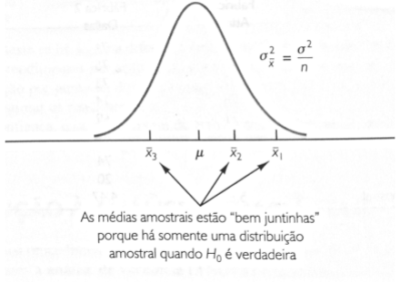
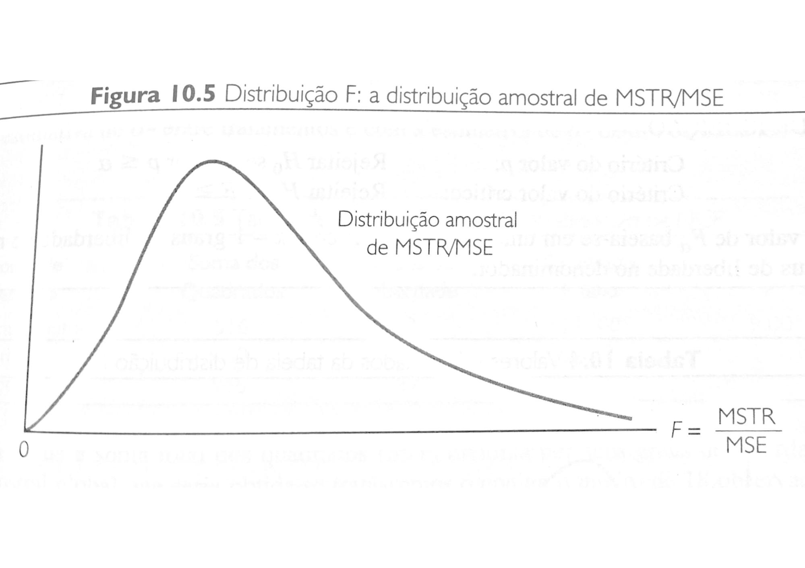
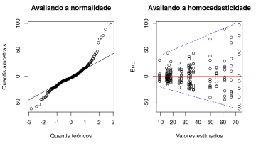
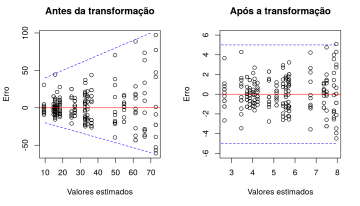
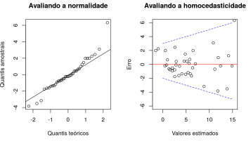
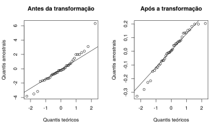
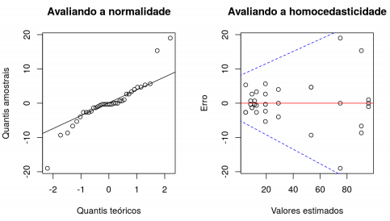
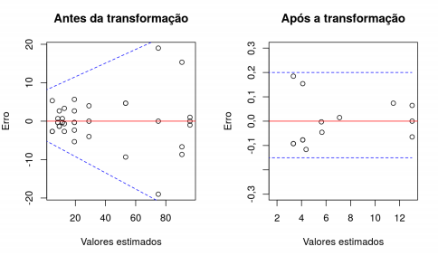

# Teste de hipótese

Teste de hipóteses, teste estatístico ou teste de significância é um procedimento estatístico que permite tomar uma decisão entre duas ou mais hipóteses, utilizando os dados observados de um determinado experimento.

Uma hipótese é suposição sobre um parâmetro específico de uma população, como média, proporção ou desvio padrão. Em muitas situações práticas o interesse do pesquisador é verificar a veracidade sobre um ou mais parâmetros populacionais $\small (μ,σ^2,p)$ ou sobre a distribuição de uma variável aleatória.

Um dos primeiros trabalhos sobre testes foi publicado em 1710 (John Arbuthnot);

Um dos primeiros procedimentos estatísticos que chega perto de um teste, no sentido moderno foi proposto por Karl Pearson em 1900. Esse foi o famoso teste do Qui-quadrado, utilizado para comparar uma distribuição de frequência observada com uma distribuição teoricamente assumida.

A ideia de testar hipóteses foi posteriormente codificada e elaborada por R. A Fischer (1925), que considerou os dados como um vetor de variáveis aleatórias que pertenciam a uma distribuição de probabilidade…

Uma outra abordagem (competitiva a de Fischer) foi estabelecida por J. Neyman e Egon Pearson (1928)…

Mais tarde, Lehmann (1993) argumentou que de fato era possível unificar as formulação, combinando as melhores características das duas abordagens…

As ferramentas que são usadas para testar hipóteses são as hipóteses nula e alternativa:

<div class="fontBlack">
  
  $$\small H_0= \textrm{Hipótese Nula}$$
  $$\small H_a= \textrm{Hipótese Alternativa}$$
</div>
Cada hipótese representa um tipo de situação:

- Hipótese Nula
  - Status quo
  - Comprovar uma suposição ou afirmação
  - Valida que o parâmetro da população é ≤ ou ≥ a um valor específico
  - É para ser verdadeira, ao menos que seja comprovada por evidência contrária
  - Usado para ver se alguma hipótese estabelecida inicialmente pode ser rejeitada ou não
- Hipótese alternativa
  - Representa o oposto da hipótese nula

Ao testar hipóteses, iniciamos por criar uma hipótese experimental a respeito de um parâmetro da população. Essa hipótese experimental é chamada hipótese nula. Ela é denotada por $\small H_0$. Definimos então outra hipótese, denominada hipótese alternativa, a qual é o oposto daquilo que é formulado na hipótese nula $\small H_a$.

## Como formular hipóteses?

- A <span class="highlightGreen"> hipótese a ser testada pela pesquisa deve ser formulada como hipótese alternativa</span>, enquanto a hipótese nula representa o status quo.
- Se o objetivo é testar uma <span class="highlightGreen"> afirmação é verdadeira o valor será colocado na hipótese nula</span>.
- Pode também ser usada em situações de tomada de decisão representando um <span class="highlightGreen">padrão/ valor esperado</span>

Os símbolos matemáticos de comparação:

- Hipótese Nula: ≤ ≥ ≠
- Hipótese Alternativa: < > =

<span class="highlightRose">Exemplo:</span>

Um certo modelo de automóvel atinge a eficiência média de 10,21 Km/L em termos de consumo de combustível. Um novo sistema foi criado e precisa comprovar que esse novo sistema aumenta a taxa média de quilômetros por litro.

Nesse caso a hipótese de pesquisa é que o novo sistema produzirá uma taxa média superior a 10,21, ou seja, μ > 10,21. Como diretriz geral, uma hipótese de pesquisa deve ser formulada como a _hipótese alternativa_. Portanto as hipóteses nula e alternativa relativas ao estudo são:

<div class="fontBlack">

$$\small H_0: μ ≤ 10,21$$
$$\small H_a: μ > 10,21$$

</div>

Se os resultados da amostra indicaram que $\small H_0$ não pode ser rejeitada, os pesquisadores não poderão concluir que o novo sistema de injeção de combustível é melhor. Entretanto, se os resultados da amostra indicarem que $\small H_0$ pode ser rejeitada, os pesquisadores poderão inferir que $\small H_a: μ > 10,21$ é verdadeira. Com essa conclusão, os pesquisadores obtêm base estatística necessária para afirmar que o novo sistema aumenta o número médio de quilômetros por litro.

A conclusão de que a hipótese de pesquisa pode ser verdadeira é obtida se os dados da amostra contradisserem a hipótese nula.

| Hipótese Nula        | $\small H_0: μ ≤ 10,21$ | $\small H_0: μ ≥ 10,21$ | $\small H_0: μ = 10,21$ |
| :------------------- | :---------------------: | :---------------------: | :---------------------: |
| Hipótese Alternativa | $\small H_a: μ > 10,21$ | $\small H_a: μ < 10,21$ | $\small H_a: μ ≠ 10,21$ |

## Erros do tipo I e tipo II

Um erro do Tipo I consiste em rejeitar a $\small H_0$ verdadeira, ou seja, o estudo indica que a hipótese nula é falsa, quando na verdade não é.

Um erro do Tipo II consiste em aceitar uma $\small H_0$ falsa, ou seja, o estudo indica que hipótese nula é verdadeira quando na verdade é falsa.

| Conclusão             | $\small H_0$ Verdadeira | $\small H_0$ Falsa  |
| :-------------------- | :---------------------- | :------------------ |
| Aceitar $\small H_0$  | Correto                 | **Erro do tipo II** |
| Rejeitar $\small H_0$ | **Erro do tipo I**      | Correto             |

O nível de significância (α)indica a probabilidade de cometer erro do Tipo I, quando a hipótese nula é verdadeira enquanto a igualdade. As escolhas comuns para o nível de significância é de 0,05 e 0,01.

Testes de hipótese que somente controlam o erro de tipo I são chamados **teste de significância.** Nestes, somente se chega à conclusão de “Não rejeitar a $\small H_0$”, já que a conclusão de “Aceitar $\small H_0$” coloca-se em risco de cometer um erro de tipo II.

<span class="highlightRose">Exemplo:</span>

Um certo modelo de automóvel atinge a eficiência média de 10,21 Km/L em termos de consumo de combustível. Um novo sistema foi criado e precisa comprovar que esse novo sistema aumenta a taxa média de quilômetros por litro.

Nesse caso a hipótese de pesquisa é que o novo sistema produzirá uma taxa média superior a 10,21, ou seja, μ > 10,21. Como diretriz geral, um hipótese de pesquisa deve ser formulada como a _hipótese alternativa_. Portanto as hipóteses nula e alternativa relativas ao estudo são:

<div class="fontBlack">

$$\small H_0: μ ≤ 10,21$$  
 $$\small H_a: μ > 10,21$$

</div>

O nível de significância, portanto trataria da probabilidade de rejeitar $\small H_0$ quando μ=10,21.

## Média da população: Desvio Padrão σ conhecido

Testes a respeito da média acerca uma população normalmente distribuída, ou grande o suficiente Teorema do Limite Central com desvio padrão conhecido.

### Teste unicaudal

Os testes unicaudais assumem as seguintes formas:

| **Teste de Cauda Inferior** | **Teste de Cauda Superior** |
| :-------------------------- | :-------------------------- |
| $\small H_0: μ ≥ μ_0$       | $\small H_0: μ ≤ μ_0$       |
| $\small H_a: μ < μ_0$       | $\small H_a: μ > μ_0$       |

<span class="highlightRose">Exemplo - Teste de cauda Inferior:</span>

Uma certa fábrica de café informa em suas embalagens que cada lata de café contém 3 libras de produto. Sabe-se ser impossível que cada lata contenha exatamente 3 libras de café, entretanto, a média de enchimento de cada lata é de no mínimo 3 libras, o que garante os direitos dos consumidores .

Temos portanto que a hipótese nula e alternativa são:

<div class="fontBlack">

$$\small H_0: μ ≥ 3$$
$$\small H_a: μ < 3$$

</div>
Isto porque a afirmação do estado atual (fato) é que as latas possuem ao menos, em média, 3 libras de café por lata, e o que se busca provar/ testar é a possibilidade de haver menos de 3 libras de café em cada lata.

Supondo que uma amostra de 36 latas foi tomada e a média amostral $(\bar{x})$ foi calculada como uma estimativa da média da população (μ). Se:

- o valor da média populacional for inferior a 3 libras, a hipótese nula será posta em dúvida
  - <span class="highlightGreen">então quanto menor a média populacional deve ser para podermos rejeitar a hipótese nula?</span>

Essa questão pode ser respondida pelo nível de significância escolhido, o qual informa a hipótese de se cometer um erro do tipo I e rejeitar a $\small H_0$ enquanto igualdade, quando ela na realidade é verdadeira.

Digamos que nesta situação a probabilidade aceita de se cometer um erro de tipo I seja de 1%, ou seja, α = 0,01

A partir disso vamos calcular as **estatísticas de teste**:

- O desvio padrão dessa população é conhecido: σ = 0,18
- A população de pesos de enchimento está normalmente distribuída, portanto a distribuição amostral da x também estará
- O tamanho da amostra = 36

Sabendo que distribuição amostral da $\small \bar{x}$ está normalmente distribuída, a distribuição amostral de:

<div class="fontBlack">
  
  $$\small z = \frac{\bar{x} - μ_0}{σ_{\bar{x}}}$$
  $$\small z = \frac{\bar{x} - 3}{0,03}$$

</div>
Com base na tabela de distribuição normal sabemos que:

- z = -1
  - significa que o de $\small \bar{x}$ está um erro padrão abaixo do valor hipotético da média
  - esta área corresponde a uma probabilidade de aproximadamente: <span class="highlightGray"> $0,5 - 0,3413 = 0,1587$</span>
- z = -2
  - significa que o de $\small \bar{x}$ está dois erros padrão abaixo do valor hipotético da média
  - esta área corresponde a uma probabilidade de aproximadamente: <span class="highlightGray"> $0,5 - 0,4772 = 0,0228$</span>
- z = -3
  - significa que o de $\small \bar{x}$ está três erros padrão abaixo do valor hipotético da média
  - esta área corresponde a uma probabilidade de aproximadamente: <span class="highlightGray"> $0,5 - 0,4987 = 0,0013$</span>

Portanto, para se obter a estatística de teste para determinar se $\small \bar{x}$ se desvia do valor hipotético de μ o suficiente para justificar a rejeição da hipótese nula:

$$\small z = \frac{\bar{x} - μ_0}{σ/\sqrt{n}}$$

Dois critérios podem ser utilizados para responder essa questão:

- Usando o valor de z para calcular a probabilidade denominada **valor p**
  - Valor p : mede o suporte ( ou a falta de suporte) que uma amostra da a hipótese nula - base para determinar se a hipótese nula deve ser rejeitada ou não, dado o nível de significância
  - Vantagem: o valor p informa o quão significativos são os resultados ( nível observado de significância)
- Determinando o **valor crítico**
  - Ponto de referência para determinar se o valor da estatística de teste é pequeno o bastante para rejeitar a hipótese nula

#### Valor p

O valor p, p-value ou nível observado de significância, é uma probabilidade calculada usando-se a estatística de teste, que mede o apoio ( ou a falta de apoio) proporcionado pela amostra a hipótese nula. É o menor nível de significância com que se rejeitaria a hipótese nula.

O valor p varia de 0 a 1.

- Quanto mais próximo a 1, mais suporte a estatística de teste da a hipótese nula ($\small H_0$).
  - <span class="highlightGreen">Valores p grandes levam a **não** rejeição da hipótese nula</span>
- Quanto mais próximo a 0, menos suporte a estatística de teste da a hipótese nula($\small H_0$).
  - O que é incomum dada a suposição de uma $\small H_0$ verdadeira, logo <span class="highlightGreen">levam a rejeição da hipótese nula ($\small H_0$)</span>

Agora utiliza-se a estatística de teste para calcular o valor p, o qual depende do tipo de teste que será feito ( cauda inferior, cauda superior, bicaudal). Num teste de cauda inferior, o valor p é a probabilidade de obtermos um valor para estatística de teste tão pequeno ou menor que aquele produzido pela amostra.

Para tanto, deve-se encontrar a área da curva normal padrão à esquerda da estatística de teste, que fornece o valor p relativo ao teste da cauda inferior no caso em que o σ é conhecido.

Do exemplo anterior, calcularemos o valor z da estatística de teste para uma média amostral x = 2,92:

<div class="fontBlack">
  
  $$\small z =\frac{\bar{x} - μ_0}{σ/\sqrt{n}}$$
</div>
<div class="fontGray">
  
  $$\small z = \frac{2,92  - 3}{0,18/\sqrt{36}} = -2,67$$
</div>

Portanto, o valor p é a probabilidade da estatística de teste z ser menor ou igual a $\small -2,67$ ( a área sob a curva normal padrão à esquerda da estatística de teste. Usando a tabela de distribuição normal padrão temos que a área entre a média e $\small z = -2,67$ é $\small 0,4962$. Assim o p valor:

<div style="text-align: center;" >

<span class="highlightGray" >$$p - value : 0,5 - 0,4962 = 0,0038$$</span>

</div>

<span class="highlightGreen"> Tal valor p indica uma pequena probabilidade de se obter uma média amostral de $\small \bar{x}= 2,92$ (e uma estatística de teste igual a -2,67) ou menor quando se extrai a amostra de uma população com μ = 3.</span>

Dado que o diretor definiu a probabilidade máxima de 1% de cometer um erro de tipo I, sabemos que o nível de significância, o α é igual a $\small 0,01$. Nosso p-value então é menor que nosso alfa, ou seja, a chance de cometermos um erro do tipo I é menor que a chance definida pelo diretor, portanto podemos rejeitar a $\small H_0$ estando dentro dos parâmetros delimitados pelo estudo.

```{r,warning=FALSE,message=FALSE,error=FALSE,fig.keep='all'}
library(tigerstats)
pnormGC(bound = 2.92, region = "below", mean = 3, sd = 0.03, graph = TRUE)
```

<span class="highlightBlue">**Regra de Rejeição** quando se usa o p-value: Rejeitar $\small H_0$ se o valor de p ≤ α </span>

#### Valor crítico

Para um teste de cauda inferior, o valor crítico é o valor da estatística de teste que corresponde a uma área de α( o nível de significância) localizado na cauda inferior da distribuição amostral da estatística de teste. Ou seja, o maior valor da estatística de teste que resultará na rejeição da hipótese nula.

No caso do exemplo, temos que o valor crítico é o valor da estatística de teste que corresponde a uma área de $α= 0,01$ na cauda inferior da distribuição normal padrão.

De acordo com a tabela normal padrão temos que $\small z = -2,33$ produz uma área igual a $\small 0,01$ na cauda inferior. Portanto se a amostra resultar em um valor da estatística de teste menor ou igual a $\small -2,33$, o valor p correspondente será menor ou igual a $\small 0,01$; nesse caso, deveríamos rejeitar a hipótese nula.

A regra de rejeição para este caso então é : Rejeitar a $\small H_0$ se z ≤ -2,33

No exemplo dado, o z da fábrica de café é de $\small -2,67$, correspondente à média $\small \bar{x}$ de 2,92. Uma vez que $\small -2,67 < -2,33$ então podemos rejeitar a $\small H_0$

<span class="highlightBlue">A **regra de rejeição** então é : Rejeitar a $\small H_0$ se z ≤ $-z_α$ </span>

$z_α$ = valor crítico

#### Cauda superior

Em um teste de cauda superior o valor p informa a probabilidade de se obter um valor para a estatística de teste que seja tão grande ou maior que aquele que é produzido pela amostra. Para tanto deve se calcular a área sob a curva normal padrão à direita da estatística de teste.

O uso do critério do valor crítico, faz com que rejeitemos a hipótese nula se o valor de estatística de teste for maior ou igual ao valor crítico.

<span class="highlightBlue">A **regra de rejeição** então é : Rejeitar a $\small H_0$ se z ≥ $-z_α$ </span>


A área em vermelho pode ser chamada de zona de rejeição ou zona crítica e define um conjunto de valores que chama para rejeitar a hipótese nula. A área compreendida entre os desvios padrão (em branco) é a área que é considerada como DIFERENÇA NÃO SIGNIFICATIVA, e a área fora é considerada DIFERENÇA SIGNIFICATIVA.

### Teste Bicaudal

A regra para um teste bicaudal é expresso da seguinte maneira:

<div class="fontBlack">
  
  $$H_0: μ =μ_0$$
  $$H_a: μ≠ μ_0$$

</div>
<span class="highlightRose">Exemplo de teste bicaudal:</span>

A norma uma empresa de equipamentos determina que bolas de golfe atinjam a média de arremesso de 295 jardas. Valores muito abaixo ou muito acima da média não são aceitos.

O programa de controle de qualidade testa periodicamente uma amostra de 50 bolas de golfe para monitorar o cumprimento da média de arremesso. Temos portanto as hipóteses:

<div class="fontGray">
  
  $$H_0: μ =295$$
  $$H_a: μ \neq 295$$

</div>

Como a média de 295 jardas é o padrão da fábrica, esperamos que este seja um fato, logo trata-se da hipótese nula, e o estudo busca provar que o padrão não está sendo cumprido, trata-se então da hipótese alternativa.

Se a média encontrada na amostra for significamente maior ou menor que a média demonstrada na $\small H_0$ rejeitaremos a hipótese nula.

O nível de significância definido pelo controle de qualidade foi de α = 0,05, e o desvio padrão, de amostras históricas dentro do padrão, mostram que pode-se presumir que o desvio padrão populacional é conhecido tendo o valor de σ = 12. Desse modo o desvio padrão de x:

<div class="fontGray">
  
  $$\small \sigma_{\bar{x}}= \frac{\sigma}{\sqrt{n}}$$

$$\small \sigma_{\bar{x}}= \frac{12}{\sqrt{50}}=1,7$$

</div>

Dado que na amostra de 50 elementos foi encontrada uma média ($\small \bar{x}$) de 297,6 seria esta amostra grande demais para … Tal pergunta pode ser respondida pelo critério do p-value ou pelo valor crítico.

#### Valor p

O valor p, p-value ou nível observado de significância, é uma probabilidade calculada usando-se a estatística de teste, que mede o apoio ( ou a falta de apoio) proporcionado pela amostra a hipótese nula.

O valor p varia de 0 a 1.

- Quanto mais próximo a 1, mais suporte a estatística de teste da a hipótese nula ($\small H_0$).
  - <span class="highlightGreen">Valores p grandes levam a **não** rejeição da hipótese nula</span>
- Quanto mais próximo a 0, menos suporte a estatística de teste da a hipótese nula ($\small H_0$).
  - O que é incomum dada a suposição de uma $\small H_0$ verdadeira, logo <span class="highlightGreen">levam a rejeição da hipótese nula ($\small H_0$)</span>

Em um teste bicaudal, o valor p é a probabilidade de se obter um valor para a estatística de teste **tão ou mais improvável** do que aquele que é fornecido pela amostra.

A estatística de teste para a média fornecida pela amostra é :

<div class="fontGray">
  
  $$z = \frac{\bar{x} - μ_0}{σ/\sqrt{n}}$$

$$z = \frac{297,6 - 295}{12/\sqrt{50}} = 1,53$$

</div>

Agora, busca-se a probabilidade de se obter um valor para a estatística de teste, que seja, **no mínimo tão improvável quanto z = 1,53.** E por se tratar de um teste bicaudal, também é tratada a hipótese de $\small z = -1,53$ ser um valor tão improvável quanto a estatística de teste fornecida pela amostra.

O valor p bicaudal para este caso, é dado por $\small P( z ≤ -1,53) + P( z ≥ 1,53)$. Visto que a curva é simétrica, podemos encontrar somente a probabilidade da área sob a curva a direita da média e a duplicando. A tabela da distribuição normal padrão mostra que a área sob a curva entre a média e $\small z = 1,53$ é $\small 0,4370$. Portanto, a área sob a curva normal à direita da estatística de teste $\small z = 1,53$ é:

<div style="text-align: center;" >

<span class="highlightGray" >$$\small p - value \textrm{(1 lado)} : 0,5 - 0,4370 = 0,0630$$</span>
<span class="highlightGray" >$$\small p - value \textrm{(bicaudal)} : 0.0630 × 2 = 0,1260$$</span>

</div>

Agora, comparando o valor p com o nível de significância, a fim de verificar se a hipótese nula deve ser rejeitada, verificamos que:

<div style="text-align: center;" >

<span class="highlightGray" >$$\small α = 0,05$$</span>
<span class="highlightGray" >$$\small p-value: 0,1260$$</span>
<span class="highlightGray" >$$\small α (0,05) < p-value (0,1260)$$</span>

</div>

Portanto, a hipótese nula não deve ser rejeitada, pois <span class="highlightGreen" >a probabilidade de uma população de média 295 produzir uma amostra com média igual ou maior a 297,6 (ou igual ou menor que 292,4 )é de 12,6%.</span> Tal probabilidade é maior que a probabilidade admissível de se cometer um erro do Tipo I, que trata de afirmar que com 95% de certeza que uma população de média 295 não poderia produzir uma amostra de média 297,6.

```{r}
df<- read.csv("data/Golf.csv",sep=",")
ttestGC(~Yards, data=df,mu=295,sd=12, alternative="two.sided",conf.level = 0.95,graph=TRUE)

```

#### Valor crítico

Para um teste bicaudal, o valor crítico é o valor da estatística de teste que corresponde a uma área de α( o nível de significância) localizado na cauda inferior e superior da distribuição amostral da estatística de teste. Ou seja, <span class="highlightGreen">se o valor da estatística de teste ultrapassar os limites dos valores críticos a hipótese nula será rejeitada.</span>

No caso do exemplo, temos que o valor crítico é o valor da estatística de teste que corresponde a uma área total de α= 0,05, a qual corresponde a uma área de 0,025 ambas as caudas da distribuição normal padrão.

```{r}
pnormGC(c(-1.96,1.96),mean=0,sd=1,region ="outside", graph=TRUE)

```

De acordo com a tabela normal padrão um z = 1,96 produz uma área de 0,025 em ambas as caudas. Portanto se a amostra resultar em um valor da estatística de teste menor ou igual a -1,96 ou 1,96, o valor p correspondente será menor ou igual a 0,025; nesse caso, deveríamos rejeitar a hipótese nula.

A regra de rejeição para este caso então é : <span class="highlightGray">Rejeitar a $\small H_0$ se z ≤ -1,96 ou se z ≥ 1,96</span>

No exemplo dado, o z da amostra dos lançamentos da bola de golfe é de 1,53, correspondente à média x de 296,6. Uma vez que 1,53 < 1,96 então **não podemos rejeitar a $\small H_0$**

<span class="highlightBlue">A **regra de rejeição** então é : Rejeitar a $\small H_0$ se z ≤ $\small -z_α$ ou se z ≥ $-z_α$ </span>

<span class="highlightBlue">$\small -z_α$ = valor crítico</span>

#### Testar a partir do intervalo de confiança

A regra para um teste bicaudal é expresso da seguinte maneira:

<div class="fontBlack">
  
  $$\small H_0: μ =μ_0$$
  $$\small H_a: μ \neq μ_0$$

</div>
Para desenvolver o intervalo de confiança:

1. Selecione uma amostra e use o valor da média amostral para desenvolver o intervalo de confiança da média populacional
   a. $\small \bar{x} ± z_{\frac{α}{2}}\frac{\sigma}{\sqrt{n}}$
   a. $\small( 1 - α)$ = coeficiente de confiança
   a. $\small α$ = Nível de significância
   a. $\small z_{\frac{α}{2}}$ = é o valor de z que produz uma área de α/2 na cauda superior da distribuição normal padrão de probabilidade
   a. $\small z_{\frac{α}{2}}$ = Semi amplitude
1. Se o intervalo de confiança contiver o valor hipotético $\small μ_0$ não rejeite $\small H_0$. Caso contrário, rejeite $\small H_0$

No exemplo das bolas de golfe teríamos:

<div class="fontBlack">
  
  $$\small \bar{x} ± z_{\frac{α}{2}}\frac{\sigma}{\sqrt{n}}$$ 
</div>
<div class="fontGray">
  
  $$\small 297,6 ± 1,96\frac{12}{50}$$
  
  $$\small 297,6 ± 3,3$$
  
  $$\small 294,3 ≤ μ ≤ 300,9$$
</div>

Portanto, podemos afirmar com 95% de confiança que a distância média atingida pela população das bolas de golfe está entre 294,3 e 300,9 jardas. Como o valor hipotético da média populacional $\small μ_0:μ = 295$ está contido dentro do intervalo, a conclusão do teste de hipóteses é que a hipótese nula, $\small μ_0:μ = 295$, não pode ser rejeitada.

### Resumo

<table>
  <tr>
    <th></th>
    <th>Teste de Cauda Inferior</th>
    <th>Teste de Cauda Superior</th>
    <th>Teste Bicaudal</th>
  </tr>
  <tr>
    <td><b>Hipótese</b></td>
    <td>$\small H_0:\mu \geq \mu_0$ \n $\small H_a:\mu < \mu_0$</td>
    <td>$\small H_0:\mu \leq \mu_0$ \n $\small H_a:\mu > \mu_0$</td>
    <td>$\small H_0:\mu = \mu_0$ <br> $\small H_a:\mu \neq \mu_0$</td>
  </tr>
  <tr>
    <td><b>Estatística de Teste </b></td>
    <td>$\small z=\frac{\bar{x}-\mu_0}{\sigma/ \sqrt{n}}$</td>
    <td>$\small z=\frac{\bar{x}-\mu_0}{\sigma/ \sqrt{n}}$</td>
    <td>$\small z=\frac{\bar{x}-\mu_0}{\sigma/ \sqrt{n}}$</td>
  </tr>
  <tr>
    <td><b>Regra de Rejeição: Critério do Valor p</b></td>
    <td>Rejeitar $\small H_0$ se o valor de $\small p \leq \alpha$</td>
    <td>Rejeitar $\small H_0$ se o valor de $\small p \leq \alpha$</td>
    <td>Rejeitar $\small H_0$ se o valor de $\small p \leq \alpha$ </td>
  </tr>
  <tr>
    <td><b>Regra de Rejeição: Critério do Valor Crítico</b></td>
    <td>Rejeitar $\small H_0$ se o valor de $\small z \leq -z_\alpha$</td>
    <td>Rejeitar $\small H_0$ se o valor de $\small z \geq z_\alpha$</td>
    <td>Rejeitar $\small H_0$ se o valor de $\small z \leq -z_{\alpha/2}$ ou se $\small z \geq z_{\alpha/2}$ </td>
  </tr>
</table>

| P - value         | Conclusão                                            |
| :---------------- | :--------------------------------------------------- |
| Menor que 0,01    | Esmagadora evidência que $\small H_a$ é verdadeira   |
| Entre 0,01 e 0,05 | Forte evidência que $\small H_0$ é verdadeira        |
| Entre 0,01 e 0,05 | Fraca evidência que $\small H_a$ é verdadeira        |
| Maior que 0,01    | Insuficiente evidência que $\small H_a$ é verdadeira |

Só podemos rejeitar ou não rejeitar a hipótese nula, nunca aceitar.

## Média da população: Desvio Padrão (σ) desconhecido

Testes a respeito da média acerca uma população normalmente distribuída, ou grande o suficiente Teorema do Limite Central com desvio padrão desconhecido. O desvio padrão desconhecido corresponde a uma situação em que não se pode desenvolver uma estimativa de desvio padrão populacional antes de se fazer uma amostragem, a amostra deve ser utilizada para desenvolver uma estimativa de μ, tanto quanto de σ.

Assim a média amostral $\small \bar{x}$ será a estimativa de μpopulacional e o desvio padrão da amostra scomo estimativa de σ.

Diferente do caso de uma população normalmente distribuída e com desvio padrão conhecido, um teste com uma população com desvio padrão desconhecido tem uma variabilidade ligeiramente maior porque a amostra é usada para desenvolver estimativas tanto de μ como de σ e é baseado na distribuição probabilística chamada distribuição T, onde para o caso de o desconhecido se trata de uma estatística de teste com n-1 graus de liberdade.

### Teste Unicaudal

A fórmula da estatística de teste para teste de hipótese a respeito de uma média populacional de σ desconhecido:

<div class="fontBlack">
  
  $$\small t = \frac{\bar{x} - μ_0}{s/ \sqrt{n}}$$
</div>

<span class="highlightRose">Exemplo:</span>

Numa avaliação de atendimento de aeroporto, onde a nota varia de 0 a 10, uma nota 7 é considerada um atendimento de alto nível. Numa pesquisa foram coletadas 60 avaliações de aeroportos e a média encontrada num certo aeroporto foi de $\small \bar{x}$ = 7,25 e um desvio padrão s = 1,052.

Um teste de hipóteses deve ser desenvolvido , onde se testa a hipótese da média populacional da avaliação do aeroporto em questão ser maior que 7.

<div class="fontBlack">
  
  $$\small H_0: μ ≤  7$$

$$\small H_a: μ >  7$$

</div>
No teste será usado o nível de significância α = 0,05.

#### Valor p

<div class="fontGray">
  
  $$\small t = \frac{\bar{x} - μ_0}{s/ \sqrt{n}}$$
  
  $$\small t = \frac{7,25 - 7}{1,052/ \sqrt{60}}=1,84$$
</div>
A distribuição amostral de T tem: 
<div class="fontGray">
  
  $$\small \textrm{n - 1 = graus de liberdade}$$
  
  $$\small \textrm{60 - 1 = 59 graus de liberdade}$$
</div>
Uma significância de 0,05  com 59 graus de liberdade numa distribuição t:

<table>
  <tr>
    <th>Área da cauda superior </th>
    <td>0,20</td>
    <td>0,10</td>
    <td><span class="highlightGreen round">0,05</span></td>
    <td><span class="highlightGreen round">0,025</span></td>
    <td>0,01</td>
    <td>0,005</td>
  </tr>
  <tr>
    <th>Valor t ( 59 graus de liberdade )</th>
    <td>0,848</td>
    <td>1,296</td>
    <td><span class="highlightGreen round">1,671</span></td>
    <td><span class="highlightGreen round">2,001</span></td>
    <td>2,391</td>
    <td>2,662</td>
  </tr>
</table>
O **t = 1,84** está entre 1,671 e 2,001. Isso significa que o p-value está entre 0,05 e 0,025 , o que, dado que o nível de significância é 0,05 podemos concluir que a hipótese nula deve ser rejeitada e portanto o aeroporto em questão deve ser considerado de alto nível, nota maior que 7.

<span class="highlightBlue">**Regra de Rejeição** quando se usa o p-value: Rejeitar $\small H_0$ se o valor de p ≤ α</span>

<span class="highlightGray">0,035 ≤ 0,05 → Rejeita a $\small H_0$</span>

#### Valor Crítico

Considerando um α = 0,05 e uma distribuição t com 59 graus de liberdade, temos um $\small t_{0,05} = 1,671$ é o valor crítico de teste. A regra de rejeição neste caso é:

<span class="highlightBlue">**Regra de rejeição** : Rejeitar a $\small H_0$ se $\small t ≥ z_α$ </span>

<span class="highlightGray">1,84 ≥ 1,671 → Portanto, rejeitar a $\small H_0$</span>

### Teste Bicaudal

A fórmula da estatística de teste para teste de hipótese a respeito de uma média populacional de σ desconhecido:

<div class="fontBlack">

$$\small t = \frac{\bar{x} - μ_0}{s/ \sqrt{n}}$$

<div>
<span class="highlightRose">Exemplo:</span>

Uma certa empresa de manufatura tem mais de mil pontos de revenda e precisa planejar seu nível de produção para a próxima estação, para tanto, precisa planejar a quantidade de produção de cada brinquedo, antes de se conhecer a real demanda do mercado. Para um novo brinquedo o diretor de marketing planeja a venda de 40 unidades por ponto de revenda.

Antes de tomar a decisão final a empresa decidiu pesquisar uma amostra de 25 varejistas a fim de desenvolver mais informações acerca da demanda do novo produto. Aos varejistas foram fornecidas as características e preço do novo brinquedo e solicitada uma quantidade prevista de compra.

Considerando que μ denota a média dos lotes de compra da população por ponto de revenda, os dados serão usados para realizar o seguinte teste bicaudal:

<div class="fontGray">
  
  $$\small H_0: μ = 40$$
  $$\small H_a: μ ≠ 40$$

</div>

Se $\small H_0$ não puder ser rejeitada, a empresa continuará com os planos de produção, baseado na estimativa feita pelo diretor de marketing. Entretanto, se $\small H_0$ for rejeitada, a empresa reavaliará os planos de produção. O teste bicaudal poderá informar se a média de compra é maior ou menor que a prevista.

Como se trata de um novo produto, a média e desvio padrão populacionais serão estimados com base na média ($\small \bar{x}$) e desvio padrão (σ) amostrais.

A amostra de 25 elementos produziu uma média de $\small \bar{x} = 37,5$ e desvio padrão $\small σ=11,79$. Um histograma foi montado a fim de observar o formato da distribuição e nenhum ponto de assimetria ou pontos fora da curva foram observados, portanto, foi adotado (n - 1) = (25 - 1) graus de liberdade. Temos portanto que t :

#### Valor p

<div class="fontGray">
  
  $$\small t = \frac{\bar{x} - μ_0}{s/ \sqrt{n}}$$

$$t = \frac{37,4  - 40}{11,79/ \sqrt{25} }= -1,10$$

</div>
O p-value, por se tratar de um teste bicaudal, deve ser calculado multiplicando por 2 o valor encontrado na tabela, no caso:

<table>
  <tr>
    <th>Área da cauda superior </th>
    <td><span class="highlightGreen round">0,20</span></td>
    <td><span class="highlightGreen round">0,10</span></td>
    <td>0,05</td>
    <td>0,025</td>
    <td>0,01</td>
    <td>0,005</td>
  </tr>
  <tr>
    <th>Valor t ( 24 graus de liberdade )</th>
    <td><span class="highlightGreen round">0,857</span></td>
    <td><span class="highlightGreen round">1,318</span></td>
    <td>1,711</td>
    <td>2,064</td>
    <td>2,492</td>
    <td>2,797</td>
  </tr>
</table>

O **t = 1,10** está entre 0,857 e 1,318. Isso significa que o p-value está entre 0,20 e 0,10 e dado que se trata de um teste bicaudal, devemos multiplicar o valor de p por dois, logo temos que o p-value está entre 0,40 e 0,20 o que, dado que o nível de significância é 0,05 podemos concluir que a hipótese nula não deve ser rejeitada e portanto a previsão realizada deve ser mantida, já que não há evidências suficientes que a previsão deva ser alterada.

#### Valor crítico

O valor crítico também pode ser utilizado para avaliar a hipótese, no caso, teríamos, com um α = 0,05e 24 graus de liberdade um de $\small -t_{0,025} = -2,064$ e $\small t_{0,025} = 2,064$ como valores críticos para o teste bicaudal. Portanto:

<span class="highlightBlue">**Regra de rejeição** : Rejeitar a $\small H_0$ se $\small t ≤ -z_α$ ou se $\small t ≥ z_α$ </span>

<span class="highlightGray">t ≤ -2,064 ou se t ≥ 2,064</span>

Com base no valor de t = -1,10 podemos concluir que a hipótese nula não deve ser rejeitada e a empresa deve manter os planos originais de produção baseados em μ = 40.

### Resumo

<table>
  <tr>
    <th></th>
    <th>Teste de Cauda Inferior</th>
    <th>Teste de Cauda Superior</th>
    <th>Teste Bicaudal</th>
  </tr>
  <tr>
    <td><b>Hipótese</b></td>
    <td>$\small H_0:\mu \geq \mu_0$ \n $\small H_a:\mu < \mu_0$</td>
    <td>$\small H_0:\mu \leq \mu_0$ \n $\small H_a:\mu > \mu_0$</td>
    <td>$\small H_0:\mu = \mu_0$ <br> $\small H_a:\mu \neq \mu_0$</td>
  </tr>
  <tr>
    <td><b>Estatística de Teste </b></td>
    <td>$\small t=\frac{\bar{x}-\mu_0}{\sigma/ \sqrt{n}}$</td>
    <td>$\small t=\frac{\bar{x}-\mu_0}{\sigma/ \sqrt{n}}$</td>
    <td>$\small t=\frac{\bar{x}-\mu_0}{\sigma/ \sqrt{n}}$</td>
  </tr>
  <tr>
    <td><b>Regra de Rejeição: Critério do Valor p</b></td>
    <td>Rejeitar $\small H_0$ se o valor de $\small p \leq \alpha$</td>
    <td>Rejeitar $\small H_0$ se o valor de $\small p \leq \alpha$</td>
    <td>Rejeitar $\small H_0$ se o valor de $\small p \leq \alpha$ </td>
  </tr>
  <tr>
    <td><b>Regra de Rejeição: Critério do Valor Crítico</b></td>
    <td>Rejeitar $\small H_0$ se o valor de $\small z \leq -z_\alpha$</td>
    <td>Rejeitar $\small H_0$ se o valor de $\small z \geq z_\alpha$</td>
    <td>Rejeitar $\small H_0$ se o valor de $\small z \leq -z_{\alpha/2}$ ou se $\small z \geq z_{\alpha/2}$ </td>
  </tr>
</table>

## Proporção da população

Para realizar um teste de hipótese a respeito de uma proporção populacional utilizaremos p0para denotar o valor hipotético da proporção populacional. De forma semelhante ao teste de hipótese da média, são três os possíveis testes a serem realizados a respeito de uma proporção populacional:

| **Teste de Cauda Inferior** | **Teste de Cauda Superior** |  **Teste Bicaudal**   |
| :-------------------------- | :-------------------------- | :-------------------: |
| $\small H_0: p ≥ p_0$       | $\small H_0: p ≤ p_0$       | $\small H_0: p ≤ p_0$ |
| $\small H_a: p < p_0$       | $\small H_a: p > p_0$       | $\small H_a: p > p_0$ |

Os testes de hipótese a respeito de uma proporção populacional se baseiam na diferença entre a proporção amostral $\small \bar{p}$ e a proporção populacional $\small p_0$ hipotética. Os métodos utilizados para realizar o teste de hipóteses são semelhantes ao método utilizado no teste da média populacional, com a diferença do uso do erro padrão para o cálculo da estatística de teste.

<span class="highlightRose">Exemplo - teste de cauda superior</span>

Numa empresa que oferece curso de golfe, encontra-se a proporção de 20% de mulheres. A fim de aumentar esse número, uma promoção foi lançada, e agora, um mês após o lançamento deseja-se saber que a proporção de mulheres aumentou, temos portanto as hipóteses:

<div class="fontBlack">
  
  $$\small H_0: p ≤ 0,20$$
  $$\small H_a: p > 0,20$$
</div>
Na execução desse teste de hipóteses deve ser usado o nível de significância α = 0,05. A rejeição da hipótese nula significa que a existe suporte estatístico a hipótese que a promoção aumentou o número de mulheres no curso de golfe.

Quando a hipótese nula é verdadeira enquanto igualdade, o valor esperado de $\small \bar{p}$ equivale ao valor de hipotético de $\small p_0$; ou seja, $\small E(\bar{p}) = p_0$. O erro padrão de p é dado por:

<div class="fontBlack">
  
  $$\small σ_{\bar{p}}=\sqrt{\frac{p_0(1 - p_0)}{n}}$$
</div>

Se <span class="highlightGray"> $\small np ≥ 5 \textrm{ e }   n ( 1 - p)≥ 5$ </span> a distribuição amostral de p pode ser aproximada a uma distribuição normal.

<div class="fontBlack">
  
  $$\small z = \frac{\bar{p} - p_0}{σ_{\bar{p}}}$$
</div>
Sendo:
<div class="fontBlack">
  
  $$\small σ_{\bar{p}}=\sqrt{\frac{p_0 ( 1 - p_0)}{n}}$$ 
</div>
Portanto, temos que z:
<div class="fontBlack">
  
  $$\small z = \frac{p - p_0}{\sqrt{\frac{p_0 ( 1 - p_0)}{n}}}$$
</div>
No caso exemplificado, consideremos uma amostra de n = 400 , onde 100 jogadores sejam mulheres. Temos então:
<div class="fontGray">
  
  $$\small \bar{p}=\frac{100}{400} = 0,25$$
</div>
Usando a equação acima temos que z:
<div class="fontGray">

$$\small z = \frac{p - p_0}{\sqrt{\frac{p_0 ( 1 - p_0)}{n}}}$$

$$\small z = \frac{0,25 - 0,20}{\sqrt{\frac{0,20 ( 1 - 0,20)}{400}}}$$

$$\small z = \frac{0,05}{0,02} = 2,50$$

</div>

### Valor p

O p-value correspondente a z = 2,50 é 0,0062. Logo:

<span class="highlightBlue">**Regra de Rejeição** quando se usa o p-value: Rejeitar $\small H_0$ se o valor de p ≤ α </span>

<span class="highlightGray">0,0062 ≤ 0,05 → Rejeita a $\small H_0$</span>

Portanto, a promoção aumentou o número de mulheres no curso de golfe.

### Valor crítico

O valor crítico correspondente a uma área de 0,05 na cauda superior de uma distribuição normal padrão é $\small z_{0,05}= 1,645$.

<span class="highlightBlue">**Regra de rejeição** : Rejeitar a $\small H_0$ se t ≥ zα </span>

<span class="highlightGray">2,5 ≥ 1,645 → Portanto, rejeitar a $\small H_0$</span>

### Resumo

O procedimento para realizar um teste de hipóteses a respeito de uma proporção populacional é o mesmo que o utilizado para testar uma média populacional. A única mudança é o termo utilizado para se referir a proporção populacional ao invés de se referir a média populacional.

<table>
  <tr>
    <th></th>
    <th>Teste de Cauda Inferior</th>
    <th>Teste de Cauda Superior</th>
    <th>Teste Bicaudal</th>
  </tr>
  <tr>
    <td><b>Hipótese</b></td>
    <td>$\small H_0:\mu \geq \mu_0$ \n $\small H_a:\mu < \mu_0$</td>
    <td>$\small H_0:\mu \leq \mu_0$ \n $\small H_a:\mu > \mu_0$</td>
    <td>$\small H_0:\mu = \mu_0$ <br> $\small H_a:\mu \neq \mu_0$</td>
  </tr>
  <tr>
    <td><b>Estatística de Teste </b></td>
    <td>$\small z = \frac{p - p_0}{\sqrt{\frac{p_0 ( 1 - p_0)}{n}}}$</td>
    <td>$\small z = \frac{p - p_0}{\sqrt{\frac{p_0 ( 1 - p_0)}{n}}}$</td>
    <td>$\small z = \frac{p - p_0}{\sqrt{\frac{p_0 ( 1 - p_0)}{n}}}$</td>
  </tr>
  <tr>
    <td><b>Regra de Rejeição: Critério do Valor p</b></td>
    <td>Rejeitar $\small H_0$ se o valor de $\small p \leq \alpha$</td>
    <td>Rejeitar $\small H_0$ se o valor de $\small p \leq \alpha$</td>
    <td>Rejeitar $\small H_0$ se o valor de $\small p \leq \alpha$ </td>
  </tr>
  <tr>
    <td><b>Regra de Rejeição: Critério do Valor Crítico</b></td>
    <td>Rejeitar $\small H_0$ se o valor de $\small z \leq -z_\alpha$</td>
    <td>Rejeitar $\small H_0$ se o valor de $\small z \geq z_\alpha$</td>
    <td>Rejeitar $\small H_0$ se o valor de $\small z \leq -z_{\alpha/2}$ ou se $\small z \geq z_{\alpha/2}$ </td>
  </tr>
</table>

## Inferência acerca da diferença entre médias

A inferência a respeito da diferença entre médias é útil para desenvolver uma estimação por intervalo da diferença da média dos salários iniciais de homens e mulheres ou testar se a média de horas entre a ocorrência de panes é o mesmo para quatro máquinas diferentes. Para tanto, devemos desenvolver estimação por intervalo e realizar testes de hipóteses a respeito da diferença entre duas médias populacionais.

### Desvio padrão conhecido

Admitindo que $\small μ_1$ denota a média da população 1 e $\small μ_2$ a média da população 2, uma amostra de $\small n_1$ unidades deve ser coletada na população 1 e uma amostra de $\small n_2$ unidades deve ser coletada na população 2. As duas amostras aleatórias simples, tomadas de maneira separada e independente, são chamadas de **amostras aleatórias simples independentes.** Consideremos que antes da realização das coletas de amostra os desvios padrão de ambas as populações são conhecidos, como $σ_1$ e $σ_2$ .

<span class="highlightRose">Exemplo:</span>

Uma empresa possui duas lojas numa mesma cidade, uma localizada no centro da cidade e outro num shopping na periferia. O gerente regional notou que os produtos que tem uma boa vendagem numa loja nem sempre vendem bem na outra. O gerente acredita que tal diferença seja devido a diferença entre os aspectos demográficos entre os clientes das duas localidades e solicitou uma investigação na diferença entre as médias de idade entre os clientes que compram nas duas lojas.

Consideremos como população 1 os clientes da loja do centro e população 2 os clientes da loja do shopping:

- $\small μ_1$ : média da população 1 (média da idade dos clientes da loja do centro)
- $\small μ_2$ : média da população 2 (média da idade dos clientes da loja do shopping)

A diferença entre as médias das populações é dado por: <span class="highlightBlue">$\small μ_1- μ_2$</span>

Para estimar $\small μ_1- μ_2$ , selecionamos uma amostra aleatória simples de $\small n_1$ clientes da população 1 e uma amostra de $\small n_2$ clientes da população 2 . Então calculamos as duas médias amostrais:

- $\small \bar{x_1}$: média amostral da idade de uma amostra aleatória simples de $\small n_1$ clientes da loja do centro
- $\small \bar{x_2}$: média amostral da idade de uma amostra aleatória simples de $\small n_2$ clientes da loja do centro

O estimador por ponto da diferença entre as médias amostrais das duas populações é a diferença entre as duas médias amostrais.

<div class="fontBlack">
  
  $$\small \bar{x_1} - \bar{x_2}$$
</div>

À semelhança do que ocorre com outros estimadores por ponto, o estimador por ponto de $\small \bar{x_1}- \bar{x_2}$ tem um erro padrão que descreve a variação da distribuição amostral do estimador. Com duas amostras aleatórias independentes, o erro padrão de $\small \bar{x_1}- \bar{x_2}$ é o seguinte:

<div class="fontBlack">
  
  $$\small σ_{\bar{x}_1- \bar{x}_2}= \sqrt{\frac{σ_1^2}{n_1} + \frac{σ_2^2}{n_2}} $$
</div>

Se ambas as populações tiverem uma distribuição normal, ou se os tamanhos de amostra forem suficientemente grandes a ponto de o teorema do limite central nos permitir concluir que as distribuições amostrais de $\small \bar{x}_1$ e de $\small \bar{x}_2$ possam ser aproximadas a uma distribuição normal, a distribuição de $\small \bar{x}_1 - \bar{x}_2$ terá uma distribuição normal com uma média dada por $\small μ_1- μ_2$.

Uma estimação por intervalo é dado por uma estimação por ponto ± uma margem de erro. No caso da estimação da diferença entre duas médias populacionais uma estimação por intervalo irá assumir a seguinte forma:

<div class="fontBlack">
  
  $$\small \bar{x}_1 - \bar{x}_2  ±  \textrm{Margem de erro}$$
</div>

Com a distribuição amostral de $\small \bar{x_1} - \bar{x_2}$ tendo uma distribuição normal, podemos escrever a margem de erro da seguinte forma:

<div class="fontBlack">
  
  $$\small \textrm{Margem de erro} = z_{α/2}   σ_{\bar{x}_1- \bar{x}_2} =z_{α/2} \sqrt{\frac{σ_1^2}{n_1} +\frac{σ_2^2}{n_2}}$$ 
</div>

Por fim, a estimação por intervalo da diferença entre as duas médias populacionais é dada por:

<div class="fontBlack">
  
  $$\small \bar{x}_1- \bar{x}_2 ± z_{α/2}  \sqrt{\frac{σ_1^2}{n_1} +\frac{σ_2^2}{n_2}}$$  
</div>

No exemplo dado temos a seguinte resultado das coletas:

|                            | Loja do Centro                       | Loja do Shopping                      |
| :------------------------- | :----------------------------------- | :------------------------------------ |
| Tamanho da Amostra         | $\small n_1=36$                      | $\small n_2=49$                       |
| Média Amostral             | $\small \bar{x}_1= \textrm{40 anos}$ | $\small \bar{x}_2 = \textrm{35 anos}$ |
| Desvio Padrão Populacional | $\small σ_1= \textrm{9 anos}$        | $\small σ_2= \textrm{10 anos }$       |

A estimação por ponto da diferença entre a média de idade das duas populações é dado por:

<div class="fontBlack">
  
  $$\small \bar{x}_1- \bar{x}_2$$
</div>
<div class="fontGray">

$$\small 40 - 35 = \textrm{5 anos}$$

</div>
Portanto, os clientes da loja do centro tem uma média de idade de 5 anos maior que a média de idade dos clientes da loja da periferia. Agora, para calcular a margem de erro e a estimação por intervalo com 95% de confiança iremos:
<div class="fontGray">

$$\small z_{α/2} = z_{0,025}  = 1,96$$
$$\small \bar{x}_1- \bar{x}_2 ± z_{α/2} \sqrt{\frac{σ_1^2}{n_1} + \frac{σ_2^2}{n2}}$$
$$\small 40 - 35 ± 1,96 \sqrt{\frac{9^2}{36} + \frac{10^2}{49}}$$
$$\small 5 ± 4,06$$
$$\small 0,94 ≤ μ_1- μ_2 ≤ 9,06$$

</div>

Portanto, a margem de erro é de 4,06 anos e a estimação por intervalo de confiança de 95% entre as duas médias populacionais é de 0,94 anos a 9,06 anos.

#### Teste de Hipóteses sobre a diferença entre médias $\small μ_1- μ_2$

Consideremos os testes de hipóteses sobre a diferença entre as médias de duas populações. Usando $\small D_0$ para denotar as diferenças hipotéticas entre $\small μ_1- μ_2$, as três formas de um teste de hipóteses são as seguintes:

| **Teste de Cauda Inferior**  | **Teste de Cauda Superior**  |      **Teste Bicaudal**      |
| :--------------------------- | :--------------------------- | :--------------------------: |
| $\small H_0: μ_1- μ_2 ≥ D_0$ | $\small H_0: μ_1- μ_2 ≤ D_0$ | $\small H_0: μ_1- μ_2 ≤ D_0$ |
| $\small H_a: μ_1- μ_2 < D_0$ | $\small H_a: μ_1- μ_2 > D_0$ | $\small H_a: μ_1- μ_2 > D_0$ |

Os passos para a realização do teste de hipótese são os mesmos utilizados em outras aplicações:

- Escolhe-se um nível de significância
- Calcula-se o valor da estatística de teste
- Encontra-se o valor p
- A partir do valor p determina-se se a hipótese deve ser rejeitada

Com duas amostras aleatórias simples independentes, mostramos que o estimador por ponto $\small \bar{x}_1- \bar{x}_2$ tem erro padrão $\small σ_{\bar{x}_1- \bar{x}_2}$ e que a distribuição de $\small \bar{x}_1- \bar{x}_2$ pode ser descrita por uma distribuição normal. Nesse caso, a estatística de teste da diferença entre as duas médias populacionais quando $\small σ_1$ e $\small σ_2$ são conhecidos é a seguinte:

<div class="fontBlack">
  
  $$\small z = \frac{( \bar{x}_1- \bar{x}_2 ) - D_0}{\sqrt{\frac{σ_1^2}{n_1} +\frac{σ_2^2}{n_2}}}$$  
</div>
<span class="highlightRose">Exemplo:</span>

Como parte de um estudo para avaliar as diferenças na qualidade educacional entre dois centros de ensino, um exame padronizado é aplicado a pessoas que estudam nesses centros. A diferença entre a média das notas obtidas no exame é usada para avaliar as diferenças de qualidade entre os centros. As médias populacionais correspondentes aos dois centros são as seguintes:

- $\small μ_1$: média da população 1 (média das notas dos estudantes que estudam no centro de ensino A)
- $\small μ_2$: média da população 2 (média das notas dos estudantes que estudam no centro de ensino B)

A diferença entre as médias das populações é dado por: $\small μ_1- μ_2$ . Iniciamos com a hipótese experimental de que não existe diferença entre a qualidade de ensino oferecida entre os dois centros. Temos então as hipóteses:

<div class="fontGray">
  
  $$\small H_0: μ_1- μ_2 = 0$$
  $$\small H_a: μ_1- μ_2 ≠ 0$$
</div>

O exame padronizado, aplicado anteriormente em outros centros educacionais, sempre resultou em um desvio padrão de notas próximo a 10 pontos. Usaremos então essa informação para supor que os desvio padrão populacionais sejam conhecidos, sendo $\small σ_1= 10$ e $\small σ_2= 10$, um nível de significância de α = 0,05 é especificado para o estudo.

Para estimar $\small μ_1- μ_2$ , selecionamos uma amostra aleatória simples de $\small n_1 = 30$ estudantes da população 1 e uma amostra de $\small n_2 = 40$ estudantes da população 2 . Então calculamos as duas médias amostrais:

- $\small \bar{x}_1$: média amostral da idade de uma amostra aleatória simples de $\small n_1$ clientes da loja do centro)
- $\small \bar{x}_2$: média amostral da idade de uma amostra aleatória simples de $\small n_2$ clientes da loja do centro)

As médias encontradas foram:

- $\small \bar{x}_1: 82$
- $\small \bar{x}_2: 78$

A questão é: Os dados sugerem uma diferença significativa entre as médias das notas dos dois centros educacionais? A estatística de teste nos ajuda a responder essa questão:

<div class="fontGray">
  
  $$\small z = \frac{( \bar{x}_1 - \bar{x}_2 )  - D_0}{\sqrt{\frac{σ_1^2}{n_1} +\frac{σ_2^2}{n_2}}}$$

$$\small z = \frac{(82 - 78)  - 0} {\sqrt{\frac{10^2}{30} +\frac{10^2}{40}}} = 1,66$$

</div>

##### Valor p

O valor p para um teste bicaudal é 0,0970. Seguindo a regra de rejeição:

<span class="highlightBlue">**Regra de Rejeição** quando se usa o p-value: Rejeitar $\small H_0$ se o valor de p ≤ α</span>

<span class="highlightGray">0,0970 > 0,05 → Não rejeita a $\small H_0$</span>

Portanto, os dados amostrais não nos fornecem evidências suficientes para concluirmos que os centros de ensino diferem em termos de qualidade.

##### Valor crítico

Considerando α = 0,05 e $\small z_{α/2}=z_{0,025} = 1,96$

<span class="highlightBlue">**Regra de rejeição** : Rejeitar a $\small H_0$ se $\small t ≤ -z_α$ ou se $\small t ≥ z_α$ </span>

<span class="highlightGray">z ≤ -1,96 ou se z ≥ 1,96</span>

<span class="highlightGray">No caso, z = 1,66 portanto, a hipótese nula não pode ser rejeitada.</span>

### Desvio padrão desconhecido

No caso em que os desvio padrão das populações $\small σ_1$ e $\small σ_2$ forem desconhecidos, os desvio padrão da amostra $\small s_1$ e $\small s_2$ devem ser utilizados para estimar os desvio padrão desconhecidos. Devido a isso, os procedimentos de estimação por intervalo e de teste de hipóteses vão se basear na distribuição t em vez da distribuição normal padrão.

<span class="highlightRose">Exemplo:</span>

Um banco deseja analisar as diferenças entre as utilizações de conta entre os clientes de duas de suas filiais. Uma amostra de 28 contas é selecionada de cada uma das filiais, sendo coletado o saldo atual dos cliente. O resultado foram o seguintes:

|                          | Filial A                                 | Filial B                    |
| :----------------------- | :--------------------------------------- | :-------------------------- |
| Tamanho da Amostra       | $\small n_1=28$                          | $\small n_2=22$             |
| Média Amostral           | $\small \bar{x}_1= \textrm{US} \$ 1.025$ | $\small \bar{x}_1=US\$ 910$ |
| Desvio Padrão da Amostra | $\small s_1= US\$ 150$                   | $\small s_2= US\$ 125$      |

O banco deseja estimar a diferença entre a média do saldo das contas mantidas pelos clientes das filiais A e B. Para tanto vamos desenvolver a margem de erro e uma estimação por intervalo da diferença entre essas duas médias populacionais.

<div class="fontBlack">

$$\small \bar{x}_1- \bar{x}_2 ± z_{α/2} \sqrt{\frac{σ_1^2}{n_1} +\frac{σ_2^2}{n_2}}$$

</div>

Como o desvio padrão é desconhecido ( $\small σ_1$ e $\small σ_1$), usaremos os desvio padrão amostrais ($\small s_1$ e $\small s_1$), para estimar os desvio padrão e substituiremos $\small z_{α/2}$ por $\small t_{α/2}$, portanto, a fórmula para estimação por intervalo da diferença entre duas médias populacionais é dada pela seguinte expressão:

<div class="fontGray">

$$\small \bar{x}_1- \bar{x}_2 ± t_{α/2} \sqrt{\frac{s_1^2}{n_1} +\frac{s_2^2}{n_2}}$$

</div>

Os graus de liberdade são calculados pela fórmula abaixo:

<div class="fontGray">

$$\small gl = \frac{(\frac{s_1^2}{n_1} + \frac{s_2^2}{n_2})^2} {\frac{1}{n_1 -1}(\frac{s_1^2}{n_1})^2 + \frac{1}{n_2 -1}(\frac{s_2^2}{n_2})^2}$$

$$\small gl = \frac{(\frac{150^2}{28} + \frac{125^2}{22})^2} {\frac{1}{28 -1}(\frac{150^2}{28})^2 + \frac{1}{22 -1}(\frac{125^2}{22})^2 }=47,8$$

</div>

Arredondamos para 47 os graus de liberdade, assim teremos um valor t ligeiramente maior e uma estimação por intervalo mais conservadora. Para 47 graus de liberdade temos $\small t_{0,025}=2,012$. Usando a equação para se desenvolver um intervalo de confiança de 95% temos:

<div class="fontGray">
  
  $$\small \bar{x}_1- \bar{x}_2± t_{α/2} \sqrt{\frac{s_1^2}{n_1} +\frac{s_2^2}{n_2}}$$

$$\small 1025 - 910± 2,012 \sqrt{\frac{150^2}{28} +\frac{125^2}{22}}$$

$$\small 115± 78$$

$$\small 37≤ μ_1-μ_2 ≤ 193$$

</div>
Portanto, a estimação por ponto da diferença entre a média populacional dos saldos de conta corrente nas duas filiais é de US$ 115. A margem de erro é de US$ 78 e a estimação por intervalo de confiança de 95% da diferença entre as médias populacionais é US$37 a US$193.

#### Teste de hipóteses sobre a diferença entre médias

Admitindo $\small D_0$ como a diferença hipotética entre $\small μ_1$ e $\small μ_2$ e equação para determinar a estatística de teste é a seguinte:

<div class="fontBlack">
  
  $$\small t = \frac{( \bar{x}_1- \bar{x}_2 )  - D_0}{\sqrt{\frac{s_1^2}{n_1} +\frac{s_2^2}{n_2}}}$$  
</div>
<span class="highlightRose">Exemplo:</span>

Considere um novo pacote de software desenvolvido a fim de agilizar o processo de desenvolvimento de software. Para analisar se o novo pacote realmente agiliza o desenvolvimento de software 24 desenvolvedores foram selecionados, onde 12 deverão usar o novo pacote e 12 continuar utilizando as tecnologias atuais. Um treinamento é realizado com os desenvolvedores que devem utilizar o novo pacote e uma especificação de software é entregue para que ambos os grupos desenvolvam.

Temos portanto duas populações: uma que se utiliza do novo pacote de software e outro que se utiliza das tecnologias atuais. As médias populacionais são as seguintes

- $\small μ_1$: tempo médio de conclusão do projeto para os desenvolvedores que usam tecnologia atual
- $\small μ_2$: tempo médio de conclusão do projeto para os desenvolvedores que usam o novo pacote de desenvolvimento

A diferença entre as médias das populações é dado por: $\small μ_1- μ_2$ . Iniciamos com a hipótese experimental de que o novo pacote de software apresentará uma média de tempo menor para o desenvolvimento do software centros, ou seja, evidência de que $\small μ_2$ é menor que $\small μ_1$. Temos então as hipóteses:

<div class="fontBlack">
  
  $$\small H_0: μ_1- μ_2 ≤ 0$$

$$\small H_a: μ_1- μ_2> 0$$

</div>
O nível de significância será α = 0,05.

Os dados coletados são os seguintes:

| Atual | Novo pacote |
| :---: | :---------: |
|  300  |     274     |
|  280  |     220     |
|  344  |     308     |
|  385  |     336     |
|  372  |     198     |
|  360  |     300     |
|  288  |     315     |
|  321  |     258     |
|  376  |     318     |
|  290  |     310     |
|  301  |     332     |
|  283  |     263     |

<table>
  <tr>
    <th colspan="4">Sumário Estatístico </th>
  </tr>
  <tr>
    <td>Amostras</td>
    <td>Tamanho da amostra</td>
    <td>Média amostral </td>
    <td>Desvio Padrão da Amostra</td>
  </tr>
  <tr>
    <td>Amostra 1</td>
    <td>$\small n_1=12$</td>
    <td>$\small x_1= 325$</td>
    <td>$\small s_1=40$</td>
  </tr>
  <tr>
    <td>Amostra 2</td>
    <td>$\small n_2=12$</td>
    <td>$\small x_2= 286$</td>
    <td>$\small s_2=44$</td>
  </tr>
</table>
O cálculo da estatística de teste então é o seguinte:
<div class="fontGray">
  
  $$\small t = \frac{( \bar{x}_1- \bar{x}_2 )  - D_0}{\sqrt{\frac{s_1^2}{n_1} +\frac{s_2^2}{n_2}}}$$

$$\small t = \frac{(325- 286 )  - 0} {\sqrt{\frac{40^2}{12} +\frac{44^2}{12} }} = 2,27$$

</div>
O cálculo dos graus de liberdade:
<div class="fontGray">

$$\small gl = \frac{(\frac{s_1^2}{n_1} + \frac{s_2^2}{n_2})^2}{\frac{1}{n_1 -1}(\frac{s_1^2}{n_1})^2 + \frac{1}{n_2 -1}(\frac{s_2^2}{n_2})^2}$$

$$\small gl = \frac{(\frac{40^2}{12} + \frac{44^2}{12})^2}{\frac{1}{12 -1}(\frac{40^2}{12})^2 + \frac{1}{12 -1}(\frac{44^2}{12})^2} = 21,8$$

</div>

Arredondando, usaremos 21 graus de liberdade. A linha de 21 graus de liberdade na tabela t é:

<table>
<tr>
  <th>Área da cauda superior </th>
  <td>0,20</td>
  <td>0,10</td>
  <td>0,05</td>
  <td><span class="highlightGreen round">0,025</span></td>
  <td><span class="highlightGreen round">0,01</span></td>
  <td>0,005</td>
</tr>
<tr>
  <th>Valor t ( 59 graus de liberdade )</th>
  <td>0,859</td>
  <td>1,323</td>
  <td>1,721</td>
  <td><span class="highlightGreen round">2,080</span></td>
  <td><span class="highlightGreen round">2,518</span></td>
  <td>2,831</td>
</tr>
</table>

Um t de 2,27 está entre 2,080 e 2,518, portanto, o p está entre 0,025 e 0,01. Desse modo o valor p é menor que α = 0,05.

<span class="highlightBlue">**Regra de Rejeição** quando se usa o p-value: Rejeitar H0se o valor de p ≤ α</span>

<span class="highlightGray">0,025 ≤ 0,05 → Rejeita a $\small H_0$</span>

Portanto, os resultados amostrais levam à conclusão que $\small μ_1- μ_2$ > 0 e $\small μ_1> μ_2$ , ou seja, o novo pacote de software oferece uma média populacional menor de tempo de conclusão.

#### Observações

Os procedimentos de estimação por intervalo e teste de hipóteses são bastante precisos desde que respeitado que $\small n_1- n_2 ≥ 20$ e sempre que possível que os tamanhos de amostras sejam iguais, ou aproximadamente iguais. Se as distribuições das populações forem altamente assimétricas tamanhos de amostra maiores são recomendados. Tamanhos de amostras menores só devem ser utilizados se houver muita segurança de que a população está normalmente distribuída.

Outro critério utilizado para se fazer inferências a respeito da diferença entre duas médias quando o desvio padrão populacional é desconhecido baseia-se na hipótese de que os desvio padrão populacionais são iguais $(σ_1=σ_2=σ)$. Dessa hipótese, os dois desvio padrão amostrais são combinados para produzir a seguinte **variância amostral combinada.**

<div class="fontBlack">

$$\small s_p^2=\frac {(n_1 - 1) s_1^2 + (n_2 - 1) s_2^2} {n_1 + n_2 - 2}$$

</div>
A estatística de teste torna-se:
<div class="fontBlack">
  
  $$\small t = \frac{(\bar{x}_1 - \bar{x}_2) - D_0}{ s_p \sqrt{\frac{1}{n_1} + \frac{1}{n_2}}}$$
</div>
Uma dificuldade apresentada por este procedimento é que a hipótese de que os dois desvio padrão são iguais é difícil de verificar. Desvio padrão populacionais não-iguais frequentemente são encontrados. Os resultados do procedimento agrupado podem não ser muito satisfatório principalmente se os tamanhos de amostra forem muito diferentes.

### Amostras relacionadas ou dependentes

Suponha que numa empresa de manufatura os funcionários possam usar dois diferentes métodos de produção. A fim de maximizar a produção, a empresa deseja identificar o método mais eficiente, ou seja, o método que possui a menor média populacional de tempo de conclusão. Digamos que :

- $\small μ_1$: média populacional de tempo de conclusão utilizando o método A
- $\small μ_2$: média populacional de tempo de conclusão utilizando o método B

A diferença entre as médias das populações é dado por: $\small μ_1- μ_2$ . Iniciamos com a hipótese experimental de que não existe diferença entre média de tempo de conclusão dos dois métodos. Temos então as hipóteses:

<div class="fontBlack center">
  
  $$\small H_0: μ_1- μ_2 = 0 \\ 
  H_a: μ_1- μ_2 ≠ 0$$

</div>

Ao escolher o procedimento de amostragem que usaremos para coletar os dados referentes ao tempo de produção e testar as hipóteses, consideramos duas alternativas de projeto. Uma se baseia em amostras independentes e a outra em **amostras relacionadas:**

- **Projeto de amostra independente:** Uma amostra aleatória simples de funcionários é selecionada e cada funcionário da amostra usa o método 1. Uma segunda amostra aleatória simples é selecionada e cada funcionário utiliza o método 2.
- **Projeto de amostras relacionadas (ou combinadas):** Uma amostra aleatória simples de funcionários é selecionada. Casa funcionário usa primeiramente um método e depois o outro. A ordem dos dois métodos é atribuída aleatoriamente aos funcionários.
- Cada funcionário produz um par de valores de dados, um correspondente ao método 1 e outro ao método 2

No projeto de amostras relacionadas, os dois métodos são testados de forma idêntica, ou seja, com os mesmos funcionários, portanto esse projeto acarreta em um erro de amostragem menor que o projeto de amostras independentes. Isso acontece devido a eliminação de variações entre funcionários já que são usadas as mesmas pessoas para ambos os métodos de produção.

Utilizando o método de amostras relacionadas, uma amostra de 6 funcionários é coletada. A amostra é listada abaixo:

<table>
<thead>
<tr>
<th align="center">Funcionário</th>
<th align="center">Tempo de conclusão - Método 1</th>
<th align="center">Tempo de conclusão - Método 2</th>
<th align="center">Diferença dos Tempos de conclusão</th>
</tr>
</thead>
<tbody>
  <tr>
    <td align="center">1</td>
    <td align="center">6,0</td>
    <td align="center">5,4</td>
    <td align="center"><span class="highlightGreen round">0,6</span></td>
  </tr>
  <tr>
    <td align="center">2</td>
    <td align="center">5,0</td>
    <td align="center">5,2</td>
    <td align="center"><span class="highlightGreen round">-0,2</span></td>
  </tr>
  <tr>
    <td align="center">3</td>
    <td align="center">7,0</td>
    <td align="center">6,5</td>
    <td align="center"><span class="highlightGreen round">0,5</span></td>
  </tr>
  <tr>
    <td align="center">4</td>
    <td align="center">6,2</td>
    <td align="center">5,9</td>
    <td align="center"><span class="highlightGreen round">0,3</span></td>
  </tr>
  <tr>
    <td align="center">5</td>
    <td align="center">6,0</td>
    <td align="center">6,0</td>
    <td align="center"><span class="highlightGreen round">0,0</span></td>
  </tr>
  <tr>
    <td align="center">6</td>
    <td align="center">6,4</td>
    <td align="center">5,8</td>
    <td align="center"><span class="highlightGreen round">0,6</span></td>
  </tr>
</tbody>
</table>

No método de amostras relacionadas, somente a diferença é levada em consideração. Admitamos que $\small μ_d$ como a média dos valores de diferença para a população de funcionários. Com essa notação, as hipóteses nula e alternativa são reescritas da seguinte maneira:

<div class="fontGray ">
  
  $$\small H_0: μ_d = 0 \\ 
  H_a: μ_d ≠ 0$$

</div>

A média amostral e o desvio padrão amostral dos seis valores de diferença são os seguintes:

<div class="fontGray ">

$$\small d=\frac{Σd_i}{n} = \frac{1,8}{6} = 0,30$$

$$\small s_d=\sqrt{\frac{Σ(d_i- \bar{d})}{n -1}} =\sqrt{\frac{0,56}{5}}= 0,335$$

</div>

Devido a amostra ser pequena, 6 elementos, precisamos levantar a hipótese de que a população de diferenças tem uma distribuição normal. Essa hipótese é necessária a fim de podermos usar a distribuição t para os procedimentos de teste de hipóteses e de estimação por intervalo. Com base nessa hipótese, a seguinte estatística de teste tem uma distribuição t com n -1 graus de liberdade:

<div class="fontGray ">

$$\small t = \frac{\bar{d} - μ_d}{s_{d/\sqrt{n}}}$$

$$\small t = \frac{0,30 - 0}{0,335/\sqrt{6}} = 2,20$$

Vamos calcular o valor de p para esse teste bicaudal. A linha de 5 graus de liberdade na tabela t é:

<table>
<thead>
  <tr>
    <th align="left">Área da cauda superior</th>
    <th align="center">0,20</th>
    <th align="center">0,10</th>
    <th align="center"><span class="highlightGreen round">0,05</span></th>
    <th align="center"><span class="highlightGreen round">0,025</span></th>
    <th align="center">0,01</th>
  <th align="center">0,005</th>
  </tr>
  </thead>
  <tbody>
  <tr>
    <td align="left">Valor t ( 21 graus de liberdade )</td>
    <td align="center">0,920</td>
    <td align="center">1,476</td>
    <td align="center"><span class="highlightGreen round">2,015</span></td>
    <td align="center"><span class="highlightGreen round">2,571</span></td>
    <td align="center">3,365</td>
    <td align="center">4,032</td>
  </tr>
</tbody>
</table>

Portanto verificamos que a estatística t se encontra entre a área da cauda superior entre 0,05 e 0,025. Uma vez que se trata de um teste bicaudal o valor deve ser duplicado, logo o valor p se encontra entre 0,10 e 0,05. Essa valor p é maior que α = 0,05. Assim a hipótese nula $\small H_0: μ_d = 0$ não é rejeitada.

Uma estimação por intervalo da diferença entre as duas médias populacionais usando a metodologia das populações simples. Com 95% de confiança o cálculo é o seguinte:

<div class="fontGray ">

$$\small \bar{d}± t_{0,025}\frac{s_d}{\sqrt{n}}$$

$$\small 0,3± 2,571(\frac{0,335}{\sqrt{6}})$$

$$\small 0,3± 0,35$$

$$\small -0,5≤ μ_d ≤ 0,65$$

</div>
A margem de erro : 0,35

#### Observação

A correspondência de relação ou dependência não se dá somente por um mesmo elemento produzir mais de um valor de amostra, a correspondencia pode ser realizada por meio de características como: idade, educação, sexo, experiência profissional, etc.

O projeto de dependência geralmente produz melhor precisão que o critério de amostras independentes.

## Inferência acerca da diferença entre duas proporções

Para realizar a comparação da diferença entre proporções populacionais precisamos realizar os seguintes passos:

1. Selecionar duas amostras aleatórias independentes (maiores que 5 elementos)
1. Realizar a estimação por ponto da diferença entre as proporções populacionais
1. Realizar a estimação por intervalo da diferença entre as proporções populacionais
1. Realizar um teste de hipótese

Para tornar mais claro os passos vamos tomar como exemplo a comparação da qualidade de trabalho de dois escritórios no quesito preenchimento correto de cadastros. Foram selecionadas aleatoriamente amostras de cadastros preenchidos pelos escritórios A e B:

- Amostra A
  - $\small n_1$: 250
- n° de erros: 35
- Amostra B
  - $\small n_2$: 300
  - n° de erros: 27
- <span class="highlightGreen">Intervalo de confiança: 90%</span>

A partir dessas informações será possível verificar a precisão amostral dos cadastros e será possível estimar a proporção dos cadastros preenchidos incorretamente em cada escritório.

<span class="highlightRed">Estimação por ponto</span>

A estimação por ponto da diferença entre as duas proporções populacionais é dada por:

<div class="fontBlack">

$$\small \bar{p}_1-\bar{p}_2$$

</div>
e é calculada a partir da diferença entre as duas proporções amostrais das amostras colhidas. Portanto:
<div class="fontGray">

$$\small \bar{p}_1=\frac{35}{250} = 0,14$$

$$\small \bar{p}_2=\frac{27}{300} = 0,09$$

$$\small \bar{p}1-\bar{p}2 =0,14 -0,09 = 0,05$$

</div>
estimamos que o escritório A tem um índice de erro 5% maior que o do escritório 2.

</br></br>

<span class="highlightRed">Estimação por intervalo</span>

Se fossem tomadas, repetidamente, amostras aleatórias independentes dos cadastros preenchidos pelos escritórios A e B teríamos uma distribuição amostral que iria refletir os possíveis valores de $\small \bar{p}_1-\bar{p}_2$ . A média desta distribuição amostral é $\small \bar{p}_1-\bar{p}_2$ e o erro padrão é o seguinte:

<div class="fontBlack">

$$\small σ_{\bar{p}_1-\bar{p}_2} = \sqrt{\frac{p_1(1 - p_1)}{n1} + \frac{p_2(1 - p_2)}{n_2}}$$

</div>
Se os tamanhos das amostras forem de tamanho suficiente a distribuição amostral será aproximada de uma distribuição normal.

A estimação por intervalo é dada por:

<div class="fontBlack">

$$\small \bar{p}_1-\bar{p}_2 ± \textrm{Margem de erro}$$

</div>
E a margem de erro é calculada(considerando uma distribuição amostral aproximada de uma distribuição normal):

<div class="fontBlack">

$$\small \textrm{Margem de erro} = z_{α/2}σ_{\bar{p}_1- \bar{p}_2}$$

</div>
Portanto:
<div class="fontGray">

$$\small \bar{p}_1- \bar{p}_2± \sqrt{\frac{p_1(1 - p_1)}{n1} + \frac{p_2(1 - p_2)}{n_2}}$$

$$\small 0,05± z_{α/2}\sqrt{\frac{0,14(1 -0,14)}{250} +\frac{0,09(1 -0,09)}{300}}$$

$$\small 0,05± z_{α/2}\sqrt{\frac{0,1204}{250} +\frac{0,0819}{300}}$$

$$\small 0,05± z_{α/2}\sqrt{0,0004816 +0,000273}$$

$$\small 0,05± z_{α/2}\sqrt{0,0007546}$$

$$\small 0,05± z_{α/2} ×0,02747$$

$$\small 0,05±1,645 ×0,02747$$

$$\small 0,05±0,045$$

$$\small 0,005< \bar{p}_1-\bar{p}_2 <0,095$$

</div>
Com uma margem de erro de 0,045 e um intervalo de confiança de 90% nossa estimação da diferença entre proporções varia de 0,005 a 0,095.
</br></br>
<span class="highlightRed">Teste de hipótese</span></br></br>

Como desejamos saber se há diferença entre as proporções de erros entre os escritórios vamos estabelecer um hipótese nula que considere que as proporções populacionais são iguais, ou seja, que não há diferença entre elas:

<div class="fontGray">

$$
\small H_0: p_1- p_2 = 0 \\
H_a: p_1- p_2 ≠ 0
$$

</div>

Baseamos a estatística de teste na distribuição amostral do estimador por ponto $\small \bar{p}_1-\bar{p}_2$ . Para calcular o erro padrão de $\small \bar{p}_1-\bar{p}_2$ utilizamos a seguinte equação:

<div class="fontBlack">

$$\small σ_{\bar{p}_1-\bar{p}_2} = \sqrt{\frac{p_1(1 - p_1)}{n_1} + \frac{p_2(1 - p_2)} {n_2}}$$

</div>

No entanto, sob a hipótese que $\small H_0$ é verdadeira enquanto igualdade, as proporções populacionais devem ser iguais e $\small \bar{p}_1-\bar{p}_2 =p$ e sendo este o caso $\small σ_{\bar{p}_1-\bar{p}_2}$ torna-se:

<div class="fontBlack">

$$\small σ_{\bar{p}_1-\bar{p}_2}  = \sqrt{\frac{ p(1 -p)}{n_1} +\frac{p(1 - p)} {n_2}}$$

$$\small σ_{\bar{p}_1-\bar{p}_2}  = \sqrt{p(1-p) \frac{1}{n_1} + \frac{1}{n_2}}$$

</div>

| Substituindo $\small \bar{p}$ por p obtemos uma estimativa do erro padrão de $\small \bar{p}_1-\bar{p}_2$. Essa estimativa do erro padrão é usada na estatística de teste. |
| :------------------------------------------------------------------------------------------------------------------------------------------------------------------------- |

Com _p_ desconhecido, agrupamos , ou combinamos, os estimadores por ponto das duas amostras ( $\small \bar{p}_1 \textrm{ e }\bar{p}_2$) para obtermos um único estimador por ponto de _p_ da seguinte maneira:

<div class="fontBlack">

$$\small \bar{p}=\frac{n_1\bar{p}_1 + n_2 \bar{p}_2}{n_1 +n_2}$$

</div>

Esse **estimador agrupado** (pooled estimator) de _p_ é uma média ponderada de $\small \bar{p}_1 \textrm{ e }\bar{p}_2$. No caso teremos:

<div class="fontGray">

$$\small \bar{p}=\frac{n_1\bar{p}_1 + n_2 \bar{p}_2}{n_1 +n_2}$$

$$\small \bar{p}=\frac{250 × 0,14+ 300 × 0,09}{250+300}$$

$$\small \bar{p}=\frac{35+ 27}{550}$$

$$\small \bar{p}=0,11\bar{27}$$

</div>

Agora vamos calcular a estatística de teste para o teste de hipóteses sobre $\small \bar{p}_1 -\bar{p}_2$:

<div class="fontGray">

$$\small z=\frac{ ( \bar{p}_1 - \bar{p}_2)}{\sqrt{\bar{p}(1-\bar{p}) (\frac{1}{n_1} +\frac{1}{n_2})}} $$

$$\small z=\frac{(0,14 - 0,09)}{\sqrt{0,1127(1-0,1127)\frac{1}{250} +\frac{1}{300}}}$$

$$\small z=\frac{0,05}{\sqrt{0,1127(0,8873)\frac{6 + 5}{1500}}}$$

$$\small z=\frac{0,05}{\sqrt{0,09999871× \frac{11}{1500}}}$$

$$\small z=\frac{0,05}{\sqrt{0,0073}}$$

$$\small z=\frac{0,05}{0,02708}$$

$$\small z=1,85$$

</div>
O _valor de p_ para este teste bicaudal é 0,0644 (0,0322 de cada lado).

Como o valor de p (0,06) é menor que o α (0,10) podemos rejeitar a $\small H_0$. Portanto, as taxas de erro entre os dois escritórios são diferentes.

O resultado apontado pelo teste de hipótese é coerente com a estimação por intervalo da diferença entre as taxas de erros entre os escritórios, admitindo o intervalo: $\small 0,005< \bar{p}_1- \bar{p}_2 <0,095$.

Se observamos a taxa do escritório 1 (0,14), esta se encontra fora do intervalo, sendo maior que os valores admitidos.

## Proporção de uma população multinomial

Para realizar a comparação da diferença entre a **proporção de elementos de uma população pertencentes a somente uma das várias classes ou categorias**, precisamos realizar os seguintes passos:

1. Estabelecer a hipótese nula e alternativa
   1. $\small H_0$: A população segue uma distribuição multinomial com probabilidades especificadas para cada uma das _k_ categorias
   2. $\small H_a$: A população não segue uma distribuição multinomial com as probabilidades especificadas para cada uma das _k_ categorias
2. Selecione uma amostra aleatória e registre as frequências observadas <span class="highlightGray">$\small f_i$ para cada categoria</span>
3. Suponha que a hipótese nula seja verdadeira e determine a frequência esperada <span class="highlightGray"> $\small e_i$ em cada categoria</span>
4. Realizar um teste de hipótese

A **população multinomial,** nada mais é que uma população que se divide em classes ou categorias onde um elemento pode pertencer a somente uma delas.

A **distribuição multinomial** de probabilidade pode ser vista como uma extensão da distribuição binomial para o caso de três ou mais categorias de resultados, onde em casa ensaio ocorre um e somente um dos resultados (categorias). Presume-se a independência dos ensaios, ou seja, as probabilidades (das categorias) permaneçam as mesmas para cada ensaio.

Para exemplificar o caso vamos tomar como **exemplo** a seguinte situação:

Uma empresa de pesquisa de mercado foi contratada para verificar se o lançamento de um produto alterou a quota de mercado de três empresas. Consideremos:

- $\small P_A$: fatia de mercado da empresa A
- $\small P_B$: fatia de mercado da empresa B
- $\small P_C$: fatia de mercado da empresa C

Uma pesquisa amostral será feita e a partir dela será calculada a proporção dos que preferem o produto de uma das empresas e um teste de hipótese será realizado para verificar se o novo produto causou alguma alteração nas fatias de mercado.

<span class="highlightOrange">Hipótese nula e alternativa</span>

Supondo que o novo produto da empresa C não altere as fatias de mercado, as hipóteses nula e alternativa são estabelecidas da seguinte maneira:

<div class="fontGray">

$$
\small H_0: P_A = 0,30 \textrm{ , } P_B =0,50\textrm{ e } P_C=0,20 \\
H_a: \textrm{as proporções populacionais não são } P_A=0,30 \textrm{ , } P_B=0,50 \textrm{ e }  P_C=0,20
$$

</div>
<span class="highlightOrange">Frequências</span>
</br></br>
A pesquisa de mercado consultou 200 consumidores acerca da preferência de compra entre as três alternativas (produtos da empresa A,B e C) e o resumo das respostas é o seguinte:

<table>
  <tr>
    <th colspan="3">Frequência Observada </th>
  </tr>
  <tr>
    <td align="center">Produto da Empresa A</td>
    <td align="center">Produto da Empresa B</td>
    <td align="center">Produto da Empresa C</td>
  </tr>
  <tr>
    <td align="center">48</td>
    <td align="center">98</td>
    <td align="center">54</td>
  </tr>
</table>

Agora o **teste de eficiência de ajuste** determinará se a amostra das preferências de compra é coerente com a hipótese nula.

<span class="highlightOrange">Qui-Quadrado : Teste de eficiência de ajuste</span>

O teste de eficiência de ajuste baseia-se na <span class="highlightRose2">comparação</span> da amostra de resultados <span class="highlightRose2">observados</span> e resultados <span class="highlightRose2">esperados</span> sob a suposição de que a hipótese nula é verdadeira. Portanto, agora basta calcular as frequências esperadas dos 200 clientes sob a suposição que <span class="highlightGray">$\small P_A=0,30 \textrm{ , } P_B=0,50 \textrm{ e }  P_C=0,20$

<table>
  <tr>
    <th colspan="3">Frequência Esperada </th>
  </tr>
  <tr>
    <td align="center">Produto da Empresa A</td>
    <td align="center">Produto da Empresa B</td>
    <td align="center">Produto da Empresa C</td>
  </tr>
  <tr>
    <td align="center">200(0,3) = 60 </td>
    <td align="center">200(0,5) = 100</td>
    <td align="center">200(0,2) = 40 </td>
  </tr>
</table>

Agora deve-se observar a diferença entre as frequências esperadas e observadas. Diferenças grandes entre as frequências levanta dúvidas sobre a suposição que as proporções hipotéticas estejam corretas. A estatística de teste explica o quão grande ou pequena é a diferença entre as frequências.

<div class="fontBlack">

$$\small χ^2=\sum_{i=1}^{k} \frac{(f_i - e_i)}{e_i}$$

$\small f_i= \textrm{frequência observada para categoria i} \\
e_i= \textrm{frequência esperada para categoria i} \\
k= \textrm{número de categorias}$

</div>

**Obs**: A estatística de teste tem uma distribuição qui-quadrado com _k-1_ graus de liberdade, desde que as frequências esperadas sejam 5 ou mais para todas as categorias.

**Obs**: O teste de eficiência de ajuste é sempre um teste unicaudal, e a rejeição ocorre na cauda superior da distribuição qui-quadrado

<table>
<thead>
<tr>
<th align="left"><strong>Categoria</strong></th>
<th align="left"><strong>Proporção Hipotética</strong></th>
<th align="left"><p><strong>Frequência Observada</strong></p><p>($\small fi$)</p></th>
<th align="left"><p><strong>Frequência Esperada</strong></p><p>($\small e_i$)</p></th>
<th align="left"><p><strong>Diferença</strong></p><p></p><p>($\small f_i - e_i$)</p></th>
<th align="left"><p><strong>Quadrado da Diferença</strong></p><p>($\small f_i - e_i)^2$</p></th>
<th align="left" colspan="2"><p><strong>Quadrado Dividido pela Frequência Esperada</strong></p><p>($\small f_i - e_i)^2/e_i$</p></th>
</tr>
</thead>
<tbody>
  <tr>
    <td align="left">Empresa A</td>
    <td align="left">0,30</td>
    <td align="left">48</td>
    <td align="left">60</td>
    <td align="left">-12</td>
    <td align="left">144</td>
    <td align="left">2,40</td>
  </tr>
  <tr>
    <td align="left">Empresa B</td>
    <td align="left">0,50</td>
    <td align="left">98</td>
    <td align="left">100</td>
    <td align="left">-2</td>
    <td align="left">4</td>
    <td align="left">0,04</td>
  </tr>
  <tr>
    <td align="left">Empresa C</td>
    <td align="left">0,20</td>
    <td align="left">54</td>
    <td align="left">40</td>
    <td align="left">14</td>
    <td align="left">196</td>
    <td align="left">4,90</td>
  </tr>
  <tr>
    <td align="left"><strong>Total</strong></td>
    <td align="left"></td>
    <td align="left">200</td>
    <td align="left"></td>
    <td align="left"></td>
    <td align="left"></td>
    <td align="left"><span class="highlightBlue">$\small χ^2=7,34$</span></td>
  </tr>
</tbody>
</table>

```{r}
  observada <- c(48,98,54)
  esperada <- c(0.3 ,0.5, 0.2)
  quiqua <-chisq.test(observada, p=esperada)
  quiqua
```

Portanto, como o p-value (0,02) é menor que o alfa (0,05), rejeitamos a hipótese nula e concluímos que o novo produto da empresa C alterará a atual estrutura de participação de mercado,

**Obs**: Graus de Liberdade (df.) : é a diferença entre o número de classes de resultados e o número de informações da amostra que são necessários ao cálculo dos valores esperados nessas classes

## Teste exato de Fisher

O teste exato de Fisher é um teste de significância estatística utilizado na análise de tabelas de contingência. Na prática ele é usado quando os tamanhos das amostras são pequenos, no entanto é válido para todos os tamanhos de amostra.

É um teste exato porque fornece um valor p exato, e não uma aproximação, como no teste qui quadrado(onde quanto maior a amostra mais exato o valor de p se torna)

Fisher teria concebido o teste depois de um comentário de uma senhora que afirmava ser capaz de detectar o que foi adicionado primeiro em sua xícara: o chá ou o leite. Ele realizou o teste no experimento "dama apreciadora de chá".

<span class="highlightRose2">O experimento</span>

No experimento Fisher ofereceu 8 xícaras a senhora, quatro de cada tipo, em ordem aleatória:

- 4 preparadas adicionando primeiro leite,
- 4 preparadas adicionando primeiro chá.

A senhora deveria que selecionar 4 xícaras por um método.

- Isso oferecia a vantagem de julgar as xícaras por comparação.
- Ela estava inteiramente informada do método experimental.

A hipótese nula era que a senhora não tinha tal habilidade. Não há hipótese alternativa; (abordagem Neyman-Pearson)

- O teste estatístico era uma simples contagem do número de sucessos em selecionar 4 xícaras.
- A distribuição da hipótese nula era computada pelo número de permutações. O número de permutações selecionadas igualava o número de permutações não selecionadas.

| **Contagem de sucesso** |     **Permutações de seleção**     | **Número de permutações** |
| :---------------------: | :--------------------------------: | :-----------------------: |
|            0            |                oooo                |         1 × 1 = 1         |
|            1            |       ooox, ooxo, oxoo, xooo       |        4 × 4 = 16         |
|            2            | ooxx, oxox, oxxo, xoxo, xxoo, xoox |        6 × 6 = 36         |
|            3            |       oxxx, xoxx, xxox, xxxo       |        4 × 4 = 16         |
|            4            |                xxxx                |         1 × 1 = 1         |
|                         |             **Total**              |            70             |

A região crítica era o único caso de 4 sucessos de 4 possibilidades baseadas em um critério de probabilidade convencional (< 5%; 1 de 70 ≈ 1.4%).

Se e somente se a senhora categorizasse corretamente todas as 8 xícaras Fisher estaria disposto a rejeitar a sua hipótese nula – efetivamente reconhecendo a capacidade da senhora ao nível de significância de 1,4% (mas sem quantificar sua capacidade).

No teste, a senhora acertou todas as oito xícaras. As chances de alguém, com base em adivinhação, acertar todas as xícaras, (assumindo que ela supõe que em quatro o chá tenha sido colocado primeiro e em quatro o leite), seriam de apenas 1 em 70 (combinação de 8 tomados 4 a 4).

<span class="highlightRose2">Usos</span>

O teste é útil para dados categóricos, que resultam de classificação de objetos em duas maneiras diferentes; ele é usado para examinar a significância da associação (contingência) entre os dois tipos de classificação. Assim, no exemplo original de Fisher, um critério de classificação poderia ser se o leite ou chá foi colocado na xícara primeiro; o outro poderia ser se a senhora pensava que o leite ou chá, fora colocado em primeiro lugar. Queremos saber se essas duas classificações são associadas - isto é, se a senhora realmente poderia dizer se o leite ou o chá foi servido em primeiro lugar.

A maioria dos usos do teste exato de Fisher envolvem, como neste exemplo, uma tabela de contingência 2×2. O p-valor do teste é calculado como se as margens da tabela fossem fixas, isto é, como se no exemplo da degustação de chá, a senhora soubesse o número de xícaras com cada tratamento (leite ou chá primeiro) que havia e poderia, portanto, fornecer estimativas com o número correto em cada categoria. Como apontado por Fisher, isso leva, sob a hipótese nula de independência a uma distribuição hipergeométrica dos números nas células da tabela.

<span class="highlightRose2">Teste exato de Fisher Vs Teste Qui-Quadrado</span>

O teste qui-quadrado é mais adequado para grandes amostras, visto que, em amostras pequenas ou desigualmente distribuídas entre as células da tabela (valores esperados ficam pequenos) a fórmula de obtenção de X² poderá produzir um valor significativo (> do que o X² crítico), e portanto maior do que o valor real.

A regra de ouro usual para decidir se o teste de aproximação da qui-quadrado é bom o suficiente é não ser:

- abaixo de 5
- ou abaixo de 10 quando há apenas um grau de liberdade

Em dados pequenos, esparsos, ou não balanceados, o p-valor exato e o assintótico podem ser muito diferentes e podem levar a conclusões opostas sobre a hipótese de interesse.

O teste exato de Fisher é, como seu nome indica, exato, e mantém os totais das linhas e colunas fixos, e pode, portanto, ser utilizado independentemente das características da amostra. No entanto, é complexo de se calcular com amostras grandes ou tabelas bem equilibradas, as quais são exatamente as condições em que o teste qui-quadrado é apropriado.

<span class="highlightRose2">Exemplo</span>

Uma amostra de adolescentes pode ser dividida em masculino e feminino e entre os que estudam e não estudam. Vamos supor, por exemplo, que a proporção de pessoas estudando é maior entre mulheres do que entre os homens, e queremos testar se é significativa a diferença das proporções que observadas. Os dados podem parecer como a tabela abaixo:

|                     | **Homens** | **Mulheres** | **Total da linha** |
| :-----------------: | :--------: | :----------: | :----------------: |
|   **Estudiosos**    |     1      |      9       |         10         |
| **Não estudiosos**  |     11     |      3       |         14         |
| **Total da coluna** |     12     |      12      |         24         |

A pergunta que se faz sobre esses dados é: sabendo que 10 destes 24 adolescentes são estudiosos, e que 12 dos 24 são do sexo feminino, e supondo que a hipótese nula de que homens e mulheres têm a mesma probabilidade de estudar, qual é a probabilidade de que esses 10 estudiosos seria tão desigualmente distribuídos entre as mulheres e os homens? <span class="highlightYellow">Se tivéssemos que escolher 10 dos adolescentes ao acaso, qual a probabilidade de que 9 ou mais deles estarem entre as 12 mulheres, e apenas 1 ou menos estarem entre os 12 homens?</span>

Nós representamos as células pelas letras a, b, c e d, chame os totais das linhas e colunas de totais marginais, e represente o total por n. Assim, a tabela agora tem esse aspecto:

|                     | **Homens** | **Mulheres** | **Total da linha** |
| :-----------------: | :--------: | :----------: | :----------------: |
|   **Estudiosos**    |   **a**    |    **b**     |        a+b         |
| **Não estudiosos**  |   **c**    |    **d**     |        c+d         |
| **Total da coluna** |    a+c     |     b+d      |    a+b+c+d = n     |

Fisher mostrou que a probabilidade de obtenção de tais valores é dada pela distribuição hipergeométrica:

<div class="fontBlack">

$$\small p=\frac{\binom{a+b}{a} + \binom{c+d}{c}}{\binom{n}{a+c}} = \frac{(a + b )! (c + d)! (a + c)! (b + d)!}{a! b! c! d! n!}$$

</div>

Onde $\binom{n}{k}$ é o coeficiente binomial. Com os dados acima, isso nos dá:

<div class="fontGray">

$$\small p=\frac{\binom{10}{1} + \binom{14}{11}}{\binom{24}{12}} = \frac{10! 14! 12! 12!}{1! 9! 11! 3! 24!} \approx 0,001346076$$

</div>

## ANOVA - Análise de Variância

Análise da Variância (ANOVA) é um método para testar a igualdade de três ou mais médias populacionais, baseado na análise das variâncias amostrais.

ANOVA pode ter utilizada para analisar dados obtidos tanto de um <span class="highlightGreen"> estudo observacional como de um estudo experimental</span>. Os experimentos podem envolver variáveis de resposta, fator e tratamento

<span class="highlightRose">Exemplo:</span>

Uma fábrica tem três linhas de produção e estão interessados em saber o quanto seus funcionários sabem sobre o gerenciamento de qualidade total. Uma amostra de 6 funcionários de cada linha foi selecionado e seus integrantes foram submetidos a um exame de seus conhecimentos sobre qualidade. As notas obtidas pelos funcionários estão listadas na tabela abaixo:

|       **Observação**       | **Atlanta** | **Dallas** | **Seattle** |
| :------------------------: | :---------: | :--------: | :---------: |
|             1              |     85      |     71     |     59      |
|             2              |     75      |     75     |     64      |
|             3              |     82      |     73     |     62      |
|             4              |     76      |     74     |     69      |
|             5              |     71      |     69     |     75      |
|             6              |     85      |     82     |     67      |
|     **Média Amostral**     |     79      |     74     |     66      |
|   **Variação Amostral**    |     34      |     20     |     32      |
| **Desvio Padrão Amostral** |    5,83     |    4,47    |    5,66     |

Os gerentes querem testar a hipótese de que a média das notas de exame é a mesma para todas as três fábricas. Consideremos as médias:

- $\small μ_1$:média das notas de exame da população 1
- $\small μ_2$:média das notas de exame da população 2
- $\small μ_3$:média das notas de exame da população 3

Embora jamais saibamos os valores reais de $\small μ_1,μ_2$ e $\small μ_3$, queremos usar os resultados amostrais para testar as seguintes hipóteses:

<div class="fontBlack">

$$\small H_0: μ_1= μ_2= μ_3$$

$$\small H_a:\textrm{Nem todas as médias populacionais são iguais}$$

</div>

A ANOVA é um procedimento estatístico que pode ser usado para determinar se as diferenças observadas nas três médias amostrais são suficientemente grandes para rejeitarmos a $\small H_0$. A ANOVA analisa experimentos que envolvem variáveis de resposta, fator e tratamento.

No exemplo as variáveis envolvidas são:

- localização das fábricas
- notas obtidas no exame de conhecimento sobre qualidade

Dado que o objetivo é determinar se a média das notas do exame é a mesma para todas as três linhas de produção , as notas do exame são chamadas de **variável dependente** ou **variável de resposta** e o local da fábrica como **variável independente** ou **fator**.

Em geral os valores de um fator selecionado para serem submetidos a uma investigação denominam-se **níveis do fator** ou **tratamentos**.

### Hipótese sobre a análise de Variância

Três hipóteses são necessárias para a análise de variância:

1. **Para cada população, a variável de resposta está normalmente distribuída.**
   - Implicação: As notas dos exames (variável resposta) devem estar normalmente distribuídas
2. **A variância da variável de resposta, denotada por** $\small σ^2$, **é idêntica para todas as populações.**
   - Implicação: A variância das notas obtidas no exame deve ser idêntica para todas as três linhas de produção.
3. **As observações devem ser independentes.**
   - Implicação: A nota de cada funcionário obteve no exame deve ser independente da nota obtida por qualquer outro funcionário.

### Visão Conceitual

Se as médias correspondentes às três populações forem iguais é esperado que as três médias amostrais estejam bem próximas entre si. Quanto mais próximas as médias amostrais estiverem, mais forte é a evidência que as médias populacionais são iguais.

Por outro lado, quanto mais as médias amostrais forem distantes uma das outras mais forte é a evidência de que as médias populacionais não são iguais. Portanto:

- Variabilidade pequena entre as médias amostrais: **evidência favorável a** $\small H_0$
- Variabilidade grande entre as médias amostrais: **evidência favorável a** $\small H_0$

Sendo <span class="highlightGreen">$\small H_a$ verdadeira</span> podemos usar a variabilidade entre as médias amostrais para desenvolver uma estimativa de $\small σ^2$. A distribuição amostral da média $\small \bar{x}$ da amostra correspondente a uma amostra aleatória simples de tamanho n extraída de uma população normal, estará normalmente distribuída e possui uma média μ com uma variância de $\small \frac{σ^2}{n}$ Como podemos observar na imagem abaixo:



<span class="highlightRose">Por exemplo (Hipótese nula verdadeira):</span>

Sendo a hipótese nula verdadeira, as médias amostrais $\small \bar{x}_1= 79, \bar{x}_2= 74, \bar{x}_3= 66$ seriam valores extraídos aleatoriamente da distribuição amostral da mesma população ( como por exemplo, a exibida na figura acima). Neste caso, a média e a variância dos três valores podem ser usados para estimar a média e a variância da distribuição amostral.

A estimativa da média seria dada por:

<div class="fontGray">

$$\small \frac{79+74+66}{3}=73$$

</div>

E essa estimativa chama-se: **média global da amostra.**

A estimativa da variância da distribuição amostral de $\small \bar{x}, σ_{\bar{x}}^{2}$ é fornecida pela variância das três médias amostrais.

<div class="fontGray">

$$s_{\bar{x}}^{2} =\frac{(79 - 73)^2 + ( 74 - 73)^2 + ( 66 - 73)^2}{3 - 1} = 43$$

</div>

Dado que que $\small σ_{\bar{x}}^{2} = σ^2\/n$, a resolução de $\small σ^2$ fornece:

<div class="fontBlack">

$$σ^2 = nσ_{\bar{x}}^{2}$$

</div>
Portanto,

<span class="highlightGray">Estimativa de $\small σ^2=n ( \textrm{Estimativa de }σ\bar{x}^{2} ) =ns_{\bar{x}}^{2} = 6 (43) = 258$</span>

A essa estimativa, denomina-se: **estimativa de** $\small σ^2$ **entre tratamentos**

```{r}
sample = sort(rnorm(n = 100,mean = 73,sd = 43 ))
a = dnorm(sample, mean = 73,sd = 43)
plot(sample,a, type = "l", col="blue",ylim=c(0,0.01))
lines(c(79, 79), c(0, 0.01), lwd = 2, col ="red",  lty = 2)
lines(c(74, 74), c(0, 0.01), lwd = 2, col = "yellow",  lty = 2)
lines(c(66, 66), c(0, 0.01), lwd = 2,  lty = 2)
```

Simulação de uma distribuição normal de média 73 e desvio padrão 43.

- Amarelo = média amostral de 74
- Preto = média amostral de 66
- Vermelho = média amostral de 79

Supondo a <span class="highlightGreen">$\small H_0$ falsa</span> , todas as médias de amostra iriam diferir. Seriam as amostras portanto, provenientes de populações normais com diferentes médias, elas resultarão em três diferentes distribuições amostrais, como pode ser observado na imagem abaixo:


Dessa forma, $\small s_{\bar{x}}^{2}$será maior, fazendo que a estimativa de de $\small σ^2$ entre tratamentos seja maior.

#### Estimativa da variância dentro dos tratamentos

A variância que ocorre dentro da cada uma das amostras também tem um efeito sobre a conclusão a que chegamos ao realizar a análise da variância. Quando uma amostra aleatória simples é selecionada de cada população, cada uma das variâncias amostrais oferece uma estimativa sem viés de $σ^2$. Portanto, podemos combinar ou agrupar as estimativas individuais de $\small σ^2$ em uma estimativa global.

A estimativa global de $σ^2$ obtida dessa maneira é chamada de **estimativa agrupada** ou **estimativa de** $σ^2$ **dentro dos tratamentos** . Uma vez que cada variância amostral fornece uma estimativa de $\small σ^2$ baseada somente na variação existente dentro de cada amostra, a estimativa de $\small σ^2$ dentro dos tratamentos não é afetada pelo fato de as médias populacionais serem ou não serem iguais.

Quando o tamanho das amostras é igual, a estimativa de $\small σ^2$ dentro dos tratamentos pode ser obtida calculando-se a média das variâncias individuais. Para o exemplo em questão temos:

<span class="highlightGray">Estimativa de $\small σ^2$ dentro dos tratamentos = $\small \frac{34 + 20 + 32}{3} = 28,67$</span>

No exemplo atual, a estimativa de $σ^2$ entre tratamentos (258) é muito maior que a estimativa de $\small σ^2$ dentro dos tratamentos (28,67). A razão das estimativas:

<span class="highlightGray">$\small \frac{\textrm{Estimativa de } \sigma^2   \textrm{ entre tratamentos}}{\textrm{Estimativa de  } \sigma^2  \textrm{  dentro dos tratamentos}}
 = \frac{258}{28,67} = 9$</span>

A abordagem entre tratamentos produz uma boa estimativa de $\small σ^2$ somente se a hipótese nula for verdadeira; se a hipótese nula for falsa, a abordagem entre tratamentos superestimará $\small σ^2$.

O critério **dentro do tratamento** fornece uma boa estima de $\small σ^2$ em qualquer um dos casos.

Desse modo, <span class="highlightGreen">se a hipótese nula for verdadeira, as duas estimativas serão similares e suas razões serão próximas a 1.</span>

Se a <span class="highlightRed">hipótese nula for falsa,</span> a estimativa <span class="highlightRed">entre tratamentos será maior que a estimativa dentro dos tratamentos </span> e a razão entre elas será grande.

#### Resumo

A lógica da ANOVA se baseia no desenvolvimento de duas estimativas independentes da variância populacional $σ^2$ comum:

- Baseada na variabilidade existente **entre** as próprias médias amostrais
- Baseada na variabilidade existente **dentro** de cada amostra

Ao comparar as essas duas estimativas de $\small σ^2$, seremos capazes de determinar se as médias populacionais são iguais.

### Observação

Se os tamanhos das amostras forem iguais, a análise de variância não terá sensibilidade suficiente para detectar afastamentos da hipótese de que as populações estão normalmente distribuídas.

### Fórmulas Matemáticas

A análise de variância pode ser usada para testar a igualdade de k médias populacionais. A forma geral das hipóteses testadas é:

<div class="fontBlack">

$$\small H_0: μ_1= μ_2= ... = μ_k$$

$$\small H_a:\textrm{Nem todas as médias populacionais são iguais}$$
</div>
em que:
<div class="fontBlack">
  $$\small μ_k = \textrm{média da k-ésima população}$$
</div>
Supomos que a amostra aleatória simples de tamanho $n_j$ tenha sido selecionada de cada uma das k populações ou tratamentos. Em relação aos dados amostrais resultantes, admitimos que:
<div class="fontBlack">
  - $\small x_{ij}$ = valor da observação i para o tratamento j
  - $\small n_j$ = número de observações para o tratamento j
  - $\small \bar{x}_j$ = média amostral para o tratamento j
  - $\small s_j^2$ = variância amostral para o tratamento j
  - $\small s_j$ = desvio padrão amostral para o tratamento j
</div>

A fórmula correspondente à média amostral para o tratamento j é a seguinte:
<div class="fontBlack">

  $$\small \bar{x}_j= \frac{\sum_{i=1}^{n_j} x_{ij}}{n_j}$$
</div>
A fórmula correspondente à variância amostral para o tratamento j é a seguinte:
<div class="fontBlack">
  $$\small s_j^2 = \frac{ \sum_{n_j}^{i = 1}(x_{ij} - \bar{x}_j)^2}{n_j - 1}$$
</div>
A média global da amostra, denotada por $\bar{x}$, é a soma de todas as observações divididas pelo número total de observações. Ou seja:
<div class="fontBlack">
  $$ \small 
  \bar{\bar{x}}= \frac{\sum_{k}^{j = 1} \sum{n_j}{i = 1}x_
  {ij}}{n_T}
  $$
</div>

Em que:
<div class="fontBlack">
  $$\small n_T= n_1+n_2+ ⋅⋅⋅ + n_k$$
</div>
Se o tamanho de cada amostra for n, $\small n_T = k_n$. Nesse caso a equação se reduz a:
<div class="fontBlack">
  $$\small \bar{\bar{x}}= \frac{\sum_{j = 1}^{k} \sum_{i = 1}^{n_j}x_{ij}}{kn} = \frac{\sum_{j = 1}^{k} \sum_{i = 1}^{n_j}x_{ij/n}}{k} = \frac{\sum_{j = 1}^{k}\bar{x}_j}{k}$$
</div>
Em outras palavras, quando o tamanho das amostras forem iguais, a média global das amostras é simplesmente o valor médio das k médias amostrais.

#### Estimativa da Variância Populacional entre Tratamentos

O conceito da estimativa de $\small σ_2$ entre tratamentos é chamado **quadrado da média em razão do tratamento** e é denotada por MSTR (**mean square due to treatments**). A fórmula geral para calcular a MSTR é:
<div class="fontBlack">
  $$\small MSTR = \frac{\sum_{j = 1}^{k} n_j(\bar{x}_j - \bar{\bar{x}})^2}{k - 1}$$
</div>
O numerador é chamado **soma dos quadrados dos tratamentos** e é denotado por SSTR ( **sum of squares due to treatments**) O denominador, k-1, representa os graus de liberdade associados à SSTR. Portanto, o quadrado médio dos tratamentos pode ser calculado pela seguinte fórmula.

<div class="fontBlack">
  $$\small MSTR = \frac{SSTR}{k - 1}$$

  $$\small SSTR = \sum_{j = 1}^{k}n_j\bar{(x}_j- \bar{\bar{x}})^2$$
</div>
Se $\small H_0$ for verdadeira, a MSTR produzirá uma estimativa sem viés de $\small σ^2$. Entretanto, se as médias de k populações não forem iguais, a MSTR não será um estimativa sem viés de $\small σ^2$; realmente, nesse caso, a MSTR deve superestimar $\small σ^2$.

#### Estimativa da Variância Populacional dentro de Tratamentos

Uma estimativa de $\small σ^2$ dentro de tratamentos é chamada **quadrado médio dos erros**, e é denotada por MSE ( **mean square due to error**). A fórmula geral para calcular o MSE é:

<div class="fontBlack">
  $$\small MSE =\frac{\sum_{j = 1}^{k}(nj - 1)s_j^2}{n_T - k}$$
</div>
O numerador é denominado **soma dos quadrados dos erros** e é denotado SSE ( **sum of square due to error**). O denominador de MSE, $\small n_T -k$, é o grau de liberdade associado à SSE. Portanto, a fórmula para calcular MSE também pode ser definida da seguinte forma:

<div class="fontBlack">
  $$\small MSE =\frac{SSE}{n_T - k}$$

  $$\small SSE =\sum_{j = 1}^{k}(n_j - 1)s_j^2$$
</div>
O MSE baseia-se na variação dentro de cada um dos tratamentos; ele não é influenciado pelo fato de a hipótese nula ser ou não ser verdadeira. Portanto, o MSE sempre produz uma estimativa sem viés de $\small σ^2$.

### Comparando as Estimativas de Variância: o Teste F

Se a hipótese nula for verdadeira, o MSTR (estimativa entre tratamentos) e o MSE ( estimativa dentro dos tratamentos ) produzem duas estimativas independentes da variância populacional $\small σ^2$. Quando a hipótese nula é verdadeira e as pressuposições ANOVA são válidas, a distribuição amostral da razão MSTR/MSE tem uma **distribuição F** com k - 1 graus de liberdade no numerador e $n_T - 1$ graus de liberdade no denominador. A forma geral dessa distribuição F é mostrada abaixo:



<span class="highlightGreen">Se a hipótese nula for verdadeira,</span> o valor de MSTR/MSE parecerá que é proveniente dessa distribuição. <span class="highlightRed">Se a hipótese nula for falsa,</span> o valor de MSTR/MSE sofrerá uma inflação, porque um MSTR grande produz uma estimativa em excesso de $σ^2$. Os valores de MSTR/MSE, essa razão torna-se a estatística de teste do teste de hipóteses sobre a igualdade de k médias populacionais. A estatística de teste é a seguinte:

<div class="fontBlack">
  $$\small F = \frac{MSTR}{MSE}$$
</div>
A distribuição F tem k - 1 graus de liberdade no numerador e $\small n_T - k$ graus de liberdade no denominador.

No exemplo, usando um nível de significância de α = 0,05 para realizar o teste de hipóteses. As hipóteses nula e alternativa são redefinidas da seguinte maneira:

<div class="fontGray">
  $$\small H_0: μ_1= μ_2= μ_3$$

  $$\small H_a:\textrm{Nem todas as médias populacionais são iguais}$$
</div>
Com MSTR = 258 e MSE = 28,67 calculados anteriormente, o valor da estatística de teste é:
<div class="fontGray">
  $$\small F = \frac{MSTR}{MSE} = \frac{258}{28,67} = 9$$
</div>
- Os graus de liberdade do numerador são (k - 1)= (3 - 1) = 2
- Os graus de liberdade do denominador são ($\small n_T - k$) = (18 - 3) = 15

Uma vez que rejeitamos a hipótese nula para valores grandes da estatística de teste, calcularemos o valor p como a área da cauda superior da distribuição F à direita da estatística de teste F = 9. A regra de rejeição de $\small H_0$ dos testes de hipótese habituais se o valor p ≤ α aplica-se nesse caso.

Um trecho da tabela F é exibido abaixo:

<table>
<thead>
  <tr>
    <th>Área da Cauda Superior<br></th>
    <th>0,10</th>
    <th>0,05</th>
    <th>0,025</th>
    <th><span class="highlightGreen round">0,01<span></th>
  </tr>
</thead>
<tbody>
  <tr>
    <td>Valor F ($\small gl_1 = 2, gl_2 = 15$)</td>
    <td>2,70</td>
    <td>3,68</td>
    <td>4,77</td>
    <td><span class="highlightGreen round">6,36<span></td>
  </tr>
</tbody>
</table>

Já que F = 9 é maior que 6,36, a área da cauda superior em F = 9 é menor que 0,01, portanto, o valor p é menor que 0,01. <span class="highlightGreen"> Com o valor de α = 0,05 a $\small H_0$é rejeitada.</span> O teste estão fornece suficientes evidências para concluirmos que as médias das três populações não são iguais, ou seja, a média populacional das notas de exame nas três fábricas não é igual.

O critério do valor crítico também poderia ser utilizado, no caso ficaria da seguinte forma:
<div class="fontGray">
  $$\small \textrm{Rejeitar }H_0\textrm{ se F ≥ }3,68$$
</div>
Com F = 9 rejeitamos a $\small H_0$ e concluímos que a média das três populações não são iguais.

Em resumo, com o exemplo obtivemos os seguintes resultados:

<table>
<thead>
  <tr>
    <th>Fonte de Variação</th>
    <th>Soma dos Quadrados</th>
    <th>Graus de Liberdade</th>
    <th>Quadrado Médio</th>
    <th>F</th>
  </tr>
</thead>
<tbody>
  <tr>
    <td><strong>Tratamentos</strong></td>
    <td>516</td>
    <td>2</td>
    <td>258</td>
    <td>9</td>
  </tr>
  <tr>
    <td><strong>Erro</strong></td>
    <td>430</td>
    <td>15</td>
    <td>28,67</td>
    <td></td>
  </tr>
  <tr>
    <td><strong>Total</strong></td>
    <td>946</td>
    <td>17</td>
    <td></td>
    <td></td>
  </tr>
</tbody>
</table>

A soma do quadrados associada à fonte de variação que recebe o rótulo de “Total” denomina-se **soma total dos quadrados** - SST (total sum of squares).
<div class="fontBlack">
  $$\small SST = SSTR + SSE$$
</div>
Os graus de liberdade associadas a essa soma total de quadrados é a soma dos graus de liberdade associados com a estimativa de $σ_2$ entre tratamentos e com a estimativa de $σ_2$ dentro dos tratamentos.

A soma total dos quadrados (SST) dividida por seus graus de liberdade <span class="highlightBlue">$n_T - 1$</span> é a <u>variância amostral global </u>que seria obtida se tratássemos o conjunto inteiro de 18 observações como um conjunto de dados. Quando se tem o conjunto de dados inteiro como uma única amostra, a fórmula para calcular a soma total dos quadrados, SST, é:
<div class="fontBlack">
  $$\small SST= \sum_{j = 1}^{k}\sum_ {i = 1}^{n_j}(x_{ij}- \bar{\bar{x}} )^2$$
</div>
Em outras palavras, a SST pode ser dividida em duas somas de quadrados:

- a soma dos quadrados dos tratamentos (SSTR)
- a soma dos quadrados dos erros (SSE)

Os graus de liberdade correspondentes a SST ( <span class="highlightBlue">$\small n_T - 1$</span>), podem ser divididos nos graus de liberdade correspondentes a SSTR (<span class="highlightBlue">$\small k - 1$</span> ), e nos graus de liberdade correspondentes a MSE (<span class="highlightBlue">$\small n_T - k$</span>).

A análise de variância pode ser vista como um processo de **partição** da soma total dos quadrados e os graus de liberdade em suas fontes correspondentes: tratamento e erro. Dividir a soma dos quadrados pelos graus de liberdade apropriados produzirá as estimativas de variância e o valor F que são usadas para testar a hipótese de médias populacionais iguais.

No caso do exemplo teremos:
<div class="fontGray">
  $$\small SST = SSTR + SSE$$

  $$\small SST = 516+ 430 = 946$$
</div>
O Desvio Padrão Agrupado (estimativa de σ) é dado por:
<div class="fontGray">
$$\small s = \sqrt{MSE}$$

$$\small s = \sqrt{28,7} = 5,354$$
</div>
### Estimação por intervalo

A forma geral de uma estimação por intervalo de uma média populacional é:
<div class="fontBlack">
  $$\small \bar{x}± t_{α / 2} \frac{s}{\sqrt{n}}$$
</div>
em que σ é a estimativa do desvio padrão _s_ da população. Na análise de variância, a melhor estimativa de σ é fornecida pela raiz quadrada do MSE ou do Desvio Padrão Agrupado. No caso do exemplo temos (especificamente para fábrica de Atlanta):
<div class="fontGray">

  $$\small \bar{x}± t_{α / 2} \frac{s}{\sqrt{n}}$$

  $$\small 79± 2,131 \frac{5,354}{\sqrt{6}}$$

  $$\small 79± 4,66$$

  $$\small 74,34 ≤ μ ≤ 83,66$$
</div>
Usamos o grau de liberdade associado à estimativa de $σ^2$ dentro dos tratamentos e a média obtida na fábrica de Atlanta.

### Resumo

<b>Teste da igualdade de <i>k</i> médias populacionais</b>
$$\small H_0: \mu_1 = \mu_2=...=\mu_k$$
$$\small H_a: \textrm{Nem todas as médias populacionais são iguais}$$

<b>Estatística de Teste</b>
$$\small F = \frac{MSTR}{MSE}$$

<b>Estatística de Teste</b>

Critério do valor <i>p</i>: Rejeitar $\small H_0$ se o valor de $\small p \leq \alpha$

Critério do valor crítico: Rejeitar $\small H_0$ se o valor de $\small F \geq F_{\alpha}$

em que o valor de $\small F_{\alpha}$ baseia-se em uma distribuição F com $\small k-1$ graus de liberdade no numerador e $\small n_T - k$ graus de liberdade no denominador.

#### Tabela de análise de variância

<table>
<thead>
  <tr>
    <th>Fonte de Variação</th>
    <th>Graus de Liberdade</th>
    <th>Soma dos quadrados</th>
    <th>Quadrado Médio</th>
    <th>Estatística F</th>
  </tr>
</thead>
<tbody>
  <tr>
    <td><strong>Tratamentos</strong></td>
    <td>k - 1</td>
    <td>SQ ( Tr )</td>
    <td>QM  ( Tr )</td>
    <td>$\frac{Qm ( Tr )}{QME}$</td>
  </tr>
  <tr>
    <td><strong>Erro</strong></td>
    <td>k (n  - 1)</td>
    <td>SQE</td>
    <td>QME</td>
    <td></td>
  </tr>
  <tr>
    <td><strong>Total</strong></td>
    <td>kn - 1</td>
    <td>SQT</td>
    <td></td>
    <td></td>
  </tr>
</tbody>
</table>
<div class="fontBlack">
  $$\small SQ ( Tr) = s_{\bar{x}}^{2} =Σ\frac{(\bar{x}_i - \bar{x})^2}{k - 1} =\textrm{Soma dos quadrados entre tratamentos}$$

  $\small \bar{x}$ = média global
  $\small \bar{x}_i$ = média do tratamento

  $$\small QM ( Tr ) = \frac{SQ ( Tr)}{k - 1} = \textrm{Quadrado Médio de Tratamento}$$

  $$\small SQE = s_{\bar{x}}^2 =Σ\frac{(\bar{x}_{ij} - \bar{x}_i)^2}{k (n - 1)} =\textrm{Soma dos quadrados entre tratamentos}$$

  $\small \bar{x}_{ij}$= elemento do tratamento
  $\small \bar{x}_i$ = média do tratamento

  $$\small QME= \frac{SQE}{k (n - 1)} = \textrm{Quadrado Médio de Erro}$$

  $$\small SQT = \sum_ {i = 1}^{k} \sum_{j =1}^n(x_{ij} - \bar{x} )^2 $$

  $\small \bar{x}_{ij}$= j-ésimo elemento do i-ésimo tratamento ou

  $\small SQT =SQ ( Tr) + SQE$
</div>

### Comparações Múltiplas

Os testes de comparações múltiplas, ou teste de comparações de médias, servem como uma complemento ao teste F, para detectar diferenças de efeitos entes tratamentos. Ou seja, quando a ANOVA detectou que existe uma diferença significativa entre as médias o teste de comparações múltiplas permite ranquear tais diferenças.

São utilizados para testar todo e qualquer contraste entre duas médias e não permite comparar grupos de médias entre si.

E porque não simplesmente utilizar um teste t? Porque assim a possibilidade de cometer um erro de tipo I (atribuir diferenças significativas quando elas realmente não existem) aumentam exponencialmente ao número de pares.
<div class="fontBlack">
$$\small Erro = 1 - (α)^n$$
</div>
n = número de pares possíveis

A tabela abaixo auxílio na escolha do teste adequado de acordo com o coeficiente de variação da amostra e o número de tratamentos.

<table>
<thead>
  <tr>
    <th rowspan="2">Coeficiente de Variação</th>
    <th colspan="2">Número de tratamentos</th>
  </tr>
  <tr>
    <th>&lt; 4 tratamentos</th>
    <th>&gt; 4 tratamentos</th>
  </tr>
</thead>
<tbody>
  <tr>
    <td>Menor que 15%</td>
    <td>Tukey, SNK ou Sheffé</td>
    <td>Tukey ou SNK</td>
  </tr>
  <tr>
    <td>Entre 15% e 30%</td>
    <td>Teste t</td>
    <td>Duncan ou SNK</td>
  </tr>
  <tr>
    <td>Maior que 15%</td>
    <td>Teste t</td>
    <td>Teste t, Duncan</td>
  </tr>
</tbody>
</table>

O teste Scott-Knott é sempre recomendado.

<span class="highlightRose">Exemplo:</span>

Os dados abaixo, informam o tempo em minutos que uma certa pessoa levou para dirigir para o local de trabalho em cinco duas, selecionadas ao acaso, ao longo de quatro trajetos diferentes:

|                            |     |     |     |     |     | $\small \bar{x}$ |
| :------------------------- | :-- | :-- | :-- | :-- | :-- | :-------: |
| <strong>Trajeto 1</strong> | 25  | 26  | 25  | 25  | 28  |   25,8    |
| <strong>Trajeto 2</strong> | 27  | 27  | 28  | 26  | 26  |   26,8    |
| <strong>Trajeto 3</strong> | 28  | 29  | 33  | 30  | 30  |   30,0    |
| <strong>Trajeto 4</strong> | 28  | 29  | 27  | 30  | 27  |   28,2    |

Iremos verificar por meio da ANOVA se são significantes as diferenças entre as quatro médias amostrais. Os resultados da análise são os seguintes (utilizando uma significância de 0,01):

<div class="fontGray">
  $$\small H_0: μ_1= μ_2= μ_3= μ_4$$

  $$\small H_a:\textrm{Nem todas as médias populacionais são iguais}$$
</div>
<table>
<thead>
  <tr>
    <th>Fonte de Variação</th>
    <th>Graus de Liberdade</th>
    <th>Soma dos quadrados</th>
    <th>Quadrado Médio</th>
    <th>Estatística F</th>
  </tr>
</thead>
<tbody>
  <tr>
    <td><strong>Tratamentos</strong></td>
    <td>3</td>
    <td>49.8</td>
    <td>16.6</td>
    <td>8.736842105</td>
  </tr>
  <tr>
    <td><strong>Erro</strong></td>
    <td>16</td>
    <td>30.4</td>
    <td>1.9</td>
    <td>P-Value: .0011581109</td>
  </tr>
  <tr>
    <td><strong>Total</strong></td>
    <td>19</td>
    <td>80.2</td>
    <td></td>
    <td></td>
  </tr>
</tbody>
</table>
Sxp = 1.37840488

O p-value é menor que a significância (0.001 < 0.01), portanto o hipótese nula deve ser rejeitada. Ou seja, nem todas as médias são iguais. Mas então qual seria a ordem dessas médias? Quais são maiores ou menores?

Se fossemos fazer um teste t de duas amostras teríamos um total de $\small \binom{4}{2} =6$ pares possíveis. Se os testes t forem feitos ao nível 0,05 de significância a probabilidade é de $\small 1 - (0,95)^6 ≈0,26$ de cometer pelo menos um erro de tipo I.

Para responder essa questão controlando a probabilidade de erros de tipo I utilizamos as comparações múltiplas. O método a seguir é chamado de **intervalo studentizado.**

**Intervalo studentizado - Teste Tukey ( HSD - honestly significant difference )**

O **intervalo studentizado, também chamado teste post-hoc** foi projetado para controlar a probabilidade global de cometermos pelo menos um erro tipo I quando comparamos os diferentes pares de médias. Ele é baseado no argumento que a diferença entre as médias de dois tratamentos (digamos, os tratamentos i e j) é significante se:
<div class="fontBlack">
  $$\small | \bar{x}_i - \bar{x}_j | ≥ \frac{q_α}{\sqrt{n}} s$$
</div>
s = raiz quadrado de do erro quadrático médio ( QME)

α = nível geral se significância

$\small q_α$ = valor calculado a partir do número de tratamentos, significância e graus de liberdade para o erro Tabela Q - Tukey

Portanto, a distância mínima significativa é:

<div class="fontGray">
  $$\small | \bar{x}_i - \bar{x}_j | ≥ \frac{\bar{q_α}}{{\sqrt{n}}} s$$

  $$\small \frac{4,05}{\sqrt{5}} 1,38=2,50$$
</div>
Em R o $\small q_α$ pode ser dado por:

```{r}
qtukey(p = 0.95, df = 16, nmeans = 4)
```

Quando utilizamos as comparações múltiplas devemos organizar os tratamentos de acordo com o tamanho de suas médias e realizar o cálculo das diferenças das médias de todos os pares de trajetos possíveis, portanto:

| Trajeto 1 | Trajeto 2 | Trajeto 3 | Trajeto 4 |
| :-------: | :-------: | :-------: | :-------: |
|   25,8    |   26,8    |   28,2    |    30     |

<table>
<thead>
  <tr>
    <th></th>
    <th>Trajeto 1</th>
    <th>Trajeto 2</th>
    <th>Trajeto 3</th>
    <th>Trajeto 4</th>
  </tr>
</thead>
<tbody>
  <tr>
    <td>Trajeto 1</td>
    <td>*</td>
    <td>1</td>
    <td>2,4</td>
    <td><span class="highlightRed round">4,2</span></td>
  </tr>
  <tr>
    <td>Trajeto 2</td>
    <td>**</td>
    <td>*</td>
    <td>1,4</td>
    <td><span class="highlightRed round">3,2</span></td>
  </tr>
  <tr>
    <td>Trajeto 3</td>
    <td>**</td>
    <td>**</td>
    <td>*</td>
    <td>1,8</td>
  </tr>
  <tr>
    <td>Trajeto 4</td>
    <td>***</td>
    <td>**</td>
    <td>**</td>
    <td>*</td>
  </tr>
</tbody>
</table>

Como podemos observar, somente os trajetos 1 e 4 e 2 e 4 apresentaram diferenças significativas. Ou seja, os trajetos 1,2 e 3 não são muito diferentes entre si e os trajetos 3 e 4 também não são muito diferentes entre si. É como se formassem dois grupos, onde os mais indicados seriam o grupo 1,2,3 ao invés do grupo dos trajetos 3 e 4.

Em R teríamos:

```{r}
a <- read.csv("data/trajetos.csv")
trajeto <- c(rep("Trajeto1",5),rep("Trajeto2",5),rep("Trajeto3",5),rep("Trajeto4",5))
tempo = c(a$Trajeto.1, a$Trajeto.2, a$Trajeto.3, a$Trajeto.4)
data <- data.frame(trajeto, tempo)
TukeyHSD(aov(lm(tempo ~ trajeto, data = data)))
```

### Princípios básicos da experimentação

Os princípios básicos da experimentação:

- repetição
- casualização
- controle local

**Repetição**: Corresponde ao número de parcelas que receberão um mesmo tratamento. Quanto maior a variabilidade do meio em que se realiza o experimento, e (ou) quando se deseja que os tratamentos apresentem poucas diferenças, maior o número de repetições, isso possibilita que o experimento tenha uma menor probabilidade de erro. Contudo, alguns fatores podem limitar o número de repetições como: o número de tratamentos que serão comparados, pela disponibilidade de material e de área experimental, entre outros. Além de permitir a estimativa do erro experimental, a repetição também aumentar a precisão das estimativas e o poder dos testes estatísticos

**Casualização**: consiste em se distribuir, aleatoriamente, os tratamentos nas parcelas, de modo que cada um tenha a mesma chance de ocupar qualquer parcela na área experimental. Com isso, a casualização evita que determinado tratamento seja favorecido e garanta que os erros sejam independentes.

**Controle Loca**l: serve para evitar as influências externas, que seriam responsáveis pela diferenciação dentro e entre tratamentos, fato que mascararia os resultados da pesquisa.

##### Como definir o número de repetições de um experimento?

O número ótimo de repetições deve levar em conta os recursos disponíveis e em geral seguem as seguintes regras:

- Obter no mínimo vinte parcelas
- Graus de liberdade dos resíduos deve ser maior que 10

Ou ainda se basear pela revisão de literatura, verificando a quantidade de repetições geralmente utilizadas para aquele tipo de experimento. As repetições também podem ser definidas por meio de métodologias estatísticas como:

- análise do coeficiente de variação da característica, observado a diferença mínima significativa

#### Pressupostos do modelo estatístico

Os pressupostos do modelo estatístico são que os erros são independentes, homocedásticos e normais.

**Erros independentes**: Se o experimento é independentes, os dados coletados serão independentes e assim também seus erros.

**Homocedasticidade** da variância: Constância da variância ao longo do eixo X. A variância em questão trata da distância entre o ponto predito pelo modelo e o ponto observado(resíduo), a homocedasticidade se refere a variância entre predito x observado não aumentar ao longo do eixo x, ou seja, a variância é constante no modelo. Caso a variância aumente/diminua com o tempo o dado é dito heterocedástico.

**Normalidade da distribuição**: Os dados devem estar normalmente distribuídos, ou seja, seguir uma distribuição normal. O teste de normalidade pode ser efetuado por meio do **Teste de Shapiro Wilk**

O pressuposto do erro é expresso pela seguinte equação:

$\small ε ∼ N ( 0, I σ^2)$

##### Consequências da não-validação de pressupostos

A violação do pressuposto de normalidade é crítica se os grupos forem pequenos (abaixo de 30 observações) e não tão importante se forem grandes. A violação do pressuposto de homogeneidade pode levar a detecção das diferenças entre os grupos, que de fato existem. Seja como for, a ANOVA é um teste bastante robusto.

Regra geral é apenas quando o resultado está na “zona cinzenta”, i.e. de p-value 1-10%, que não se deve tirar conclusões se houver pressupostos não validados.

##### Testes não paramétricos

No caso de múltiplas violações grosseiras dos pressupostos será necessário recorrer a um método não paramétrico para analisar o planejamento experimental elaborado.

###### _Um fator - Teste de Krustal-Wallis_

Um teste alternativo quando não estão validados os pressupostos da ANOVA é o teste de Kruskal-Wallis. Este é um teste não-paramétrico, as suas hipóteses H0 e Ha . não se referem a parâmetros da distribuição das variáveis estatísticas, como a média μ , mas sim a características gerais dessas distribuições:

<div class="fontGray">
  $$\small H_0: \textrm{os grupos têm a mesma distribuição}$$

  $$\small H_a: \textrm{Há pelo menos um grupo com distribuição diferente dos restantes}$$
</div>
O teste de Kruskal-Wallis pode ser executado independentemente do tipo de dados, mas tem mais dificuldades em identificar diferenças entre grupos, no geral devolve p-values mais elevados. O teste funciona transformando as observações em postos (ranks), após o que calcula um valor, H, e com ele obtém um p-value. Esta transformação de valores em postos chama-se rank transform e é uma das formas principais de relacionar a estatística paramétrica com a não-paramétrica.

Compare o p-value obtido pelo teste anova e abaixo pelo krustal.test:

```{r}
prod = c(8.7, 8.3, 7.6, 6.0, 7.9, 5.7, 8.0, 7.0, 8.7, 8.7, 4.7,
4.0, 6.7, 6.3, 5.0)
vinha = c(rep("SGab",5),rep("SMig",5),rep("SRaf",5))
dados = data.frame(prod,vinha)
anova(lm(prod ~ vinha, data = dados))
kruskal.test(prod ~ vinha, data = dados)
```

Como vemos, o teste de Kruskal-Wallis devolve um p-value maior do que a ANOVA, mas também próximo de 1%, confirmando mais uma vez que (pelo menos) um dos grupos é diferente dos restantes.

###### _Dois fatores - Teste de rank ANOVA_

Para realização do teste ANOVA de dois fatores, no caso de múltiplas violações grosseiras, é preciso realizar um teste não paramétrico. Para ANOVA de um fator, o teste de Kruskal-Wallis é útil, porém no caso de dois fatores. De acordo com Conover e Iman podemos substituir as observações das variáveis em estudo pelos seus postos (ranks) e realizar a ANOVA tradicional sobre eles.

A transformação de posto ( rank transformation ) pode ser feito em R com o comando rank():

```{r}
grau = c(14, 11, 11, 11, 8, 10, 11, 11, 10, 17, 16, 14, 10, 10, 7,
5, 8, 8, 8, 7, 4, 6, 7, 8, 17, 21, 17, 15, 19, 16, 15, 21, 18, 16,
17, 19)
tipoVinho = c(rep("bairrada",12),rep("verde",12),rep("porto",12))
tipoCasco = c(rep(c(rep("carvalho",6),rep("pinho",6)),3))
grauVinho = data.frame(grau,tipoVinho,tipoCasco)
anova(lm(rank(grau)~tipoVinho*tipoCasco,data=grauVinho))
```

A ANOVA sobre os postos pode depois ser complementada pelos testes post-hoc usuais, bastando

para isso ter novamente o cuidado de usar sempre rank(nome) como variável de resposta. A

interpretação destes testes não é em termos de médias da variável de resposta, mas sim,

naturalmente, em termos do rank médio das observações dos grupos, ou seja, “grupo A tem rank médio maior que grupo B” ou algo de semelhante.

A ANOVA sobre os postos também pode ser usada como uma alternativa ao teste de Kruskal-Wallis

para o caso de um fator, com a vantagem de poder ser seguida de um banal teste de Tukey sobre os postos.

##### Problemas do teste anova por ranks

Como para todo teste paramétrico de ANOVA existe um teste não paramétrico pode parecer uma boa ideia ignorar os pressupostos e sempre partir para um teste não paramétrico. Porém existem algumas observações a serem feitas:

- Para testes de um fator
  - p-value dos ranks se diferem de um teste de Krustal-Wallis (que seria o teste exato)
    - Não são grandes, mas existem - Conover e Iman
  - Portanto, em caso de violação dos pressupostos só se deve recorrer ao ANOVA por ranks dado a inexistência do outro teste não paramétrico
- Para teste de dois ou mais fatores
  - o p-value do teste de interação por ranks deflaciona ( cresce) artificialmente quando há rejeição da $H_0$ nos fatores 1 e 2. Ou seja, caso ambos os fatores influenciem a variável de resposta é possível que o teste à interação fique enviesado no sentido de rejeição (detectando interação onde não existem).
  - Portanto em caso de tripla rejeição ( influência de ambos os fatores e interação) deve ser observado o diagrama de interação para confirmação dos resultados.
    - Dada a não evidência clara de interação a hipótese de interação deve ser rejeitada.
  - Em alternativa, se se quiser mesmo um p-value exato ao teste de interação, há que correr uma ANOVA específica para o efeito, a “ANOVA-ART” (aligned rank transform ANOVA), disponível no pacote R ARTool

#### Delineamentos

Os delineamentos mais comuns são os:

- DIC - Delineamento Inteiramente Casualizado
- DBC - Delineamento em Blocos Casualizados
- DBC - Blocos ao acaso

Eles tem por objetivo remover parte do erro experimental do experimento, de modo que as diferenças que forem apontadas numa comparação entre médias, ou numa análise de variância sejam, de fato, em função de diferenças entre os dados e não em função da variância devido a um fator externo ao experimento (ou não medido)- que é chamado de variação ao acaso.

##### Delineamento Inteiramente Casualizado

É o delineamento mais simples, onde a área do experimento é dividido em blocos e por meio de sorteio os tratamentos são destinados a cada área.

| T1  | T2  | T2  | T1  |
| :-- | :-- | :-- | :-- |
| T1  | T1  | T2  | T2  |

Dessa forma, nenhum tratamento é favorecido por uma variabilidade (não aparente) e o experimento fica protegido pela aleatoriedade.

Neste caso somente os princípios da aleatorização e da casualização são levados em conta, não existindo portanto o controle local. Devido a isso, o ambiente do experimento deve ser o mais uniforme possível

**Vantagens**

- Qualquer número de tratamentos e repetições pode ser usado
- As repetições podem variar entre tratamentos
- É simples de ser implantado
- O número de graus de liberdade para o resíduo é o maior possível

**Desvantagens**

- Exige homogeneidade total das condições experimentais
- Conduz estimativas elevadas do erro experimental

**Objetivo**

- Permitir a estimativa do erro experimental
- Contribuir para aumentar a precisão dos experimentos
- Fornecer informações sobre o procedimento mais apropriado para proceder os testes de significância

##### Delineamento em Blocos Casualizados

O delineamento em blocos casualizados é o delineamento mais utilizado nas pesquisas devidos sua simplicidade e alta precisão. Neste delineamento são levadas em consideração os princípios da repetição, casualização e do controle local.

Quando existe uma variabilidade entre as áreas experimentais, como no exemplo abaixo, um terreno em declive, onde quanto mais embaixo no terreno, maior a fertilidade e maior a umidade. Dessa forma se os tratamentos fossem somente repetidos e aleatorizados algum tratamento poderia ser favorecido ao ter mais parcelas da área baixa do terreno.


Para contornar esse problema de enviesamento de dados podemos criar conjuntos ambientais homogêneos chamados blocos, sendo esta a aplicação do princípio do controle local:


Os blocos tem por objetivo homogeneizar as unidades experimentais dentro de cada bloco, de modo a minimizar a variabilidade dentros dos blocos e maximizar a variabilidade entre os blocos.

Dentro desses blocos será realizada uma distribuição casualizada, que é a aplicação do princípio da repetição e casualização, podendo ter uma ou mais repetições dentro da cada bloco.

**Vantagens**

- A perda de um ou mais blocos não dificulta a análise estatística
- Conduz estimativas com erro experimental menos elevado
- A análise é simples
- Permite, dentro de certos limites, utilizar qualquer número de tratamentos e repetições
- Controla homogeneidade do ambiente onde o experimento é conduzido
- Melhor estimativa da variância residual (QMR)

**Desvantagens**

- Redução dos graus de liberdade dos resíduos
- Exige homogeneidade dentro do bloco
- Susceptível ao desbalanceamento
- Não permite um número muito grande de tratamentos

##### Delineamento em Quadrado Latino

Quando existem heterogeneidade em dois sentidos como no exemplo abaixo onde a seta azul indica a umidade e a seta preta a fertilidade:


A solução é dividir a área em blocos, horizontais e verticais na mesma quantidade que os tratamentos e os tratamentos deveriam ser distribuídos de forma a não haver o mesmo tratamento numa mesma linha ou coluna, sendo então o controle local aplicado em dois sentidos (linha e coluna). Assim todos os tratamentos estão bem representados nas duas condições de heterogeneidade


Vantagens

- Ideal para condição de grande heterogeneidade na área experimental
- É mais informativo em situações em que se quer obter informações sobre as linhas e as colunas

Desvantagens

- Baixa flexibilidade
- Número de tratamentos, repetições, linhas e colunas devem ser os mesmos
- Não possibilita a avaliação de muitos tratamentos
- Números de parcelas =( Número de tratamentos )²
- Perda severa de graus de liberdade do resíduo
- A perda de blocos/parcelas causa um grave desbalanceamento

### ANOVA de dois critérios (sem interação)

A formulação de hipóteses a serem testadas no caso de duas variáveis é representada da seguinte forma:

<div class="fontBlack">
  $$\small μ_{ij}= μ + α_{i} + β_{j}$$
</div>
$\small μ_{ij}$ = média populacional que corresponde ao i-ésimo tratamento e j-ésimo bloco

μ = média global - média de todas as médias populacionais $\small μ_{ij}$

$\small α_i$ =efeitos do tratamento (cuja soma é zero)

$\small β_j$= efeitos de bloco (cuja soma é zero)

As duas hipóteses que serão testadas são escritas:

<div class="fontGray">
  $$\small H_0 : α_1 = α_2 = ... = α_k = 0$$

  $$\small H_a:\textrm{Nem todas os efeitos do tratamento αi são iguais a zero}$$
</div>
e
<div class="fontGray">
  $$\small H_0: β_1 = β_2 = ... = β_n = 0$$
  
  $$\small H_a:\textrm{Nem todas os efeitos do bloco βi são iguais a zero}$$
</div>
Para testar a segunda hipótese é necessária uma grandeza análoga à soma dos quadrados de tratamentos que meça a variação entre as médias de blocos. Para tanto temos a **soma de quadrados de blocos**:
<div class="fontBlack">
  $$\small SQB = \frac{1}{k} . \sum_{j = 1}^{n}T_{. j}^{2} - \frac{1}{kn^.} T_{..}^{2}$$
</div>
$\small T . j$ = total de todos os valores de j-ésimo bloco

$\small x_{ij}$ = valor da observação i para o tratamento j

$\small n_j$ = número de observações para o tratamento j

<div class="fontBlack">
$$\small STQ =\sum_{i = 1}^{k} \sum_{j = 1}^{n}x_{ij}^{2}- \frac{1}{kn} . T_{..}^{2}$$

$$\small SQ (Tr) =\frac{1}{n^.} \sum_{i = 1}^{k}T_{i.}^{2}- \frac{1}{kn} . T_{..}^{2}$$

$$\small STQ = SQ (Tr) + SQB + SQE$$

$$\small SQE = STQ -[ SQ (Tr) + SQB]$$
</div>
<table>
<thead>
  <tr>
    <th>Fonte de Variação</th>
    <th>Graus de Liberdade</th>
    <th>Soma dos quadrados</th>
    <th>Quadrado Médio</th>
    <th>Estatística F</th>
  </tr>
</thead>
<tbody>
  <tr>
    <td><strong>Tratamentos</strong></td>
    <td>k - 1</td>
    <td>SQ ( Tr )</td>
    <td>$\small QM  ( Tr ) = \frac{SQ (Tr )}{k  -1}$ </td>
    <td>$\small \frac{Qm ( Tr )}{QME}$</td>
  </tr>
  <tr>
    <td><strong>Blocos</strong></td>
    <td>n  - 1</td>
    <td>SQB</td>
    <td>$\small QMB = \frac{SQB}{n -1}$</td>
    <td>$\small \frac{QMB}{QME}$</td>
  </tr>
  <tr>
    <td><strong>Erro</strong></td>
    <td>(k - 1) (n  - 1)</td>
    <td>SQE</td>
    <td>$\small QME = \frac{SQE}{(k - 1(n - 1))}$</td>
    <td></td>
  </tr>
  <tr>
    <td><strong>Total</strong></td>
    <td>kn - 1</td>
    <td>SQT</td>
    <td></td>
    <td></td>
  </tr>
</tbody>
</table>

<span class="highlightRose">Exemplo:</span>

Suponhamos que seja aplicado um teste de compreensão de leitura a amostras aleatórias de alunos da oitava série de quatro escolas com os resultados seguintes:

|              |     |     |     | Média | Variância | Amplitude |
| :----------- | :-- | :-- | :-- | :---- | :-------- | :-------- |
| **Escola A** | 87  | 70  | 92  | 83    | 133       | 22        |
| **Escola B** | 43  | 75  | 56  | 58    | 259       | 32        |
| **Escola C** | 70  | 66  | 50  | 62    | 112       | 20        |
| **Escola D** | 67  | 85  | 79  | 77    | 84        | 18        |

Como as médias são bem diferentes podemos imaginar que haja algumas diferenças reais entre os graus de compreensão de leitura dos alunos. Não é o que decorre entretanto, de uma análise de variância de um critério:

<div class="fontGray">
  $$\small H_0: μ_1= μ_2= μ_3 = μ_4$$

  $$\small Ha:\textrm{Nem todas as médias populacionais são iguais}$$
</div>
| Fonte de Variação | Graus de Liberdade | Soma dos quadrados | Quadrado Médio | Estatística F |
| :---------------: | :----------------: | :----------------: | :------------: | :-----------: |
|    Tratamentos    |         3          |        1278        |      426       |     2.90      |
|       Erro        |         8          |        1176        |      147       |               |
|       Total       |         11         |        2454        |                |               |

O F crítico para 3 e 8 graus de liberdade e 0,05 para significância é de 4,07. Portanto, a hipótese nula não pode ser rejeitada ao nível de 0,05 de significância.

A razão disso é que não há somente grandes diferenças entre as médias, mas também grandes diferenças entre os valores dentro das amostras que pode ser observada na amplitude dos dados.

Analisando a questão podemos supor que as diferenças possam ser causadas por diferenças de capacidade (um fator irrelevante que poderíamos considerar um fator de “incomodação”) que foi aleatorizado ao tomarmos uma amostra aleatória de alunos de cada escola.

Assim as variações causadas por diferenças de capacidade foram incluídas no erro experimental; isso “inflacionou” a soma de quadrados de erros, o denominador da estatística F e devido a isso os resultados não foram significantes.

Para evitar essa situação poderíamos:

- manter fixo o fator irrelevante
- mas isso raramente nos dará a informação desejada
- limitar os estudos a alunos de nota média maior que 90
- mas isso limitaria o estudo a alunos de nota maior que 90
- fazer o fator de variabilidade (o fator irrelevante) variar deliberadamente variar deliberadamente sobre um intervalo tão amplo quanto necessário, de forma que a variabilidade causada possa ser medida e assim eliminada do erro experimental

Ao escolher a terceira opção podemos planejar o experimento de forma a realizar uma análise de variância de dois critérios, onde a variabilidade total dos dados seja dividida em três componentes atribuídos aos tratamentos, ao fator irrelevante, e ao erro experimental.

No exemplo podemos dividir os alunos em três grupos de acordo com as notas médias. Dessa forma, seriam selecionados aleatoriamente, em cada escola, alunos que se encaixassem em cada grupo. O resultado dessa divisão seria o seguinte:

|              | Nota média Baixa | Nota média Típica | Nota média Alta |
| :----------- | :--------------: | :---------------: | :-------------: |
| **Escola A** |        71        |        92         |       89        |
| **Escola B** |        44        |        51         |       85        |
| **Escola C** |        50        |        64         |       72        |
| **Escola D** |        67        |        81         |       86        |

Essa divisão é denominada Delineamento em Blocos Casualizados. e cada bloco são os níveis que mantemos fixo um fator irrelevante, de modo que possamos medir sua contribuição para a variabilidade total dos dados por meio de uma análise de variância de dois critérios.

As hipóteses seriam as seguintes:

<div class="fontGray">
  $$\small H_0 : α_1 = α_2 = ... = α_k = 0$$

  $$\small H_a:\textrm{Nem todas os efeitos do tratamento } α_i \textrm{ são iguais a zero}$$
</div>
e
<div class="fontGray">
  $$\small H_0: β_1 = β_2 = ... = β_n = 0$$

  $$\small H_a:\textrm{Nem todas os efeitos do bloco } β_i \textrm{ são iguais a zero}$$
</div>
Onde:

- $\small α_i$ equivale à hipótese de que o grau médio de compreensão de leitura dos alunos da oitava série é o mesmo nas quatro escolas.
- $\small β_i$ equivale à hipótese de que a compreensão média de leitura dos alunos da oitava série é a mesma para todos os três níveis de nota média.
<div class="fontBlack">
$$\small SQB = \frac{1}{k} . \sum_{j = 1}^{n}T_{. j}^{2} - \frac{1}{kn^.} T_{..}^{2}$$
</div>
$\small T . j$ = total de todos os valores de j-ésimo bloco

$\small x_{ij}$ = valor da observação i para o tratamento j

$\small n_j$ = número de observações para o tratamento j

$\small k$ = número de blocos

|                  | Nota média Baixa | Nota média Típica | Nota média Alta | Total Tratamentos |
| :--------------- | :--------------: | :---------------: | :-------------: | :---------------: |
| **Escola A**     |        71        |        92         |       89        |        252        |
| **Escola B**     |        44        |        51         |       85        |        180        |
| **Escola C**     |        50        |        64         |       72        |        186        |
| **Escola D**     |        67        |        81         |       86        |        234        |
| **Total Blocos** |       232        |        288        |       332       |                   |

T.. = 232 + 288 + 332 = 852

k = 4 (tratamentos)

n = 3 (blocos)

j = 4 ( tratamentos)

i = 3 (observação do tratamento j)
<div class="fontGray">
  $$\small SQB = \frac{1}{k} . \sum_{j = 1}^{n}T_{. j}^{2} - \frac{1}{kn^.} T_{..}^{2}$$

  $$\small SQB = \frac{1}{4} . (232^2 + 288^2+ 332^2) - \frac{1}{12}. (852)^2$$

  $$\small SQB = \frac{1}{4} . (53824 + 82944+ 110224) - \frac{1}{12}. (725904)$$

  $$\small SQB = \frac{1}{4} . (246992) - 60492$$

  $$\small SQB =1256$$
</div>

<table>
<thead>
  <tr>
    <th colspan="5"><br>$$\small \sum_{i=1}^{k}\sum_{j=1}^{n}x_{ij}^{2}$$</th>
  </tr>
</thead>
<tbody>
  <tr>
    <td></td>
    <td><strong>Nota média Baixa</strong></td>
    <td><strong>Nota média Típica</strong></td>
    <td><strong>Nota média Alta</strong></td>
    <td><strong>Total Tratamentos</strong></td>
  </tr>
  <tr>
    <td><strong>Escola A</strong></td>
    <td>$\small (71)^2 = 5041$</td>
    <td>$\small (92)^2 =8464$</td>
    <td>$\small (89)^2 = 7921$</td>
    <td>21426</td>
  </tr>
  <tr>
    <td><strong>Escola B</strong></td>
    <td>$\small (44)^2=1936$</td>
    <td>$\small (51)^2 =2601$</td>
    <td>$\small (85)^2=7225$</td>
    <td>11762</td>
  </tr>
  <tr>
    <td><strong>Escola C</strong></td>
    <td>$\small (50)^2=2500$</td>
    <td>$\small (64)^2 =4096$</td>
    <td>$\small (72)^2 = 5184$</td>
    <td>11780</td>
  </tr>
  <tr>
    <td><strong>Escola D</strong></td>
    <td>$\small (67)^2=4489$</td>
    <td>$\small (81)^2=6561$</td>
    <td>$\small (86)^2=7396$</td>
    <td>18446</td>
  </tr>
  <tr>
    <td><strong>Total Blocos</strong></td>
    <td></td>
    <td></td>
    <td></td>
    <td><strong>63.414</strong></td>
  </tr>
</tbody>
</table>

<div class="fontGray">
  $$\small STQ =\sum_{i = 1}^{k} \sum_{j = 1}^{n}x_{ij}^{2}- \frac{1}{kn} . T_{..}^{2}$$

  $$\small STQ =63414 - \frac{1}{12} (852)^2$$

  $$\small STQ =63414 - 60492 = 2922$$

<br />

  $$\small SQ (Tr) =\frac{1}{n^.} \sum_{i = 1}^{k}T_{i.}^{2}- \frac{1}{kn} . T_{..}^{2}$$

  $$\small SQ (Tr) =\frac{1}{3} (252^2 + 180^2+ 186^2+ 234^2) - \frac{1}{12} (852)^2$$

  $$\small SQ (Tr) =\frac{1}{3} (63504 + 32400+ 34596+ 54756) - \frac{1}{12} (725904)^2$$

  $$\small SQ (Tr) =\frac{1}{3} . (185256) - 60492$$

  $$\small SQ (Tr) =61752 - 60492 =1260$$

<br />

  $$\small STQ = SQ (Tr) + SQB + SQE$$

  $$\small SQE = STQ -[ SQ (Tr) + SQB]$$

  $$\small SQE = 2922-[ 1260 + 1256] = 406$$
</div>

<table>
<thead>
  <tr>
    <th>Fonte de Variação</th>
    <th>Graus de Liberdade</th>
    <th>Soma dos quadrados</th>
    <th>Quadrado Médio</th>
    <th>Estatística F</th>
  </tr>
</thead>
<tbody>
  <tr>
    <td>Tratamentos</td>
    <td>$\small k - 1$ <br>$\small 4 - 1 = 3$</td>
    <td>$\small SQ ( Tr )=1260$</td>
    <td>$\small QM  ( Tr ) = \frac{SQ (Tr )}{k-1}$<br>$12603=420$ </td>
    <td>$\small \frac{Qm ( Tr )}{QME}$<br>$\small \frac{420}{67,67} =6,21$</td>
  </tr>
  <tr>
    <td>Blocos</td>
    <td>$\small n  - 1$<br>$\small 3  - 1 = 2$</td>
    <td>$\small SQB=1256$</td>
    <td>$\small QMB = \frac{SQB}{n -1}$<br>$\small \frac{1256}{2}=628$</td>
    <td>$\small \frac{QMB}{QME}$<br>$\small \frac{628}{67.67}=9,28$</td>
  </tr>
  <tr>
    <td>Erro</td>
    <td>$\small (k - 1) (n - 1)$ <br>$\small (4 - 1) (3 - 1) = 6$</td>
    <td>$\small SQE=406$</td>
    <td>$\small QME = \frac{SQE}{(k - 1)(n - 1)}$<br>$\small \frac{406}{6} \approx 67,67$</td>
    <td></td>
  </tr>
  <tr>
    <td>Total</td>
    <td>$\small kn - 1$<br>$\small 4 \times 3 - 1 = 11$</td>
    <td>$\small STQ=2922$</td>
    <td></td>
    <td></td>
  </tr>
</tbody>
</table>

F crítico para os tratamentos: ≈ 4,76

```{r}
qf(p = 0.95, df1 = 3, df2 = 6)
```

F crítico para os blocos ≈ 5,14

```{r}
qf(p = 0.95, df1 = 2, df2 = 6)
```

Portanto, como o F observado nos tratamentos foi de 6,21 e o F crítico foi de 4,76 a hipótese nula relacionada aos tratamentos deve ser rejeitada). O F observado nos blocos foi de 9,28 e o F crítico foi de 5,14 , então a hipótese nula relacionada aos blocos deve ser rejeitada.

Ou seja, concluímos que o grau médio de compreensão de leitura de alunos da oitava série não é o mesmos para as quatro escolas e o grau médio de compreensão de leitura de alunos da oitava série não é o mesmo para os três níveis de média de notas.

```{r}
pf(q = 6.21, df1 = 3 , df2 = 6, lower.tail = F)
pf(q = 9.28, df1 = 2 , df2 = 6, lower.tail = F)
```

Ambos os p-values são menores que a significância de 0.05 , confirmando novamente a rejeição de ambas as hipóteses nulas.

<span class="highlightRed">Como pode ser observado, obtivemos diferenças significativas entre os graus médios de compreensão de leitura com o uso de bloqueamento, o que não ocorreu com o uso da ANOVA de um fator (sem bloqueamento).</span>

### ANOVA de dois critérios (com interação)

A formulação de hipóteses a serem testadas no caso de duas variáveis é representada da seguinte forma:

<div class="fontBlack">
$$\small μ_{ij}= μ + α_i + β_j + γ_{ij}$$
</div>
$\small μ_{ij}$ = média populacional que corresponde ao i-ésimo tratamento e j-ésimo bloco

$\small μ$ = média global - média de todas as médias populacionais $\small μ_{ij}$

$\small α_i$ =efeitos do fator A(cuja soma é zero)

$\small β_j$= efeitos do fator B(cuja soma é zero)

$\small γ_{ij}$ = efeitos do fator A e B combinados

As duas hipóteses que serão testadas são escritas:

**Teste ao fator 1:**

<div class="fontGray">
  $$\small H_0 : α_1 = α_2 = ... = α_k = 0$$

  $$\small H_a:\textrm{Nem todas os efeitos do fator αi são iguais a zero}$$
</div>
e **Teste ao fator 2:**
<div class="fontGray">
  $$\small H_0: β_1 = β_2 = ... = β_n = 0$$

  $$\small H_a:\textrm{Nem todas os efeitos do fator βi são iguais a zero}$$
</div>
e **Teste à interação dos fatores:**
<div class="fontGray">
  $$\small H_0: ∀_{ij} γ_{ij} = 0$$

  $$\small H_a:\textrm{Nem todas os efeitos das combinações dos fatores são iguais a zero}$$
</div>
<span class="highlightRose">Exemplo:</span>

Um experimento projetado para testar se o alcance de vôo de um míssil (em quilômetros) é afetado pelas diferenças entre os lançadores e também pelas diferenças entre os tipos de combustível:

<table>
<thead>
  <tr>
    <th></th>
    <th>Combustível 1</th>
    <th>Combustível 2</th>
    <th>Combustível 3</th>
    <th>Combustível 4</th>
  </tr>
</thead>
<tbody>
  <tr>
    <td><strong>Lançador X</strong></td>
    <td>45,9</td>
    <td>57,6</td>
    <td>52,2</td>
    <td>41,7</td>
  </tr>
  <tr>
    <td><strong>Lançador Y</strong></td>
    <td>46,0</td>
    <td>51,0</td>
    <td>50,1</td>
    <td>38,8</td>
  </tr>
  <tr>
    <td><strong>Lançador Z</strong></td>
    <td>45,7</td>
    <td>56,9</td>
    <td>55,3</td>
    <td>48,1</td>
  </tr>
</tbody>
</table>

As duas variáveis serão chamadas de Fator A e Fator B.

Para que ser possível analisar as interações entre os dois fatores (Fator AB) é necessário que cada grupo tenha mais de um elemento representativo (para que a variância dentro do grupo não seja 0). Portanto, iremos aplicar o princípio da repetição e repetir o experimento. A repetição rendeu as seguintes observações:

<table>
<thead>
  <tr>
    <th></th>
    <th>Combustível 1</th>
    <th>Combustível 2</th>
    <th>Combustível 3</th>
    <th>Combustível 4</th>
  </tr>
</thead>
<tbody>
  <tr>
    <td><strong>Lançador X</strong></td>
    <td>46,1</td>
    <td>55,9</td>
    <td>52,6</td>
    <td>44,3</td>
  </tr>
  <tr>
    <td><strong>Lançador Y</strong></td>
    <td>46,3</td>
    <td>52,1</td>
    <td>51,4</td>
    <td>39,6</td>
  </tr>
  <tr>
    <td><strong>Lançador Z</strong></td>
    <td>45,8</td>
    <td>57,9</td>
    <td>56,2</td>
    <td>47,6</td>
  </tr>
</tbody>
</table>

A primeira análise será baseada na hipótese:
<div class="fontGray">
  $$\small H_0 : α_1 = α_2 = ... = α_k = 0$$

  $$\small H_a:\textrm{Nem todas os efeitos do tratamento αi são iguais a zero}$$
</div>
e
<div class="fontGray">
  $$\small H_0: β_1 = β_2 = ... = β_n = 0$$

  $$\small Ha:\textrm{Nem todas os efeitos do bloco } β_i \textrm{ são iguais a zero}$$
</div>
Sendo α o lançador e β o combustível. O resultado da análise ANOVA para as hipóteses acima é a seguinte:

<table>
<thead>
  <tr>
    <th></th>
    <th>Df</th>
    <th>Sum Sq</th>
    <th>Mean Sq</th>
    <th>F value</th>
    <th>Pr(&gt;F)</th>
  </tr>
</thead>
<tbody>
  <tr>
    <td></td>
    <td>&lt;int&gt;</td>
    <td>&lt;dbl&gt;</td>
    <td>&lt;dbl&gt;</td>
    <td>&lt;dbl&gt;</td>
    <td>&lt;dbl&gt;</td>
  </tr>
  <tr>
    <td><strong>lancador</strong></td>
    <td>2</td>
    <td>91.50333</td>
    <td>45.751667</td>
    <td>14.02668</td>
    <td>2.128629e-04</td>
  </tr>
  <tr>
    <td><strong>combustivel</strong></td>
    <td>3</td>
    <td>570.82458</td>
    <td>190.274861</td>
    <td>58.33504</td>
    <td>1.800197e-09</td>
  </tr>
  <tr>
    <td><strong>Residuals</strong></td>
    <td>18</td>
    <td>58.71167</td>
    <td>3.261759</td>
    <td>NA</td>
    <td>NA</td>
  </tr>
</tbody>
</table>

O p-value para α e β são menores que a significância de 0,05, então ambas as hipótese nulas devem ser rejeitadas. Ou seja, existe diferença significativa entre as distâncias de arremesso dos diferentes lançadores e combustíveis.

Agora vamos realizar a análise considerando a hipótese de haver uma interação entre os fatores combustível e lançador. As hipóteses a serem analisadas são as seguintes:

<div class="fontGray">
  $$\small H_0 : α_1 = α_2 = ... = α_k = 0$$

  $$\small H_a:\textrm{Nem todas os efeitos do tratamento } α_k \textrm{ são iguais a zero}$$
</div>
e
<div class="fontGray">
  $$\small H_0: β_1 = β_2 = ... = β_n = 0$$

  $$\small H_a:\textrm{Nem todas os efeitos do bloco } β_n \textrm{ são iguais a zero}$$
</div>
e
<div class="fontGray">
  $$\small H_0: α_1 β_1 = α_2 β_2 = ... = α_kβ_n = 0$$

  $$\small H_a:\textrm{Nem todas os efeitos do bloco } α_k β_n \textrm{  são iguais a zero}$$
</div>
Sendo α o lançador e β o combustível e αβ a interação entre os fatores . O resultado da análise ANOVA para as hipóteses acima é a seguinte:

<table>
<thead>
  <tr>
    <th></th>
    <th>Df</th>
    <th>Sum Sq</th>
    <th>Mean Sq</th>
    <th>F value</th>
    <th>Pr(&gt;F)</th>
  </tr>
</thead>
<tbody>
  <tr>
    <td></td>
    <td>&lt;int&gt;</td>
    <td>&lt;dbl&gt;</td>
    <td>&lt;dbl&gt;</td>
    <td>&lt;dbl&gt;</td>
    <td>&lt;dbl&gt;</td>
  </tr>
  <tr>
    <td><strong>combustivel</strong></td>
    <td>3</td>
    <td>570.82458</td>
    <td>190.2748611</td>
    <td>293.67181</td>
    <td>1.716617e-11</td>
  </tr>
  <tr>
    <td><strong>lancador</strong></td>
    <td>2</td>
    <td>91.50333</td>
    <td>45.7516667</td>
    <td>70.61350</td>
    <td>2.307148e-07</td>
  </tr>
  <tr>
    <td><strong>combustivel:lancador</strong></td>
    <td>6</td>
    <td>50.93667</td>
    <td>8.4894444</td>
    <td>13.10268</td>
    <td>1.187165e-04</td>
  </tr>
  <tr>
    <td><strong>Residuals</strong></td>
    <td>12</td>
    <td>7.77500</td>
    <td>0.6479167</td>
    <td>NA</td>
    <td>NA</td>
  </tr>
</tbody>
</table>
O p-value para α , β , αβ são menores que a significância de 0,05, então todas as hipótese nulas devem ser rejeitadas. Ou seja, existe diferença significativa entre as distâncias de arremesso dos diferentes lançadores e combustíveis.

O gráfico de interação pode ser obtido pelo comando:

```{r}
L_X<- c(45.9,57.6,52.2,41.7)
L_Y<- c(46,51,50.1,38.8)
L_Z<- c(45.7,56.9,55.3,48.1)
alcance1 <- c(L_X,L_Y,L_Z)
#replicação
L_X<- c(46.1,55.9,52.6,44.3)
L_Y<- c(46.3,52.1,51.4,39.6)
L_Z<- c(45.8,57.9,56.2,47.6)
alcance2 <- c(L_X,L_Y,L_Z)

alcance <- c(alcance1, alcance2)
lancador <- rep(c("Lançador X","Lançador Y","Lançador Z"),each=4, times = 2)
combustivel <- rep(c("Combustível 1","Combustível 2", "Combustível 3", "Combustível 4"),each=1,times = 6)
data = data.frame(alcance, lancador, combustivel)
interaction.plot(data$combustivel, data$lancador, data$alcance)
```

A partir do gráfico podemos perceber que os lançadores fazem uma grande diferença no alcance, porém a maior diferença é vista nos diferentes combustíveis.

### Resumo : Anova dois critérios

**O que é?**

Essencialmente, a ANOVA de dois fatores é um modelo de regressão múltipla com duas variáveis categóricas (fatores ) como variáveis explanatórias.

**Usado quando?**

- Avaliação inicial do modelo
- Teste de interação
- Teste de fatores individuais

**Condições**

Variável resposta é independente, homogênea dentro dos grupos e normalmente distribuída. Caso as observações sejam desequilibradas (diferente números de observações (n) para cada combinação de tratamentos (ab)).

**Modelo saturado - não aditivo**

No modelo não aditivo, os efeitos de um fator são possivelmente diferentes em todos os níveis do outro fator
→ há interação. Essencialmente, o modelo de linhas separadas em regressão múltipla.

<div class="fontBlack">
  $$\small μ( Y | A,B) = β_0 + A + B + AB$$
</div>

**Modelo aditivo**

Em um modelo aditivo, os efeitos de um fator são todos iguais em todos os níveis do outro fator → não há interação. Essencialmente, o modelo de linhas paralelas na regressão múltipla..
<div class="fontBlack">
  $$\small μ( Y | A,B) = β_0 + A + B$$
</div>

## Transformação de dados

A transformação de dados nada mais é do que modificar cada ponto de um dataset por meio da aplicação de uma função matemática. Isso geralmente é realizado com o objetivo de tornar os dados apropriados para serem utilizados num teste ou método estatístico, como por exemplo:

- Utilizar o inverso : $\small \frac{1}{x}$ para reduzir efeito aparente dos outliers
- A função log: para estabilizar a variância
- Ocorre quando os dados cobrem diferentes ordens de magnitude
- Elevar a potência: para induzir a normalidade ou simetria dos dados
- Melhorar a exibição gráfica dos dados, como reduzir o domínio de outliers em dados fortemente agrupados

### Rank

A transformação de dados em rank trata de substituir o valor do dado pela sua posição ordenada em relação ao demais dados:

Original: s = {4.001 , 1, -10, 4 , 76328632586325 }

Rank: s = {4 , 2 , 1 , 3 , 5}

Percebe-se:

- que o valor dos dados foram substituídos pela posição relativa dos valores ordenados
- trata-se uma **transformação não linear** dos dados visto que:
- 4.001 e 4 são próximos, mas estão separados por um index, assim como o maior valor do grupo em relação a 4.001
- é uma **transformação que perde informação**: (**não invertível**)
- depois de feita a transformação não é possível retornar ao valor original

#### Tipos

RT = Ranking transformation

##### RT - 1

O conjunto inteiro de observações é rankeado do menor para o maior. Em caso de valores iguais, o rank é dado pela média entre as posições.

##### RT - 2

As observações são divididas em subgrupos, onde cada subgrupo tem um rank próprio, independente.

##### RT - 3

O RT - 1 é aplicado depois da transformação dos dados ( log, raiz quadrada, etc.).

##### RT - 4

O RT - 2 é aplicado depois da transformação dos dados ( log, raiz quadrada, etc.).

### Raiz Quadrada

A transformação raiz quadrada é utilizada quando se tratam:

- dados de contagem
- ex: número de carrapatos em uma determinada área do corpo de um animal, número de vezes que o animal vai ao cocho,...
- a distribuição é de poisson (média igual à variância)

Seja Y uma variável aleatória mensurada na unidade de observação:

<div class="fontGray">
  $\small Y' = \sqrt{Y}$
</div>

Caso hajam zeros na distribuição basta adicionar meio ou 1 (a todos os elementos):

<div class="fontBlack">
  $\small Y' = \sqrt{Y + 0,5}$
</div>
Graficamente teríamos os seguintes resultados:
<br />

<br />

<br />

<br />

### Logarítmica

A transformação logarítmica é usada quando:

- Os dados são contínuos e mesmo assim não aderem a distribuição normal
- Quando há proporcionalidade entre as médias e os desvios padrões dos tratamentos

<span class="highlightRed">Não há diferença da base logarítmica ser 10 ou neperiana (ϱ)</span>

Portanto, seja Y uma variável aleatória mensurada na unidade de observação, tem-se a seguinte transformação:
<div class="fontBlack">
  $$\small Y' =log(Y) \textrm{ ou }  Y' =ln(Y)$$
</div>
Caso hajam zeros na distribuição basta adicionar meio ou 1 (a todos os elementos):

<div class="fontBlack">
$$\small Y' = log(Y' + 0,5) \textrm{ ou }  ln(Y' + 0,5)$$
</div>
Graficamente teríamos os seguintes resultados:
<br />

<br />

<br />

<br />

### Arcoseno Raiz Quadrada (Angular)

A transformação arcoseno raiz qadrada é usada quando:

- dados binomiais
- proporções ou percentagens
- se os dados variam entre 30-70% (15- 85% )- dispensável

A função arcoseno é a inversa da função seno com domínio no intervalo[- π2 , π2] e domínio no intervalo [-1, 1 ].

Portanto, seja Y uma variável aleatória mensurada na unidade de observação, tem-se a seguinte transformação para decimais:

<div class="fontBlack">
  $$\small Y' = arcsin \sqrt{Y}$$
</div>

E a seguinte transformação para percentagens:

<div class="fontBlack">
  $$\small Y' = arcsin \sqrt{\frac{ Y}{100}}$$
</div>

Graficamente temos:
<br />

<br />

<br />

<br />

### Transformação BoxCox

A transformação BoxCox é a mais recentes das transformações e <span class="highlightBlue">é aplicável a qualquer tipo de variável e geralmente resolve a grande maioria dos casos (principalmente nos casos</span> em que as transformações usuais não funcionam).

Dado Y, que é uma variável aleatória discreta ou contínua, a transformação é realizada da seguinte forma:

<div class="fontBlack">
  $$\small Y' = \frac{Y^λ - 1}{λ} \textrm{ se } λ ≠ 0$$

  $$\small Y' = log(Y) \textrm{ se } λ = 0$$
</div>
Sendo o parâmetro λ o que queremos encontrar, pois ele é o que maximiza a função de verossimilhança para uma distribuição normal.

Ao utilizar a função no R teremos como retorno o MLE ( Maximum-likelihood ) e este valor deverá ser utilizado para elevar à potência a variável resposta.

Como o método trabalha com o logaritmo da função de verossimilhança, caso tenha zeros nos dados, também podemos acrescentar 0,5 aos dados para que seja possível a transformação.

Graficamente temos:
<br />

<br />

<br />

<br />

## Comparações Envolvendo Proporções e Teste de Independência


